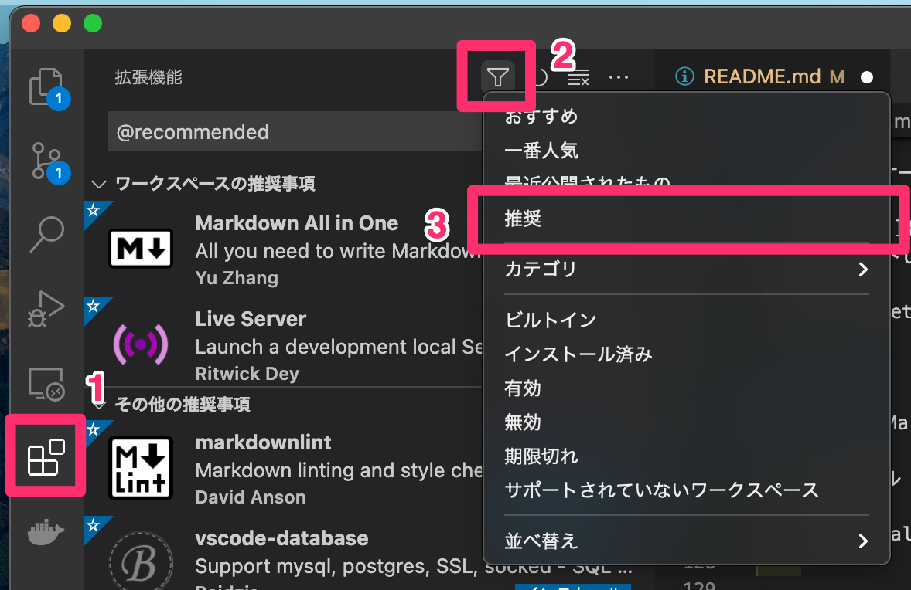
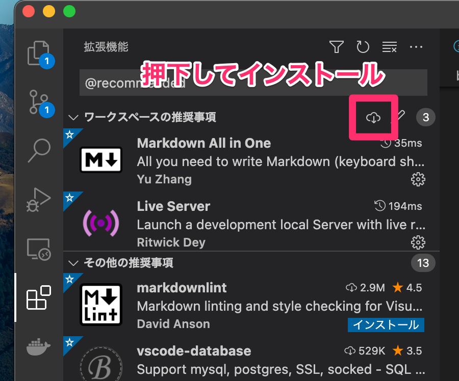

# グラッチェコインドキュンメントリポジトリ
- [グラッチェコインドキュンメントリポジトリ](#グラッチェコインドキュンメントリポジトリ)
    - [環境構築](#環境構築)
        - [Python導入(macOS)](#python導入macos)
            - [エラーになる場合](#エラーになる場合)
            - [pip](#pip)
        - [Python導入後](#python導入後)
    - [MkDocs実行](#mkdocs実行)
    - [Tips](#tips)
        - [装飾](#装飾)
        - [折りたたみ](#折りたたみ)
## 環境構築
作業用PCはMacだけなので、macOSでの手順のみ。
必要があればWindowsでの手順を作成する。

### Python導入(macOS)
1. Pythonバージョン確認
    ```shell
    $ Python -V

    Python 2.7.16
    ```
    - Python3.8以上 : PIPインストールへ
    - 上記未満 : 以下の手順を実行
1. Homeblewインストール
    ```shell
    $ /bin/bash -c "$(curl -fsSL https://raw.githubusercontent.com/Homebrew/install/HEAD/install.sh)"
    ```
2. pyenvインストール(Pythonバージョン管理ソフト)
    ```shell
    $ brew install pyenv
    ```
3. pyenvの設定(以下を`~/.zshrc`または`~/.bash_profile`に追記する)
    ```shell
    export PYENV_ROOT="$HOME/.pyenv"
    export PATH="$PYENV_ROOT/bin:$PATH"
    export PATH="/usr/local/bin:$PATH"
    eval "$(pyenv init --path)"

    eval "$(pyenv init -)"
    export LDFLAGS="-L/usr/local/opt/zlib/lib -L/usr/local/opt/bzip2/lib"
    export CPPFLAGS="-I/usr/local/opt/zlib/include -I/usr/local/opt/bzip2/include"
    export PKG_CONFIG_PATH="/usr/local/opt/zlib/lib/pkgconfig"
    ```
1. pyenvでPythonをインストール
    ```shell
    pyenv install 3.8.3
    ```
2. インストールしたバージョンを確認（`*`がついているのが有効なバージョン）
    ```shell
    pyenv versions

    * system
      3.8.3
    ```
3. バージョン切り替え
    ```shell
    pyenv global 3.8.3
    ```
4. バージョン確認
    ```shell
    python -V

    Python 3.8.3
    ```

`pyenv install 3.8.3` でエラーが発生する場合、以下の手順で再試行する。

#### エラーになる場合
エラーが出力される場合、次のコマンドを順番に入力する。

- エラー出力例
    ```
    BUILD FAILED (OS X 11.0.1 using python-build 20180424)

    Inspect or clean up the working tree at /var/folders/17/2xhf1tw15xzd8sz_0hw3gp2h0000gn/T/python-build.20201124174138.31290
    Results logged to /var/folders/17/2xhf1tw15xzd8sz_0hw3gp2h0000gn/T/python-build.20201124174138.31290.log

    Last 10 log lines:
                                                        ^
    clang -c -Wno-unused-result -Wsign-compare -Wunreachable-code -DNDEBUG -g -fwrapv -O3 -Wall -I/Applications/Xcode.app/Contents/Developer/Platforms/MacOSX.platform/Developer/SDKs/MacOSX.sdk/usr/include   -I/Applications/Xcode.app/Contents/Developer/Platforms/MacOSX.platform/Developer/SDKs/MacOSX.sdk/usr/include   -std=c99 -Wextra -Wno-unused-result -Wno-unused-parameter -Wno-missing-field-initializers -Wstrict-prototypes -Werror=implicit-function-declaration  -I./Include/internal  -I. -I./Include -I/usr/local/opt/readline/include -I/usr/local/opt/readline/include -I/Users/shinokada/.pyenv/versions/3.8.0/include  -I/usr/local/opt/readline/include -I/usr/local/opt/readline/include -I/Users/shinokada/.pyenv/versions/3.8.0/include   -DPy_BUILD_CORE -o Modules/gcmodule.o Modules/gcmodule.c
    clang -Wno-unused-result -Wsign-compare -Wunreachable-code -DNDEBUG -g -fwrapv -O3 -Wall -I/Applications/Xcode.app/Contents/Developer/Platforms/MacOSX.platform/Developer/SDKs/MacOSX.sdk/usr/include   -I/Applications/Xcode.app/Contents/Developer/Platforms/MacOSX.platform/Developer/SDKs/MacOSX.sdk/usr/include   -std=c99 -Wextra -Wno-unused-result -Wno-unused-parameter -Wno-missing-field-initializers -Wstrict-prototypes -Werror=implicit-function-declaration  -I./Include/internal  -I. -I./Include -I/usr/local/opt/readline/include -I/usr/local/opt/readline/include -I/Users/shinokada/.pyenv/versions/3.8.0/include  -I/usr/local/opt/readline/include -I/usr/local/opt/readline/include -I/Users/shinokada/.pyenv/versions/3.8.0/include   -DPy_BUILD_CORE_BUILTIN  -DPy_BUILD_CORE_BUILTIN -I./Include/internal -c ./Modules/posixmodule.c -o Modules/posixmodule.o
    ./Modules/posixmodule.c:9084:15: error: implicit declaration of function 'sendfile' is invalid in C99 [-Werror,-Wimplicit-function-declaration]
            ret = sendfile(in, out, offset, &sbytes, &sf, flags);
                ^
    1 error generated.
    ```

- 神コマンド
    ```shell
    Resinstall Xcode
    sudo rm -rf /Library/Developer/CommandLineTools

    # ここでユーザーのパスワードを聞かれる → ダイアログが出るのでインストールする
    xcode-select --install

    # Install zlib and bzip2 using brew
    brew reinstall zlib bzip2

    # Install tcl-tk tkinter
    brew install tcl-tk

    # Uninstall previous versions from python
    pyenv uninstall 3.8.3

    # Install python 3.8.3 patched
    env \
    PATH="$(brew --prefix tcl-tk)/bin:$PATH" \
    LDFLAGS="-L$(brew --prefix tcl-tk)/lib -L$(brew --prefix zlib)/lib -L$(brew --prefix bzip2)/lib" \
    CPPFLAGS="-I$(brew --prefix tcl-tk)/include -L$(brew --prefix zlib)/include -L$(brew --prefix bzip2)/include" \
    PKG_CONFIG_PATH="$(brew --prefix tcl-tk)/lib/pkgconfig" \
    CFLAGS="-I$(brew --prefix tcl-tk)/include -I$(brew --prefix openssl)/include -I$(brew --prefix bzip2)/include -I$(brew --prefix zlib)/include -I$(brew --prefix readline)/include -I$(xcrun --show-sdk-path)/usr/include" \
    LDFLAGS="-I$(brew --prefix tcl-tk)/lib -L$(brew --prefix openssl)/lib -L$(brew --prefix readline)/lib -L$(brew --prefix zlib)/lib -L$(brew --prefix bzip2)/lib"
    pyenv install --patch 3.8.3 < <(curl -sSL https://github.com/python/cpython/commit/8ea6353.patch\?full_index\=1)

    ```


#### pip
Pythonのパッケージマネージャーであるpipをインストール

1. [公式サイト](https://pip.pypa.io/en/stable/installation/)へから`get-pip.py`ファイルをダウンロード
1. ダウンロードしたスクリプトを実行
    ```shell
    python get-pip.py
    ```

### Python導入後
1. `requirements.txt`のパッケージを一括でインストールする
`pip install -r requirements.txt`
1. 推奨拡張機能をインストール
    1. 推奨拡張機能を表示
        
    2. 推奨拡張機能をインストール
        

## MkDocs実行
- ローカルで確認
`mkdocs serve`

- HTMLにビルド
`mkdocs build`


## Tips
ドキュメント作成時の小ネタ

### 装飾

!!! note
!!! info
!!! tip
!!! success
!!! help
!!! warning
!!! fail
!!! error
!!! bug
!!! example
!!! quote

```md
!!! note
!!! info
!!! tip
!!! success
!!! help
!!! warning
!!! fail
!!! error
!!! bug
!!! example
!!! quote
```

### 折りたたみ
コンテンツを折りたたみすることができる。

```md
???+ label
    +をつけると開いたままの状態で表示される
    ??? label "見出し"
        +をつけないと閉じたままの状態で表示される
    ???+ label "見出し"
        ネストされた項目を開いた状態で表示する
```


https://roy-n-roy.nyan-co.page/mkdocs/