# Grazie Coin アプリ ヘルプページ

## アプリの使い方

1. [ログインする](#login)
2. [グラッチェする](#grazie)
3. [コインを送る](#coin)
4. [商品を交換する](#coin)
5. [ランキングを見る](#ranking)
6. [履歴を見る](#history)
7. [設定を変える](#settings)
8. [ユーザのプロフィール画像を変更する](#settings)
9. [デフォルトグラッチェメッセージを設定する](#settings)
10. [言語を設定する](#settings)
11. [お知らせを確認する](#header)

## 画面説明

## Login

1. GrazieCoin(Web)でお使いのID/パスワードでログインできます。
1. 以下の条件を満たす場合、スイッチをONにすることで次回以降のログイン時に生体認証を利用できます
    - ✅ ご利用のスマートフォンに生体認証機能がある
    - ✅ 生体認証機能を有効化している

- 対応している生体認証
  - iOS : Face ID, Touch IDが利用できます
  - Android : 指紋認証、顔認証が利用できます
    - 画面上のラベルは「指紋認証」「顔認証」と表示されます

### パスワード再設定
##### 1.パスワード入力欄の右下にある「パスワード忘れた？」をタップしてください

##### 2.ログインに使用しているメールアドレスを入力し「送信」をタップしてください

##### 3.メールの本文に記載されているリンクをクリックしてください

**※入力したメールアドレス宛に以下のメールが送信されます**

##### 4.新しいパスワードを入力し「保存」を選択することでパスワードを再設定することができます

## Header

### お知らせを確認する
- 未読のお知らせがある場合、**ベルアイコンに赤いバッジが表示され、ログイン時に自動的に表示されます**。
- ベルアイコンをタップするとお知らせ掲示板画面が表示されます。
- 一覧画面では、**未読のお知らせが赤丸**で表示され、**固定されたお知らせはピンアイコン**で表示されます。
- お知らせをタップすると、詳細内容（タイトル・本文）が表示され、**未読のお知らせは既読になります。**

### お知らせを一括既読にする
- お知らせ掲示板画面の左上にある「**一括既読**」ボタンをタップすると、**全てのお知らせを既読にすることができます**。
- 確認プルダウンが表示されるので、「**既読にする**」をタップしてください。

### お知らせを並び替える
- お知らせ掲示板画面の右上にある「**昇順/降順**」ボタンをタップすると、**昇順/降順を変更することができます**。
- 並び順は「**未読順**」「**重要度**」「**タイトル順**」「**期間順**」から選択してください。

### オンラインマニュアルを見る
アプリ内からオンラインマニュアルを閲覧することができます。

## Home
ご利用中のユーザの情報を表示する画面です。ログイン後に最初に表示されます。

### 画面項目
- ユーザ情報
  - ユーザ名、プロフィール画像を表示します。
- ポイント・コイン残高
  - 現在のグラッチェポイント、グラッチェコイン残高を表示します。
- 直近5件の取引履歴
  - 自分が送った/受け取ったグラッチェまたはコインの履歴を表示します。

### グラッチェを送る(メッセージ入力)画面へ移動　
グラッチェの直近5件の取引履歴に表示されているユーザ名の下部にある「返信」or「送る」をタップすると、表示されているユーザにグラッチェすることができます

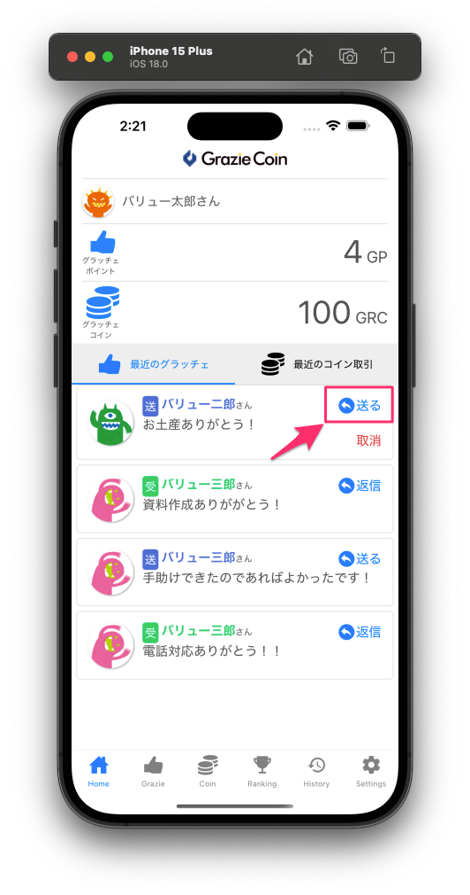
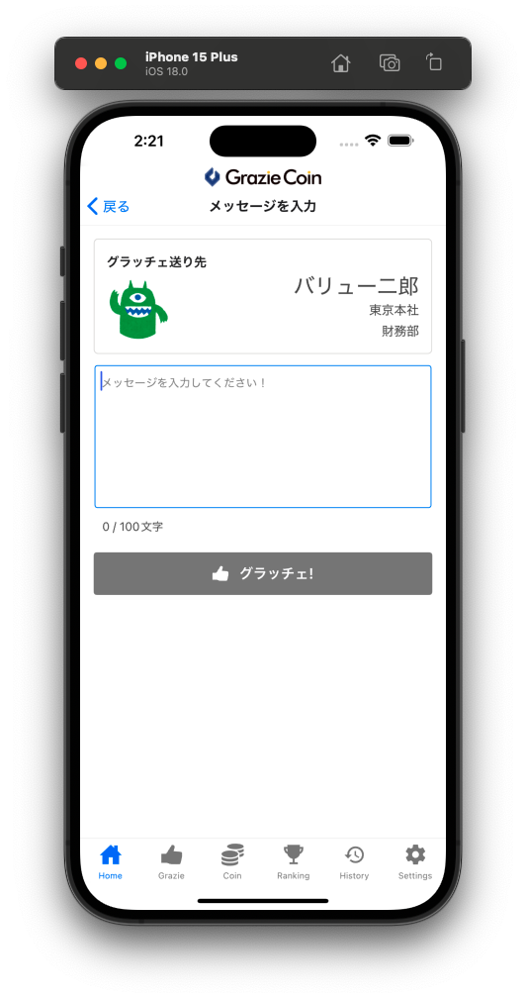

### グラッチェメッセージの詳細を表示　
グラッチェの直近5件の取引履歴に表示されているメッセージの右下にある「続きを見る」をタップすると、メッセージの全文が表示されます
**※メッセージ数によっては表示されません**

###  グラッチェを取り消す

- グラッチェ取消機能の仕様は[こちら](../管理者機能/その他設定/other07.md)をご確認ください。

## Grazie
グラッチェを送る画面です。

### グラッチェを送る(簡易)
1. グラッチェを送りたいユーザを選択します。
    - ユーザ名、事業所、部署を指定することで、ユーザを絞り込めます。 
    - **※サービス契約区分が会社の場合は「事業所」「部署」は表示されません**

2. :material-new-box: **ユーザ情報表示欄のどこをタップしても**、そのユーザにグラッチェを送ることができます。
    - この場合、デフォルトメッセージでグラッチェが送信されます。
    - デフォルトメッセージはSettingsタブ内から変更できます。

### グラッチェを送る(メッセージ入力)
:material-new-box: **ユーザ情報表示欄全体を長押しすると**、メッセージを入力してからグラッチェを送ることができます。

### 重み付けされたグラッチェを送る
- **重み付け機能が有効になっている場合にのみ操作できます**
- 詳しくは[グラッチェの大きさ設定とは](../管理者機能/その他設定/other09.md)をご確認ください

## Coin
グラッチェコインの送金や、商品を交換する画面です。

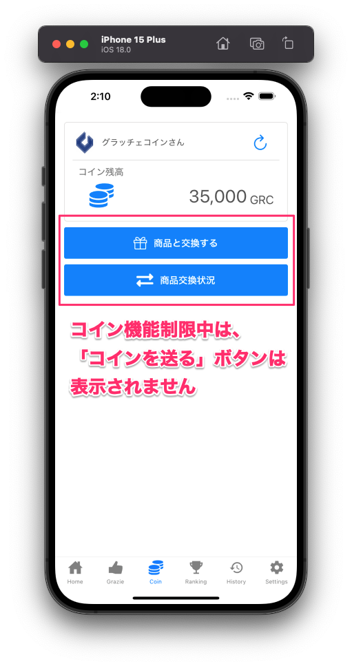

### 画面項目

- コイン残高
    -  更新ボタンを押すと最新の残高を取得します。
- 「コインを送る」ボタン
    - コイン送金先選択画面へ移動します。
      - **※コイン送金機能が制限されている場合は表示されません。**
- 「商品と交換する」ボタン
    - 商品選択画面へ移動します。
- 「商品交換状況」ボタン
    - 商品交換状況一覧画面へ移動します。

### コイン送金先選択画面

1. コインを送りたいユーザを選択します。
   - ユーザ名、事業所、部署を指定することで、ユーザを絞り込めます。 
   - ※サービス契約区分が会社の場合は「事業所」「部署」は表示されません
1. コインアイコンをタップすると、コイン送金入力画面に移動します。

### コイン送金入力画面

1. メッセージを1~100文字で入力します。
2. 送金するコインを入力します。
3. 紙ヒコーキボタンをタップすると送金することができます。

### 商品選択画面
交換したい商品を選択する画面です。

「交換」ボタンをタップすると商品を交換できます。

残高不足で交換できない商品は、ボタンが「**残高不足**」と表示されます。

在庫がない商品は、ボタンが「**在庫切れ**」と表示されます。

### 商品交換状況一覧画面
**交換申請中の商品**を確認する画面です。

「取消」ボタンをタップすると**交換申請を取り消すことができます。**

取り消しを行うと、**商品交換時に消費したコインが返金されます。**

**※2024年9月以降に交換申請した商品のみが対象です。ご了承ください。**

## Ranking
過去の集計結果、その日のグラッチェをした/されたユーザをランキング形式で表示する画面です。
グラッチェ集計の表彰ランキングと、サービス利用開始から通算のランキングと、1日ごとのランキングを表示します。
プルダウンを切り替えるとサービスを利用する組織全体や事業所ごとの表示になります。

### 表彰結果ランキング

### 過去の表彰結果へ切り替え

### 総保有ランキング
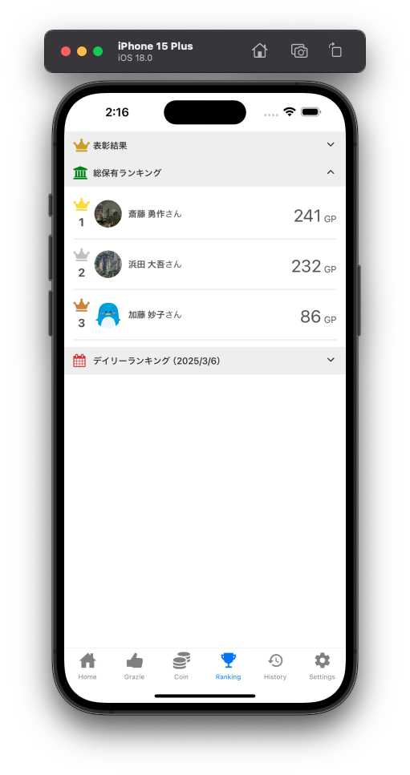

### デイリーランキング

### 事業所の切り替え
**※サービス契約区分が会社の場合は「事業所」タブは表示されません**

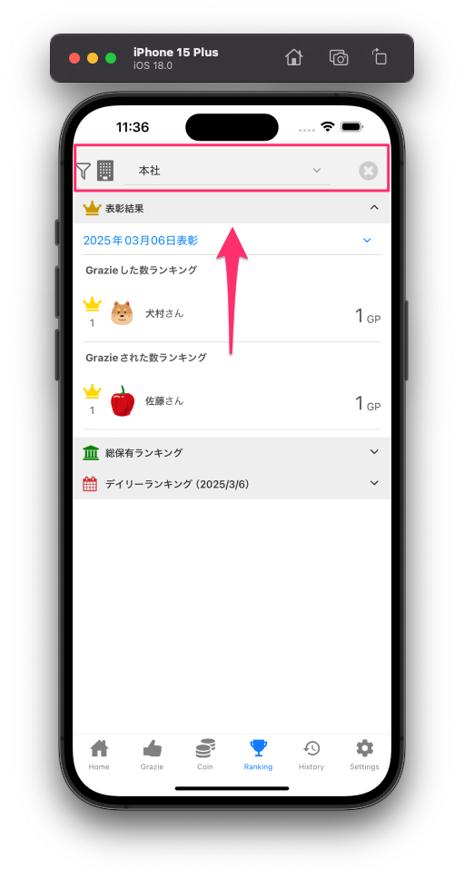

## History
組織全体のグラッチェやコイン送金、商品交換の履歴を表示する画面です。

### グラッチェ
グラッチェの履歴を表示します。
自分宛や自分が送ったメッセージ履歴は、**ユーザ名や吹き出しが緑色**で表示されます。

メッセージの右下にある「続きを見る」をタップすると、**メッセージの全文が表示されます**

※メッセージ数によっては表示されません

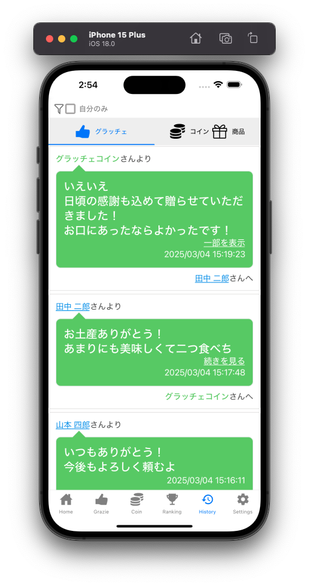

 青い下線が表示されているユーザ名をタップすると、**グラッチェ入力画面に遷移します**

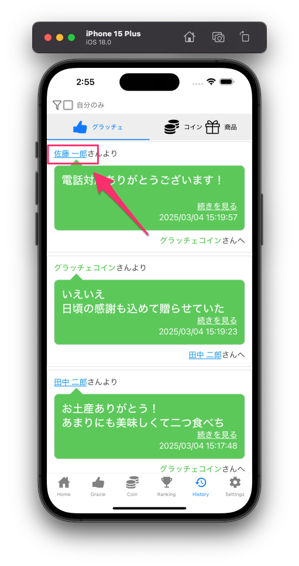
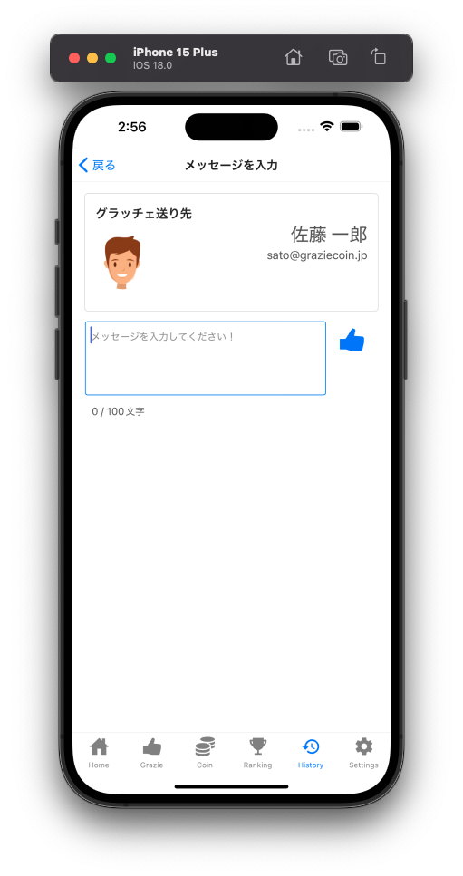

### コイン
コインの送金履歴を表示します。
自分宛や自分が送ったコイン履歴は、**ユーザ名が緑色**で表示されます。
また、送金履歴には以下の種別があります。

- 送金
  - ユーザ間の送金を表します。
- 表彰
  - 管理者からユーザへの送金を表します。
- 回収
  - ユーザが管理者からコインを回収されたことを表します。
- 拠点間送金
  - 事業所から事業所への送金を表します。
- 予算付与
  - GrazieCoinサービスから組織へのコイン送金を表します。

### 商品
商品の交換履歴を表示します。
自分が交換した履歴は、**ユーザ名が緑色**で表示されます。

### 「自分のみ」絞り込み
ログインしているユーザが関わっている履歴のみ表示します。

- 「自分のみ」ボタン
    - チェックをつけると、ログインしているユーザが関わっている履歴のみ表示します。

※ 所属している会社/事業所の公開設定が「やりとりユーザのみ公開」かつ一般ユーザの場合は使用できません。

## Settings

通知設定やグラッチェのデフォルトメッセージを変更することができます。
不具合やお問合せ、アプリの使い方(ヘルプページ)へのリンクがあります。

### 通知設定
グラッチェやコインを受け取った際に、メールやプッシュで通知を受け取るか設定できます。
また、アプリから定期的に届く通知を受け取るかの設定をすることができます

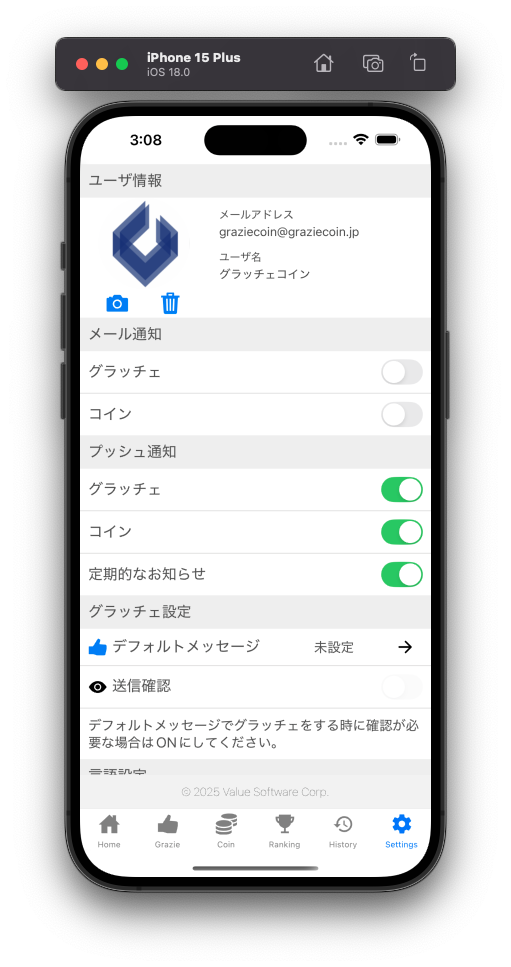

### サムネイル変更
  - カメラアイコンをタップし、画像を選択することでプロフィール画像を変更できます。
  - アイコンタップ時に「写真」へのアクセスを許可するか確認するダイアログが表示されますが「許可」をしてください

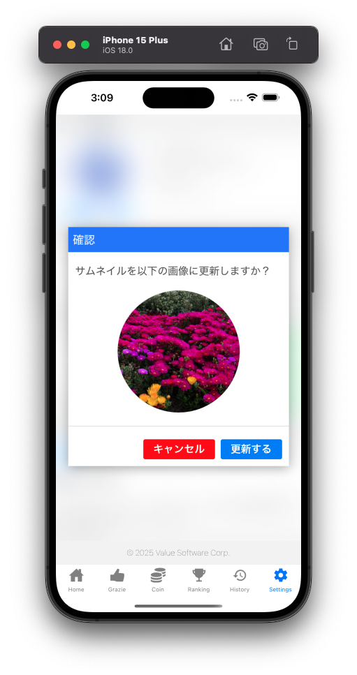

###  ユーザ情報変更

- ユーザ情報更新リンク機能が有効になっている場合にのみご利用いただけます
- ユーザ情報更新フォームの操作手順は[こちら](../一般機能/Setting/setting01.md#_7)をご確認ください

###  グラッチェメッセージ変更
Grazie画面でユーザ名の右隣に表示される👍ボタンをタップした際のデフォルトメッセージを変更できます。

 設定されているメッセージをタップすると入力がクリアされ、入力例に設定されていたメッセージが表示されます。

### 言語設定変更
アプリ全体に表示されるラベルやボタンの言語の設定を変更することができます。

**デフォルトの設定は端末の言語設定依存しております。詳しくは以下の表となります**

| 端末の言語設定 | アプリの言語設定　|
| --- | --- |
| 日本語 | 日本語 |
| 日本語以外 | 英語 |

**※ユーザが入力したグラッチェメッセージや履歴の内容を翻訳するものではありません。**

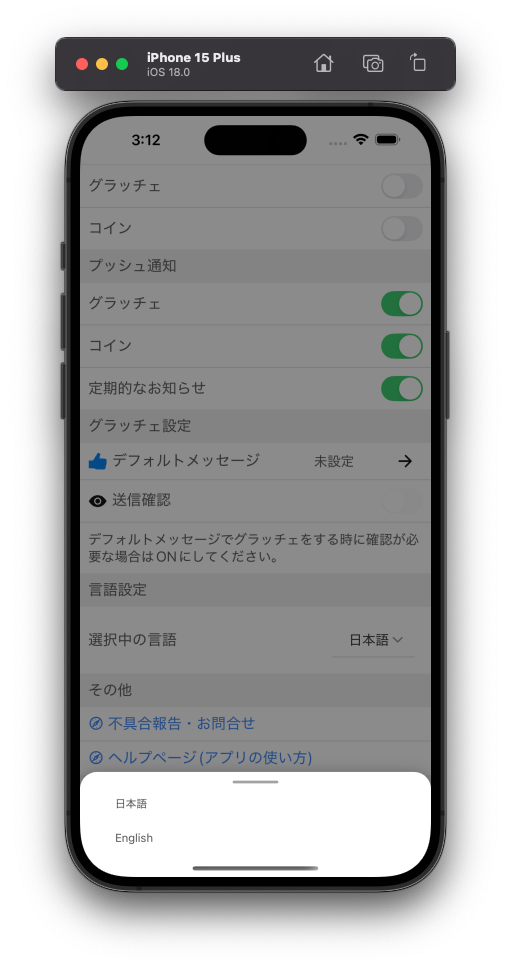

