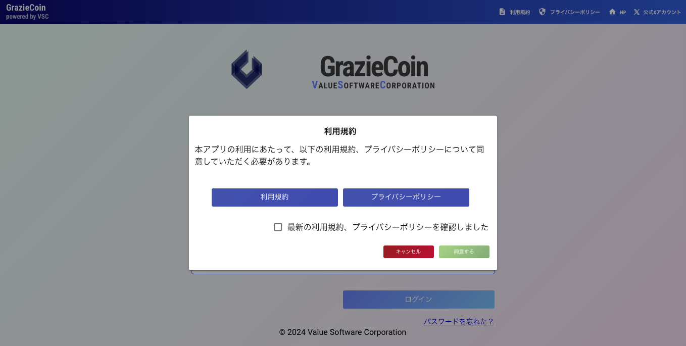
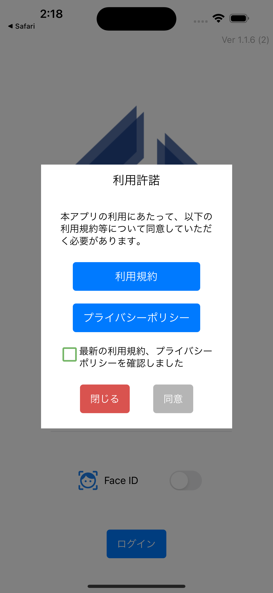

# リリースノート

## :material-new-box: 2025年3月アップデート内容

- ***変更点***
    - スマホアプリ版
        - [<u>パスワード再発行機能の追加</u>](../app/index.md#_3)
            - ログイン画面からパスワード再発行のメールを送信できるようになります。
        - [<u>ランキング画面の操作性向上</u>](../app/index.md#ranking)
            - 事業所の切り替え方法をタブからプルダウンに変更しました。
        - **アプリのパフォーマンス向上**
            - デザインを一部改善し、よりスムーズに操作できるようになりました。
    - Web版
        - 変更はございません。

##  2024年11月アップデート内容

- ***変更点***
    - **マスターアカウントの[<u>追加</u>](../管理者機能/ユーザ/user02.md)・[<u>変更</u>](../管理者機能/ユーザ/user03.md)・削除機能の実装(Web版)**
        - 従来のマスターアカウントは一人のみでしたが、今回のリリースで複数人のマスターアカウントを作成できます
        - マスターアカウントの追加・変更・削除はマスターアカウントのみ操作できます
        - CSVインポートでマスターアカウントを追加することはできません
        - マスターアカウントは最低一人以上必要です
    - **グラッチェ履歴からグラッチェできるようになります([<u>Web版</u>](../一般機能/History/history01.md))**
        - アプリ版と同様に、ポイント履歴画面から直接グラッチェできるようになります
    - **Web版のサムネイル変更機能の刷新([<u>Web版</u>](../一般機能/Setting/setting01.md))**
        - レイアウトを変更し、操作性が向上しました
        - アプリ版と同様に、画像の切り取り操作を行えるようになります
    - **Web版の通知設定画面のレイアウト変更([<u>Web版</u>](../一般機能/Setting/setting02.md))**
        - 視認性を向上しました
    - **CSVインポート時の更新処理の変更([<u>Web版</u>](../管理者機能/ユーザ/user04.md))**
        - 従来は更新時にメールを送信していましたが、今回のリリースからはメールを送信しないようになります
    ※従来通り追加時は送られます
    - 軽微な不具合を修正
## 2024年10月アップデート内容

- ***新機能***
    - **コイン送金、回収する際に1~100文字でメッセージを入力できるようになりました([<u>Web</u>](../一般機能/GrazieCoin/coin02.md)/[<u>アプリ</u>](../app/index.md#_10))**
        - メッセージを追加することで、コイン送金をする経緯を記録することができます
        - たまにはお世話になっている方にグラッチェ以外の方法で感謝をしてみませんか？

- ***変更点***
    - **集計結果を表彰する際にコインを送金する必要がなくなりました([<u>Web</u>](../管理者機能/集計・表彰/total03.md#_6))**
        - コイン送金することなく、一般ユーザに表彰結果を公開することができます
        - 手動/自動集計どちらともコイン送金なしで表彰することができます
    - **ユーザCSVインポートする際に空行が含まれていてもインポートできるようになりました([<u>Web</u>](../管理者機能/ユーザ/user04.md#csv_2))**
        - 空行部分をアプリ側が自動的に排除することで、より快適にユーザインポートができるようになりました
        - **※従来では空行が含まれている場合は空行部分を手動で削除し、再インポートをする必要がありました**
    - **利用許諾を同意する画面のレイアウトが変更されました(Web/アプリ)**
        - さらに見やすくするため外部リンクに変更しました  

##  2024年9月アップデート内容

- ***新機能***
    - **商品に在庫数を設定できるようになりました！([<u>Web版</u>](../管理者機能/productmaintenance.md)/[<u>スマホアプリ版</u>](../app/index.md#_10))**
        - 在庫数が0になると「売り切れ」になり、ユーザは商品の交換ができなくなります
    - **商品の交換申請を取り消しできるようになりました！([<u>Web版</u>](../一般機能/GrazieCoin/coin04.md)/[<u>スマホアプリ版</u>](../app/index.md#_11))**
        - 取り消しを行うと、交換時に消費したコインが返金されます
        - **※2024年9月以降に交換申請した商品のみが対象です**
    - **コイン送金機能の制限ができるようになりました！([<u>Web版</u>](../管理者機能/その他設定/other05.md)/[<u>スマホアプリ版</u>](../app/index.md#coin))**
        - 制限されたユーザは一般画面のコイン送金ができなくなります(管理者画面からのコイン送金は除く)
    - **CSVアップロードが更新にも対応するようになりました！([<u>Web</u>](../管理者機能/ユーザ/user04.md))**
        - 今までは登録のみでしたが、ついに更新にも対応しました
        - また、現在登録しているユーザの一覧をCSVでダウンロードできるため、更新も簡単です！
    - **履歴からグラッチェできるようになりました！([<u>スマホアプリ版</u>](../app/index.md#history))**
        - 履歴に表示されているユーザ名をタップするだけで、グラッチェ入力画面に遷移します

## 2024年7月アップデート内容

- ***変更点***
    - **スマホアプリ版のみ**
        - 設定画面から[アプリの言語設定](../app/index.md#settings)ができるようになりました！
            - 現在は日本語と英語のみとなります
            - デフォルトでは端末の言語設定に依存します

        - [ホーム画面](../app/index.md#home)と[設定画面](../app/index.md#settings)のレイアウトを変更しました！
            - ユーザ情報を設定画面に移動することでホーム画面に表示されている直近5件の履歴が見やすくなります

        - [ユーザのサムネイルのアップロード時](../app/index.md#settings)に確認画面を表示するようになりました
            - 今までは画像を選択すると即座にアップロードしていたため、確認画面を追加することで間違った画像が設定されることは無くなりました

    - **スマホアプリ/Web版**
        - 事業所/部署名の最大文字数を20→50文字まで拡張しました！
            - 画面表示部分に入りきらない場合は省略されます
            - Web版のみマウスカーソルすると全文字が表示されます
            - 登録方法については[組織](../管理者機能/groupmaintenance.md)をご確認ください

- ***不具合の修正***
    - **スマホアプリ/Web版**
        - グラッチェメッセージに絵文字を使用すると文字化けする不具合を修正
            - <u>端末によって表示されない絵文字がある場合もありますがご了承ください。</u>

## 2024年4月アップデート内容

- 履歴の公開設定ができる機能を追加

    - [履歴公開設定](../管理者機能/その他設定/other04.md)をご確認ください

- グラッチェのメッセージをダウンロードできる機能を追加

    - [期間・対象を選択して、グラッチェメッセージをダウンロードする](../管理者機能/集計・表彰/total01.md)をご確認ください

- 履歴を絞り込む機能を追加
- 履歴画面のデザインにカード表示を追加

    - [ポイント履歴](../一般機能/History/history01.md)、[コイン履歴](../一般機能/History/history02.md)をご確認ください

## 2024年1月アップデート内容

- グラッチェのメッセージ数の上限が「20」から「100」に増えました

詳細は[グラッチェする](../一般機能//GraziePoint/grazie02.md)をご確認ください

## 2022年9月アップデート内容

- 管理者コンソールの画面構成をメニュー形式にしました
- 管理者コンソールに以下の機能を追加しました
    - スーパーグラッチェ
        - グラッチェをするとコインがもらえる機能です
    - グラッチェの回数制限
    - コインの一括配布・一括回収
    - 商品交換状況管理
    - 自動集計設定
    - 予算管理
        - コインの支出内容を確認できる機能です
    - 集計・表彰の自動化
    - 利用状況
        - ログインユーザ数、グラッチェ数をグラフ表示できます
    - ユーザ登録フォーム

詳細は[管理者ユーザマニュアル](../管理者機能/index.md)をご確認ください
