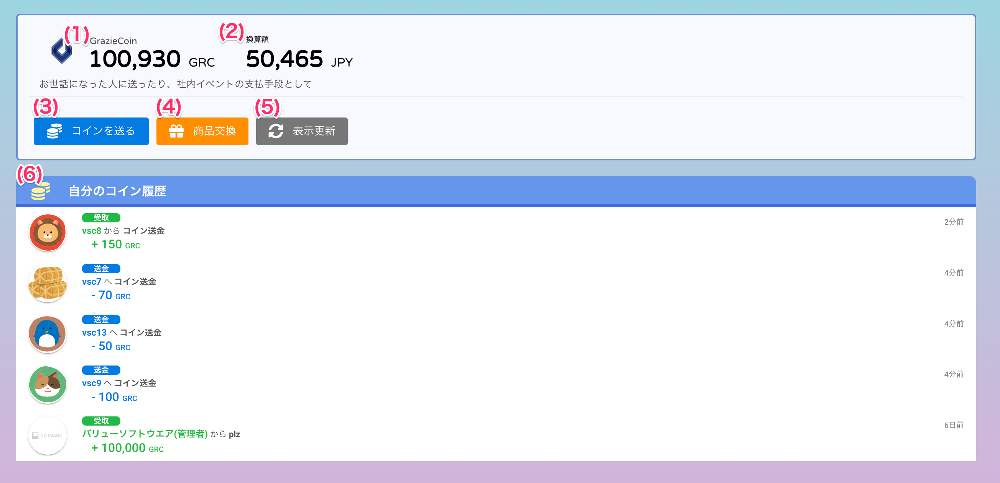

[一般ユーザ向けマニュアル](../../../一般機能/) > [機能説明](../../../一般機能/#_2) > [Grazie Coin](../../../一般機能/#grazie-coin) > [Top](#)
# GrazieCoin Top

## 画面

## 項目

|   #   | 項目名             | 必須  | 説明                                                                                                                                                                                                                                                                                                                                                           |
| :---: | :----------------- | :---: | :------------------------------------------------------------------------------------------------------------------------------------------------------------------------------------------------------------------------------------------------------------------------------------------------------------------------------------------------------------- |
|   1   | GrazieCoin         |   -   | ログインユーザが保有しているコイン数です                                                                                                                                                                                                                                                                                                                       |
|   2   | 換算額             |   -   | コインを現在のレートで換算した金額を表示します。 **レートオプション機能が有効な場合のみ表示します**。 レートオプション機能は[こちら](../../管理者機能/オプション機能/option01.md)をご参照ください。                                                                                                                                                      |
|   3   | [コインを送るボタン](../GrazieCoin/coin02.md) |   -   | ボタンを押すと送金画面を開きます                                                                                                                                                                                                                                                                                                      |
|   4   | [商品交換ボタン](../GrazieCoin/coin03.md)     |   -   | ボタンを押すと商品交換画面を開きます                                                                                                                                                                                                                                                                                                         |
|   5   | 更新ボタン         |   -   | ボタンを押すとGrazieCoinと換算額を最新情報に更新します                                                                                                                                                                                                                                                                                                         |
|   6   | 自分のコイン履歴   |   -   | 自分の送ったり受け取ったりしたコイン取引を直近5件分表示します。以下の内容を表示します ・**送金**: 自分が支払ったコイン取引です ・**受取**: 自分が受け取ったコイン取引です ・ユーザ名: コインの送り主または受け取り先。表彰時の賞金授与など、取引によってメッセージが付く場合があります ・金額: 取引金額です(**＋**表記は増えた金額、**➖**表記は減った金額を表します) |

## 使い方
- [商品を交換する](../../howto/howto02.md)

### コインを送る
<iframe src="https://scribehow.com/embed/__cDcvfvSeRUeUbhrTTF24YA" width="640" height="640" allowfullscreen frameborder="0"></iframe>
