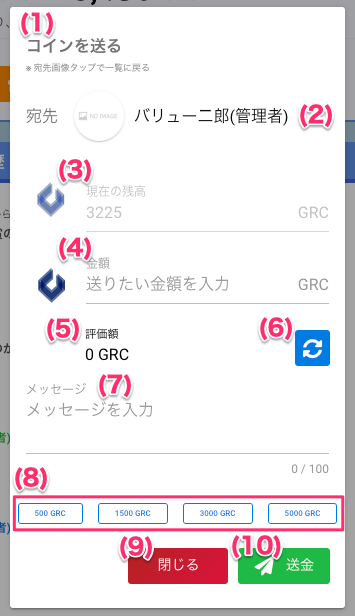

[一般ユーザ向けマニュアル](/一般機能/) > [機能説明](/一般機能/#_2) > [Grazie Coin](/一般機能/#grazie-coin) > [Top](coin01.md) > [コインを送る](#)
# 　コインを送る

## ユーザ選択画面

### 項目

|   #   | 項目名           | 必須  | 説明                                                                                           |
| :---: | :--------------- | :---: | :--------------------------------------------------------------------------------------------- |
|   1   | ユーザ選択画面   |   -   | コインを送るボタンを押すと表示します。会社内のユーザを一覧表示します。                         |
|   2   | ユーザ検索       |   -   | 文字を入力するとメールアドレスまたはユーザ名で、一覧に表示するユーザを絞り込みます             |
|   3   | 事業所プルダウン |   -   | 一覧に表示するユーザを、選択した事業所で絞り込みます **事業所が有効な場合のみ表示されます** |
|   4   | 部署プルダウン   |   -   | 一覧に表示するユーザを、選択した部署で絞り込みます **部署が有効な場合のみ表示されます**     |
|   5   | [ユーザ](#_4)           |   -   | 行を押すと送金金額を入力する画面を開きます                                                     |

## 送金金額入力画面

### 項目

|   #   | 項目名                | 必須  | 説明                                                                                                                                                                                                      |
| :---: | :-------------------- | :---: | :-------------------------------------------------------------------------------------------------------------------------------------------------------------------------------------------------------- |
|   1   | 送金金額入力画面      |   -   | ユーザ選択画面でユーザ行を押すと表示します                                                                                                                                                                |
|   2   | 宛先ユーザ            |   -   | 送金先となるユーザのアイコンと名前です                                                                                                                                                                    |
|   3   | 現在の残高            |   -   | ログインユーザの保有するコイン枚数です                                                                                                                                                                    |
|   4   | 金額                  |   -   | 送金する金額を入力します                                                                                                                                                                                  |
|   5   | 円換算                |   -   | コインを現在のレートで換算した金額を表示します。 **レートオプション機能が有効な場合のみ表示します**。 レートオプション機能は[こちら](../../管理者機能/オプション機能/option01.md)をご参照ください。 |
|   6   | 更新ボタン            |   -   | 最新のレートを取得し、コインを現在のレートで換算した金額を表示します。 **レートオプション機能が有効な場合のみ表示します**。                                                                            |
|   7   | 500GRC, 1500GRCボタン |   -   | ボタンを押すとボタンに書いてある金額を、「金額」欄に入力します                                                                                                                                                                              |
|   8   | [閉じるボタン](../GrazieCoin/coin01.md)         |   -   | ボタンを押すと画面を閉じます                                                                                                                                                                              |
|   9   | 送金ボタン           |   -   | ボタンを押すと送金します                                                                                                                                                                                  |

## 使い方
### コインを送る
<iframe src="https://scribehow.com/embed/__cDcvfvSeRUeUbhrTTF24YA" width="640" height="640" allowfullscreen frameborder="0"></iframe>
