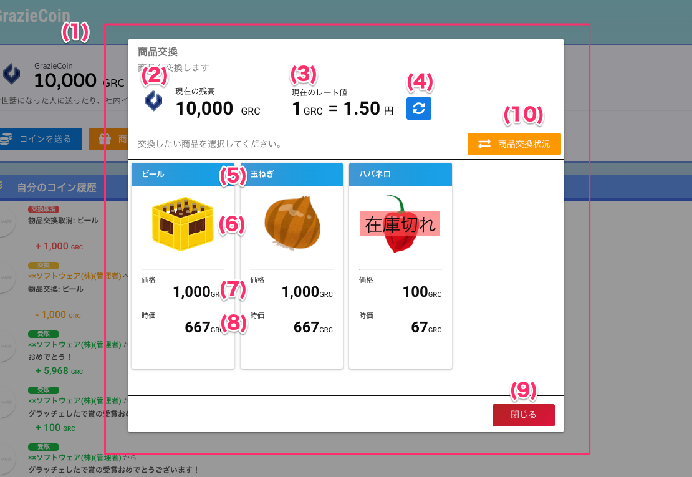

# 　商品交換

## 画面

## 項目

|   #   | 項目名         | 必須  | 説明                                                                                                                                                                                                               |
| :---: | :------------- | :---: | :----------------------------------------------------------------------------------------------------------------------------------------------------------------------------------------------------------------- |
|   1   | 商品選択画面   |   -   | GrazieCoin Top画面で商品交換ボタンを押すと表示します                                                                                                                                                               |
|   3   | 現在の残高     |   -   | ログインユーザの保有するコイン枚数です                                                                                                                                                                             |
|   3   | 現在のレート値 |   -   | 最新のレートです。1コインあたり何円とするかを表示します。 **レートオプション機能が有効な場合のみ表示します**。 レートオプション機能は[こちら](../../管理者機能/オプション機能/option01.md)をご参照ください。 |
|   4   | 更新ボタン     |   -   | 最新のレートを取得し、現在のレート値を更新します。 **レートオプション機能が有効な場合のみ表示します**。                                                                                                         |
|   5   | 商品カード     |   -   | 交換できる商品情報をカード形式で表示します。カードの上部(青い部分)は商品名を表示します。                                                                                                                           |
|   6   | 商品画像       |   -   | 商品画像です                                                                                                                                                                                                       |
|   7   | 価格           |   -   | 商品を交換するために必要なコインの枚数です                                                                                                                                                                         |
|   8   | 時価           |   -   | 価格を現在のレート値で換算した時価です。 **レートオプション機能が有効な場合のみ表示します**。 レートオプション有効時は、**時価が商品を交換するために必要なコイン枚数**になります。                           |
|   9   | 閉じるボタン   |   -   | ボタンを押すと画面を閉じます                                                                                                                                                                                       |
|   10   | 商品交換状況ボタン     |   -   | 商品交換状況画面が表示されます  

## 使い方

- [商品を交換する](../../howto/howto02.md)
- [交換申請を取り消す](./coin04.md)

