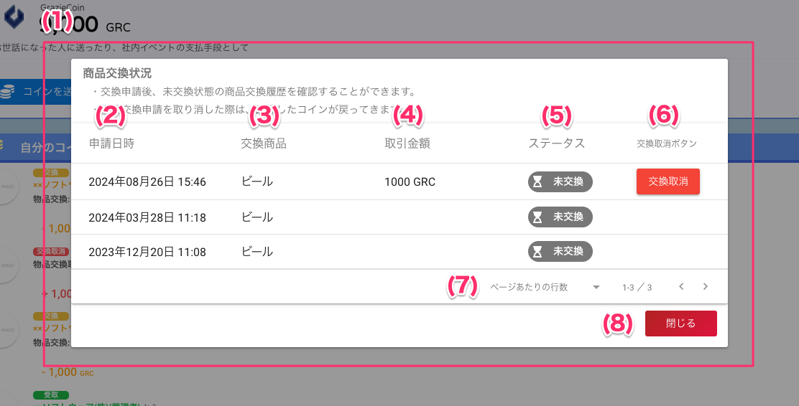

[一般ユーザ向けマニュアル](../../../一般機能/) > [機能説明](../../../一般機能/#_2) > [Grazie Coin](../../../一般機能/#grazie-coin) > [Top](coin01.md) > [商品交換](coin03.md) > [商品交換状況](#)
# 　商品交換状況画面
## 画面

## 項目

|   #   | 項目名         | 必須  | 説明                                                                                                                                                                                                               |
| :---: | :------------- | :---: | :----------------------------------------------------------------------------------------------------------------------------------------------------------------------------------------------------------------- |
|   1   | 商品交換状況画面   |   -   | 商品交換画面で商品交換状況ボタンを押すと表示します                                                                                                                                                               |
|   2   | 申請日時     |   -   | 商品を交換した日時です                                                                                                                                                                             |
|   3   | 交換商品     |   -   | 交換した商品の名前です                                                                                                                           |
|   4   | 取引金額           |   -   | 交換時に消費した金額です                                                                                                                                                                         |
|   5   | ステータス           |   -   | 「未交換」のステータス                           |
|   6   | 交換取消ボタン           |   -   | 商品を交換を取り消すことができます ※**2024年9月以降に交換申請した商品のみが対象です** |
|   7   | [閉じるボタン](../GrazieCoin/coin03.md)   |   -   | ボタンを押すと画面を閉じます                                                                                                                                                                                       |

## 使い方

### 交換申請を取り消す

<iframe src="https://scribehow.com/embed/__3L_BgmRwQoq2QMzLZEwWQQ" width="640" height="640" allowfullscreen frameborder="0"></iframe>

