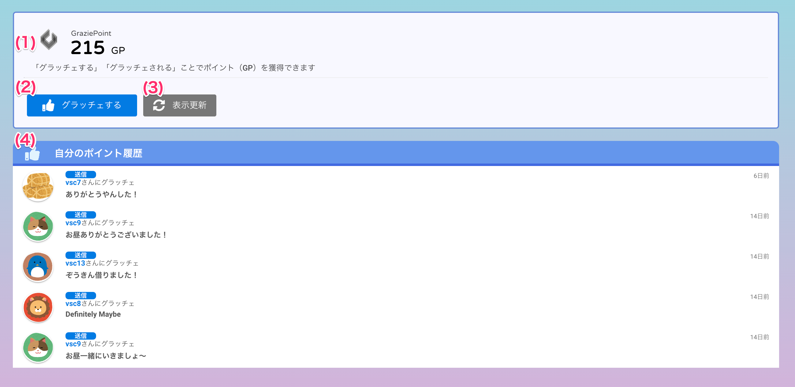

[一般ユーザ向けマニュアル](/一般機能/) > [機能説明](/一般機能/#_2) > [Grazie Point](/一般機能/#grazie-point) > [Top](#)
# Grazie Point Top

## 画面

## 項目

|   #   | 項目名               | 必須  | 説明 |
| :---: | :------------------- | :---: | :--- |
|   1   | グラッチェポイント   |   -   |  ログインユーザのグラッチェポイントを表示します GPとは**G**razie **P**ointの略称です    |
|   2   | グラッチェするボタン |   -   |  ボタンを押すと、他のユーザにグラッチェすることができます    |
|   3   | 更新ボタン           |   -   |  ボタンを押すとグラッチェポイントを最新情報に更新します    |
|   4   | 自分のポイント履歴   |   -   |   自分が送ったまたは受け取ったグラッチェを直近5件分表示します。以下の内容を表示します ・**送信**: 自分が送ったグラッチェ ・**受信**: 自分が受け取ったグラッチェ ・ユーザ名: グラッチェの送り主または受け取り先 ・グラッチェした際のメッセージ   |

!!! info
    - グラッチェポイントは、「グラッチェをする」「グラッチェを受け取る」ことで加算されます
    - この画面で表示しているグラッチェポイントは累計です。

## 使い方
- [グラッチェする](../../howto/howto01.md)

