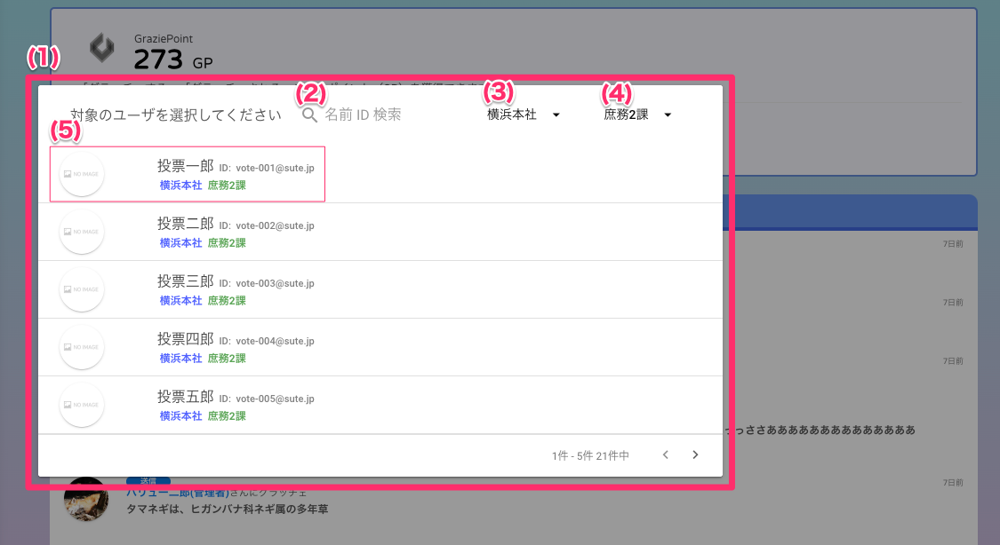
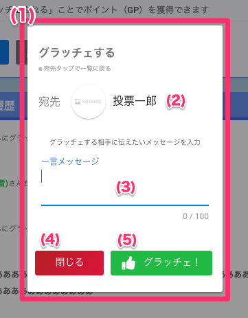

[一般ユーザ向けマニュアル](../../../一般機能/) > [機能説明](../../../一般機能/#_2) > [Grazie Point](../../../一般機能/#grazie-point) > [Top](../../../一般機能/GraziePoint/grazie01) > [グラッチェする](#)
# グラッチェする

## ユーザ選択画面

### 項目

|   #   | 項目名           | 必須  | 説明                                                                                           |
| :---: | :--------------- | :---: | :--------------------------------------------------------------------------------------------- |
|   1   | ユーザ選択画面   |   -   | グラッチェするボタンを押すと表示します。会社内のユーザを一覧表示します。                       |
|   2   | ユーザ検索       |   -   | 文字を入力するとメールアドレスまたはユーザ名で、一覧に表示するユーザを絞り込みます             |
|   3   | 事業所プルダウン |   -   | 一覧に表示するユーザを、選択した事業所で絞り込みます **事業所が有効な場合のみ表示されます** |
|   4   | 部署プルダウン   |   -   | 一覧に表示するユーザを、選択した部署で絞り込みます **部署が有効な場合のみ表示されます**     |
|   5   | [ユーザ](#_4)           |   -   | 行を押すとメッセージを入力する画面を開きます                                                   |

## メッセージ入力画面

### 項目

|   #   | 項目名             | 必須  | 説明                                                                                 |
| :---: | :----------------- | :---: | :----------------------------------------------------------------------------------- |
|   1   | メッセージ入力画面 |   -   | ユーザ選択画面でユーザ行を押すと表示します                                           |
|   2   | 宛先ユーザ         |   -   | グラッチェの送り先となるユーザのアイコンと名前です                                   |
|   3   | 一言メッセージ     |   ○   | グラッチェする相手に送るメッセージを入力します メッセージは100文字まで入力可能です |
|   4   | [閉じるボタン](../メニュー/menu01.md)       |   -   | ボタンを押すと画面を閉じます                                                         |
|   5   | グラッチェボタン   |   -   | ボタンを押すとグラッチェを送ります                                          |

## 使い方
- [グラッチェする](../../howto/howto01.md)

