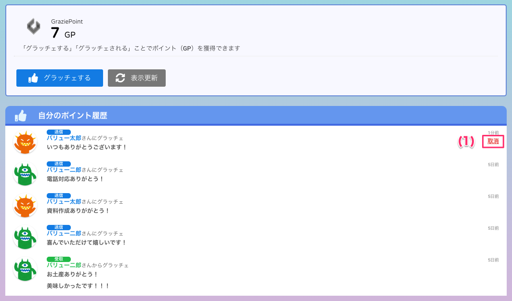
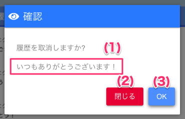

[一般ユーザ向けマニュアル](../../../一般機能/) > [機能説明](../../../一般機能/#_2) > [Grazie Point](../../../一般機能/#grazie-point) > [Top](../../../一般機能/GraziePoint/grazie01/) > [グラッチェを取り消す](#)
#  グラッチェを取り消す

- グラッチェ取消機能の仕様は[こちら](../../管理者機能/その他設定/other07.md)をご確認ください。

## Grazie Point画面

### 項目

|   #   | 項目名           | 必須  | 説明                                                                                           |
| :---: | :--------------- | :---: | :--------------------------------------------------------------------------------------------- |
|   1   |  取消ボタン   |   -   | 「取消」ボタンを押すとグラッチェを取り消すしことができます。**※グラッチェを送ってから24時間以内であれば可能です**                       |

## グラッチェ取消確認画面

### 項目

|   #   | 項目名             | 必須  | 説明                                                                                 |
| :---: | :----------------- | :---: | :----------------------------------------------------------------------------------- |
|   1   | 取り消されるメッセージ |   -   | 取り消すメッセージが表示されます                                           |
|   2   | [閉じるボタン](#)       |   -   | ボタンを押すと画面を閉じます                                                         |
|   3   | OKボタン   |   -   | ボタンを押すとグラッチェを取り消します                                         |

## グラッチェを取り消す
<iframe src="https://scribehow.com/embed/__DmUq9fO2SpapyfWgWrLxQg" width="640" height="640" allowfullscreen frameborder="0"></iframe>