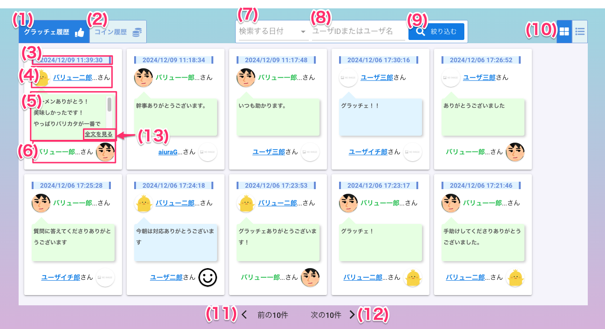
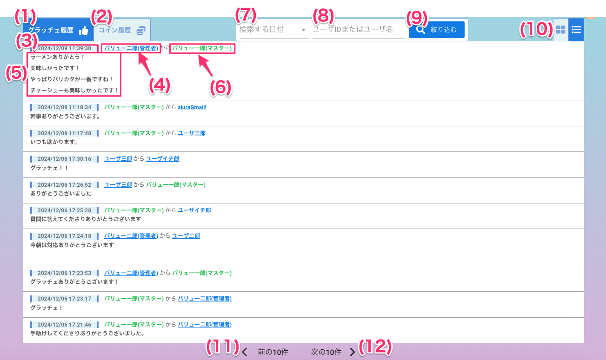

[一般ユーザ向けマニュアル](../../../一般機能/) > [機能説明](../../../一般機能/#_2) > [History](../../../一般機能/#history) > [ポイント履歴](#)
# ポイント履歴

!!! info
    - 会社内の**全てのユーザ**のグラッチェのやりとりを履歴として表示します
    - 公開設定がやりとりユーザのみに設定されている場合は、ログインユーザのやりとりに関係する履歴のみ表示されます
        - 詳細は[履歴公開設定](../../管理者機能/その他設定/other04.md)をご確認ください
    - 特定の履歴だけを非表示にすることは**できません**
    - ログイン中のユーザは緑色で表示されます
    - :new:ログイン中のユーザ以外のユーザは青色で表示され、下線が引かれています  
    押下することでグラッチェすることができます

## 画面

## カード表示

## リスト表示

### 項目

|   #   | 項目名           | 必須  | 説明                                                                                                                                                                   |
| :---: | :--------------- | :---: | :--------------------------------------------------------------------------------------------------------------------------------------------------------------------- |
|   1   | ポイント履歴タブ |   -   | タブを押すとポイント履歴を表示します                                                                                                                                   |
|   2   | [コイン履歴タブ](./history02.md)   |   -   | タブを押すとコイン履歴を表示します                                                                                                                                     |
|   3   | 取引時刻         |   -   | グラッチェした・された日時が表示されます |
|   4   | 送信ユーザ   |   -   | :new:下線が引かれている場合、[押下する事でグラッチェできます](../../GraziePoint/grazie02/#_4)      |
|   5   | メッセージ   |   -   | 絞り込みたい日付を入力します      |
|   6   | 受信ユーザ   |   -   | :new:下線が引かれている場合、[押下する事でグラッチェできます](../../GraziePoint/grazie02/#_4)      |
|   7   | 検索する日付   |   -   | 絞り込みたい日付を入力します      |
|   8   | ユーザIDまたはユーザ名入力フォーム   |   -   | 絞り込みたいユーザIDまたはユーザ名に含まれている文字を入力します      |
|   9   | 絞り込むボタン   |   -   | ボタンを押すと入力された条件から履歴を絞り込んで表示します      |
|   10   | カード/リスト表示切り替えタブ   |   -   | ボタンを押すと表示中の履歴表示がカード/リストに切り替わります      |
|   11   | 前の10件ボタン   |   -   | ボタンを押すと表示中の履歴から前ページの10件を表示します      |
|   12   | 次の10件ボタン   |   -   | ボタンを押すと表示中の履歴から次ページの10件を表示します     |
|   13   | 全文を見るボタン   |   -   | ボタンを押すと表示中の履歴の全文を見ることができます|

## 絞り込み

!!! info
    - 以下の内容で絞り込むことができます
        - 日付
        - ユーザIDまたはユーザ名に含まれる文字

### 履歴を日付で絞り込む

<iframe src="https://scribehow.com/embed/__9CiIW2vsSBGvERHyJx1FKQ" width="640" height="640" allowfullscreen frameborder="0"></iframe>

### 履歴をユーザID/ユーザ名で絞り込む

<iframe src="https://scribehow.com/embed/ID__xq2ODZdFTJK4YPUWsBTGqw" width="640" height="640" allowfullscreen frameborder="0"></iframe>

### 履歴を日付、ユーザID/ユーザ名で絞り込む

<iframe src="https://scribehow.com/embed/ID__8icvi4VLTTGs2DjQpeYy4w" width="640" height="640" allowfullscreen frameborder="0"></iframe>