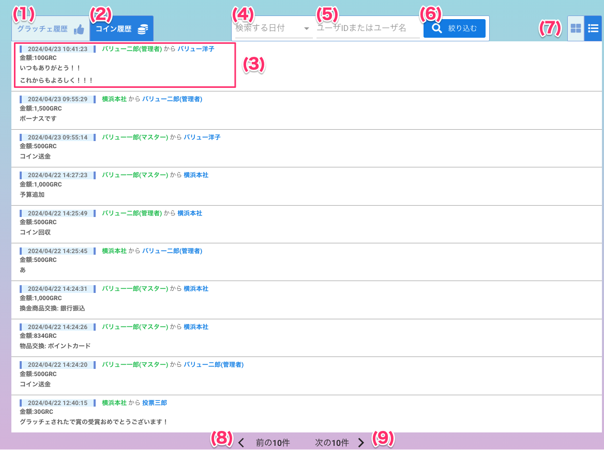

[一般ユーザ向けマニュアル](../../../一般機能/) > [機能説明](../../../一般機能/#_2) > [History](../../../一般機能/#history) > [コイン履歴](#)
# コイン履歴

!!! info
    - 会社内の**全てのユーザ**のコイン取引を履歴として表示します。コイン取引は以下のイベントが対象です。
        - ユーザ間のコイン送金
        - 商品交換
        - 表彰による賞金
        - 管理者によるコインの配布または回収
    - 特定の履歴だけを非表示にすることは**できません**
    - 「金額」は**管理者権限を持つユーザ**が履歴を閲覧した時に表示します。**一般ユーザには「金額」は表示されません**。

## 画面

## カード表示

## リスト表示

### 項目
|   #   | 項目名           | 必須  | 説明 |
| :---: | :--------------- | :---: | :--------------------------------------------------------------------------------------------------------------------------------------------------------------------- |
|   1   | [ポイント履歴タブ](./history01.md) |   -   | タブを押すとポイント履歴を表示します                                                                                                                                   |
|   2   | コイン履歴タブ   |   -   | タブを押すとコイン履歴を表示します                                                                                                                                     |
|   3   | 履歴情報         |   -   | グラッチェされた履歴を一行ごとに表示します ・取引時刻: グラッチェした日時 ・メッセージ: グラッチェした際のメッセージ ・イベント: 誰から誰へグラッチェされたか |
|   4   | 検索する日付   |   -   | 絞り込みたい日付を入力します      |
|   5   | ユーザIDまたはユーザ名入力フォーム   |   -   | 絞り込みたいユーザIDまたはユーザ名に含まれている文字を入力します      |
|   6   | 絞り込むボタン   |   -   | ボタンを押すと入力された条件から履歴を絞り込んで表示します      |
|   7   | カード/リスト表示切り替えタブ   |   -   | ボタンを押すと表示中の履歴表示がカード/リストに切り替わります      |
|   8   | 前の10件ボタン   |   -   | ボタンを押すと表示中の履歴から前ページの10件を表示します      |
|   9   | 次の10件ボタン   |   -   | ボタンを押すと表示中の履歴から次ページの10件を表示します     |
|   10   | メッセージを見るボタン   |   -   | ボタンを押すとスーパーグラッチェの全文を見ることができます|

## 絞り込み

!!! info
    - 以下の内容で絞り込むことができます
        - 日付
        - ユーザIDまたはユーザ名に含まれる文字

### 履歴を日付で絞り込む

<iframe src="https://scribehow.com/embed/__8EQmt9-dT0K2PBd1WBjF3Q" width="640" height="640" allowfullscreen frameborder="0"></iframe>

### 履歴をユーザID/ユーザ名で絞り込む

<iframe src="https://scribehow.com/embed/ID__uEGle0AKTS6WS6ojdnO4PQ" width="640" height="640" allowfullscreen frameborder="0"></iframe>

### 履歴を日付、ユーザID/ユーザ名で絞り込む

<iframe src="https://scribehow.com/embed/ID__b5LEw3E-QKSTFdPj0FA7Hg" width="640" height="640" allowfullscreen frameborder="0"></iframe>