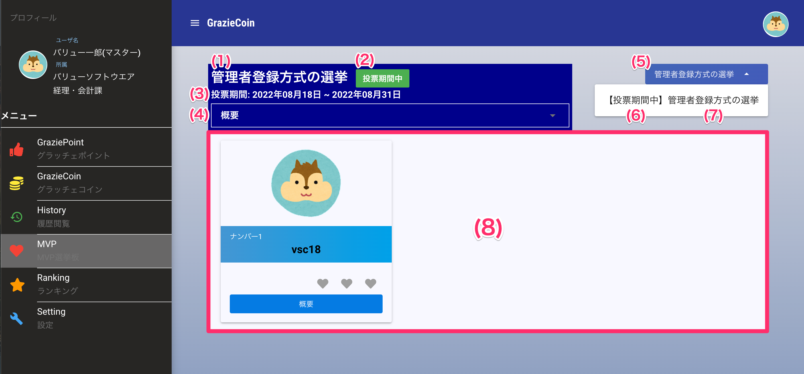
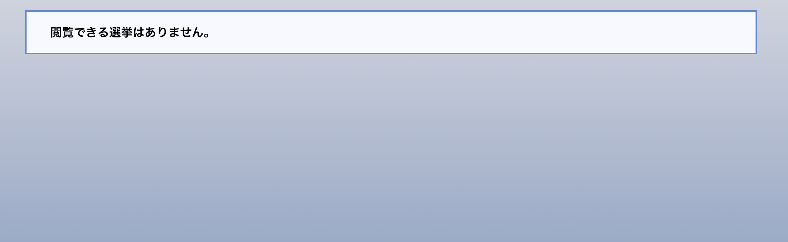

[一般ユーザ向けマニュアル](../../../一般機能/) > [オプション機能](../../../一般機能/#_4) > [MVP](../../../一般機能/#mvp) > [選挙を表示する](#)
# 選挙を表示する

## 画面

## 項目
|   #   | 項目名            | 必須  | 説明                                               |
| :---: | :---------------- | :---: | :------------------------------------------------- |
|   1   | 選挙タイトル |   -   | 選挙に設定されているタイトルです |
|   2   | 選挙ステータス |   -   | 選挙の現在のステータスです |
|   3   | 期間 |   -   | 現在のステータスが有効な期間です ステータスが推薦期間中の場合は、推薦期間を表示します |
|   4   | 概要 |   -   | 選挙の概要です ▼ボタンを押すと、内容を開閉できます |
|   5   | 選挙プルダウン |   -   | 表示したい選挙を切り替えるプルダウンです |
|   6   | プルダウン項目 |   -   | プルダウンを押すと選挙が複数表示します `【ステータス】選挙タイトル`の形式で項目を表示します |

## 表示できる選挙がない場合の表示

!!! info
    - 以下のケースに当てはまる場合、選挙が表示されません
        - 選挙が作成されていない
        - 選挙の期間外（推薦期間、投票期間）
        - 選挙結果が未公開状態
            - **管理者ユーザが結果を公開するまでは選挙結果は表示されません**

##　 使い方
### 選挙の表示と切り替え
<iframe src="https://scribehow.com/embed/__R8VeIDLlT8-btpnVgGAOhw" width="640" height="640" allowfullscreen frameborder="0"></iframe>
