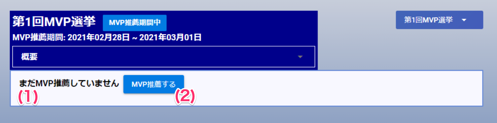
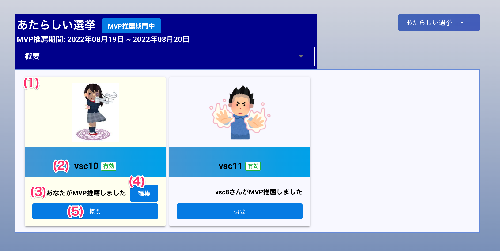

[一般ユーザ向けマニュアル](/一般機能/) > [オプション機能](/一般機能/#_4) > [MVP](/一般機能/#mvp) > [候補者を推薦する](#)
# 候補者を推薦する

## 画面（推薦前）

### 項目

|   #   | 項目名            | 必須  | 説明                                             |
| :---: | :---------------- | :---: | :----------------------------------------------- |
|   1   | 未推薦テキスト    |   -   | 候補者を推薦していない場合、**まだMVP推薦していません**と表示されます                                                 |
|   2   | MVP推薦するボタン |   -   | ボタンを押すと候補者登録画面を開きます |

## 画面（推薦後）

### 項目

|   #   | 項目名       | 必須  | 説明                                                                                                                     |
| :---: | :----------- | :---: | :----------------------------------------------------------------------------------------------------------------------- |
|   1   | 候補者カード |   -   | 選挙の投票対象となる候補者情報を表示します ログインユーザが推薦した候補者は、カード全体が黄色でハイライト表示されます |
|   2   | 候補者名     |   -   | 候補者のユーザ名と有効または無効状態を表示します                                                                         |
|   3   | 推薦者       |   -   | 推薦したユーザ名を表示します ログインユーザが推薦している場合、「**あなたがMVP推薦しました**」と表示されます          |
|   4   | 編集ボタン   |   -   | ボタンを押すと候補者情報編集画面を開きます                                                                               |
|   5   | 概要ボタン   |   -   | ボタンを押すと推薦文を表示します                                                                                         |

## 使い方
### 候補者を推薦する
<iframe src="https://scribehow.com/embed/__3ypG_cZBQDqYD3Ez7CfEKg" width="640" height="640" allowfullscreen frameborder="0"></iframe>

### 候補者を変更する
<iframe src="https://scribehow.com/embed/__mMDdSOtIQUqiLHlaxY-jEQ" width="640" height="640" allowfullscreen frameborder="0"></iframe>
