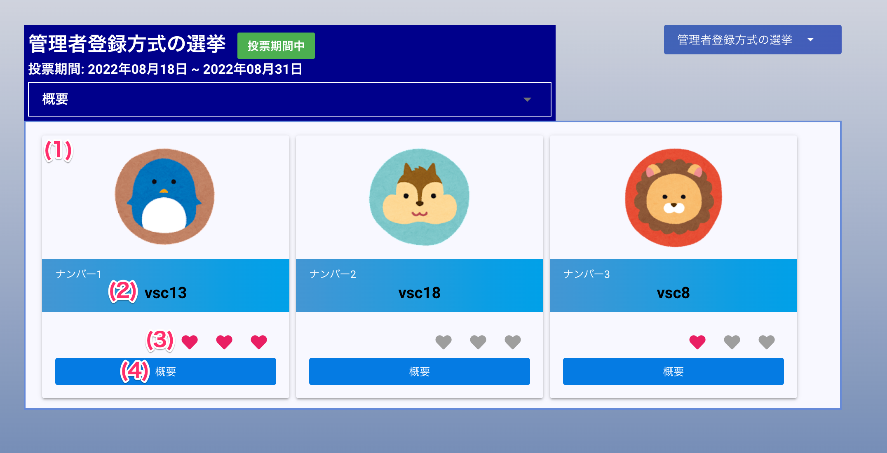

[一般ユーザ向けマニュアル](../../../一般機能/) > [オプション機能](../../../一般機能/#_4) > [MVP](../../../一般機能/#mvp) > [投票する](#)
# 投票する

## 画面

## 項目

|   #   | 項目名       | 必須  | 説明                                                                                                            |
| :---: | :----------- | :---: | :-------------------------------------------------------------------------------------------------------------- |
|   1   | 候補者カード |   -   | 選挙の投票対象の候補者情報を表示します                                                                      |
|   2   | 候補者名     |   -   | 候補者のユーザ名です                                                                |
|   3   | 投票ボタン       |   -   | ハートマークを押すと1人あたり3票まで投票することができます ・左端のハート: 1票 ・中央のハート: 2票 ・右端のハート: 3票 |
|   4   | 概要ボタン   |   -   | ボタンを押すと候補者情報編集画面を開きます                                                                      |

!!! info
    - 1人の候補者に**最大3票**を投票できます
    - 複数の候補者に投票することもできます
        - 例えば、全ての候補者に3票ずつ投票できます

## 使い方
### 投票する
<iframe src="https://scribehow.com/embed/__uaIICvDESHuo-PKC39hMrA" width="640" height="640" allowfullscreen frameborder="0"></iframe>

