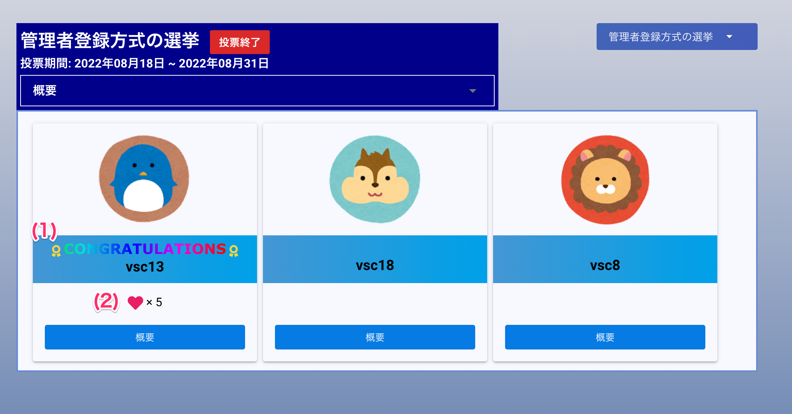

# 選挙結果を確認する

## 画面

## 項目

|   #   | 項目名       | 必須  | 説明                                   |
| :---: | :----------- | :---: | :------------------------------------- |
|   1   | 優勝表示 |   -   | 優勝者名の上部に「**CONGRATULATIONS**」と表示します |
|   2   | 得票数     |   -   | 優勝したユーザの得票数を表示します                   |

!!! info
    - 優勝者以外の得票数は**表示しません**

## 使い方
### 選挙結果を確認する
<iframe src="https://scribehow.com/embed/__5-iw0h4xRFm-_Nb3FUpAow" width="640" height="640" allowfullscreen frameborder="0"></iframe>

