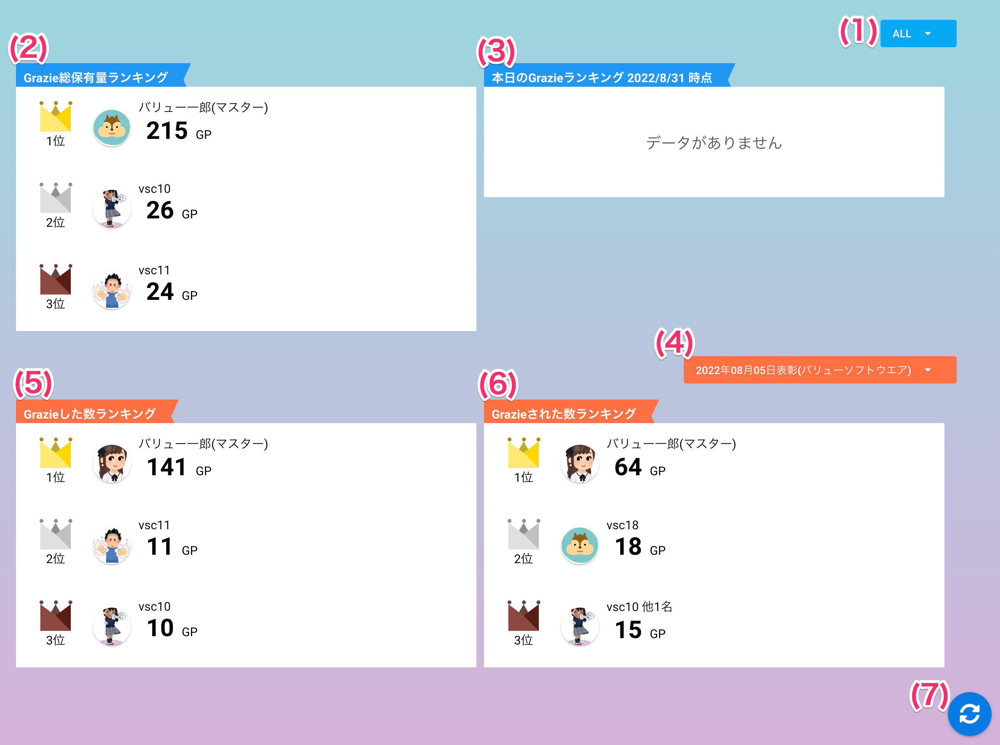

[一般ユーザ向けマニュアル](/一般機能/) > [機能説明](/一般機能/#_2) > [Ranking](/一般機能/#ranking) > [Top](#)
# Ranking Top

## 画面

## 項目
|   #   | 項目名                   | 必須  | 説明                                                                                                                                      |
| :---: | :----------------------- | :---: | :---------------------------------------------------------------------------------------------------------------------------------------- |
|   1   | 事業所切替プルダウン     |   -   | 事業所ごとのランキング表示に切り替えます ALLの場合は会社全体のランキング表示です このプルダウンは**事業所が有効な場合のみ表示されます** |
|   2   | Grazie総保有量ランキング |   -   | サービス利用開始時からのGraziePoint累計数によるランキングです ランキングには順位・ユーザアイコン・ユーザ名・ポイント数を表示します                                                                            |
|   3   | 本日のGrazieランキング   |   -   | 1日のGraziePoint取得数ランキングです                                                                                                      |
|   4   | 表彰結果切替プルダウン   |   -   | 表彰結果ランキングの表示を切り替えます これまで表彰された結果がプルダウン項目に表示されます |
|   5   | Grazieした数ランキング   |   -   | グラッチェをした数によるランキングです                                                                                                                                          |
|   6   | Grazieされた数ランキング |   -   |  グラッチェを受け取った数によるランキングです                                                                                                                                         |
|   7   | 更新ボタン               |   -   | ボタンを押すとランキングを最新情報に更新します                                                                                            |

!!! info
    - 同一順位に複数ユーザがランクインしている場合、**他x名**と表示します
        - ポイント数部分をマウスオーバーすると、同一順位のユーザ名が表示されます

