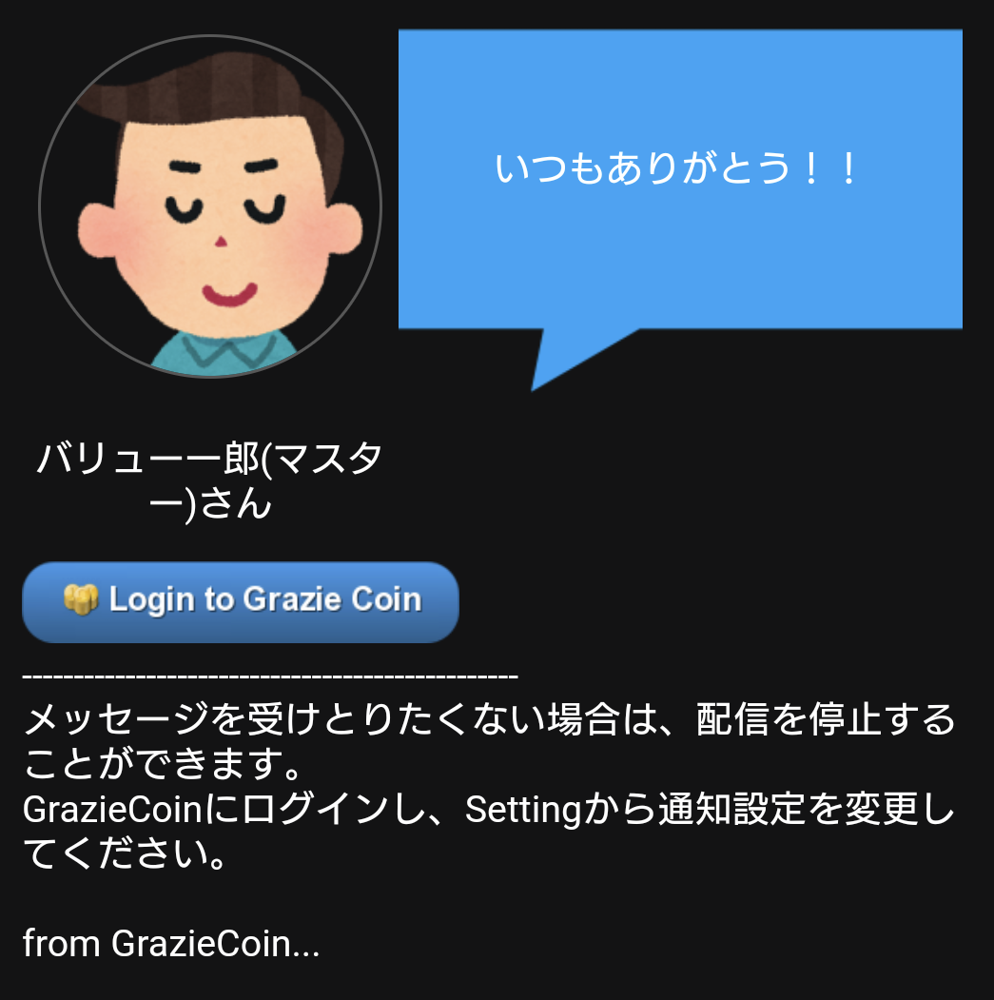

[一般ユーザ向けマニュアル](../../../一般機能/) > [機能説明](../../../一般機能/#_2) > [Setting](../../../一般機能/#setting) > [通知設定](#)
# 通知設定
## 画面

## 項目

|   #   | 項目名                                 | 必須  | 説明                                                                                                                                                               |
| :---: | :------------------------------------- | :---: | :----------------------------------------------------------------------------------------------------------------------------------------------------------------- |
|   1   | 開閉ボタン                             |   -   | ボタンを押すとユーザ情報変更エリアを開閉します                                                                                                                     |
|   2   | グラッチェ受け取りメール通知スイッチ   |   -   | スイッチを有効にすると、グラッチェを受け取った際にメールアドレスへ通知を送ります                                                                                   |
|   3   | コイン受け取りメール通知スイッチ       |   -   | スイッチを有効にすると、コインを受け取った際にメールアドレスへ通知を送ります                                                                                       |
|   4   | グラッチェ受け取りプッシュ通知スイッチ |   -   | スイッチを有効にすると、グラッチェを受け取った際にスマホへプッシュ通知します プッシュ通知を受け取るにはスマホ版グラッチェコインへログインしている必要があります |
|   5   | コイン受け取りプッシュ通知スイッチ     |   -   | スイッチを有効にすると、コインを受け取った際にスマホへプッシュ通知します プッシュ通知を受け取るにはスマホ版グラッチェコインへログインしている必要があります     |
|   6   | お知らせプッシュ通知スイッチ           |   -   | スイッチを有効にすると、アプリから定期的なお知らせをプッシュ通知します                                                                                             |
|   7   | 保存ボタン                             |   -   | ボタンを押すと、変更したスイッチの設定を登録します                                                                                                                 |

## 使い方
### 通知設定を変更する

<iframe src="https://scribehow.com/embed/__r1j6ZbWtQleIL5Zkz79-yw" width="640" height="640" allowfullscreen frameborder="0"></iframe>

### メール通知例

### プッシュ通知例

