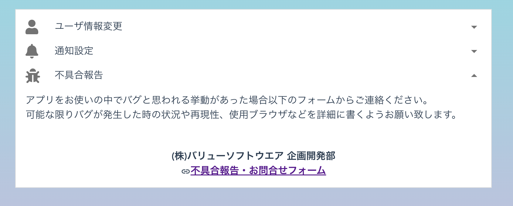

[一般ユーザ向けマニュアル](../../../一般機能/) > [機能説明](../../../一般機能/#_2) > [Setting](../../../一般機能/#setting) > [不具合報告](#)
# 不具合報告

!!! info
    不具合報告・お問合せフォームのリンクから、Googleフォームの画面へ遷移します。 
    大変お手数ですが、不具合が発生した状況や操作手順を記載をお願いいたします。 
    本ページ下部の[リンク](#_4)からもお問合せフォームへ遷移します。

## 画面

### お問合せフォーム画面

## リンク
- [お問合せフォーム](https://forms.gle/UaU5F5KyTpCVkJGH9)
