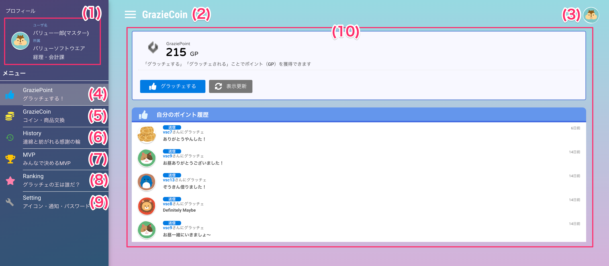
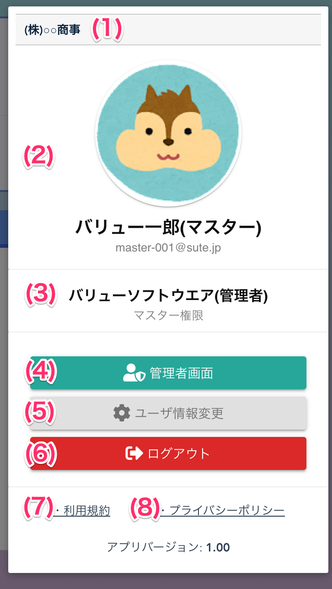

[一般ユーザ向けマニュアル](../../../一般機能/) > [機能説明](../../../一般機能/#_2) > [メニュー](../../../一般機能/#_3) > [画面構成](../../../一般機能/メニュー/menu01)
# メニュー

## 画面

### 項目
|   #   | 項目名                 | 必須  | 説明                                                                                                             |
| :---: | :--------------------- | :---: | :--------------------------------------------------------------------------------------------------------------- |
|   1   | ログインユーザ情報     |   -   | ログインしているユーザのアイコン・名前・所属組織を表示します                                                     |
|   2   | メニュー開閉ボタン     |   -   | ボタンを押すと、メニューの表示・非表示を切り替えます                                                             |
|   3   | :material-new-box: [お知らせボタン]     |   -   | ボタンを押すと、お知らせの表示・非表示を切り替えます  
|   4   | [ログインユーザアイコン](#_4) |   -   | アイコンを押すと、ユーザ情報・ユーザ情報変更ボタン・ログアウトボタンを表示します                                 |
|   5   | [Grazie Point](../GraziePoint/grazie01.md)           |   -   | メニューを押すと、Grazie Point Top画面に遷移します                                                               |
|   6   | [Grazie Coin](../GrazieCoin/coin01.md)            |   -   | メニューを押すと、Grazie Coin Top画面に遷移します                                                                |
|   7   | [History](../History/history01.md)                |   -   | メニューを押すと、History ポイント履歴画面に遷移します                                                           |
|   8   | [MVP](../Mvp/mvp11.md)                    |   -   | ・メニューを押すと、MVP 選挙一覧画面に遷移します ・**オプション機能が有効な場合のみ、メニューに表示されます** |
|   9   | [Ranking](../Ranking/ranking01.md)                |   -   | メニューを押すと、Ranking Top画面に遷移します                                                                    |
|  10   | [Setting](../Setting/setting01.md)                |   -   | メニューを押すと、Setting画面に遷移します                                                                        |
|  11   | :material-new-box: オンラインマニュアル                |   -   | メニューを押すと、オンラインマニュアルに遷移します                                                                        |
|  12   | :material-new-box: お問い合わせ・不具合報告                |   -   | メニューを押すと、お問い合わせ・不具合報告フォームに遷移します                                                                        |
|  13   | コンテンツ領域         |   -   | メニューで選択された機能を表示する領域です                                                                       |

## ログインユーザアイコン押下時

### 項目
|   #   | 項目名                     | 必須  | 説明                                                                                                             |
| :---: | :------------------------- | :---: | :--------------------------------------------------------------------------------------------------------------- |
|   1   | 会社名                     |   -   | ユーザの所属する会社名を表示します                                                     |
|   2   | ログインユーザ情報         |   -   | ユーザの設定しているサムネイル画像・ユーザ名・メールアドレスを表示します                                                             |
|   3   | ユーザ権限                 |   -   | ユーザの権限を表示します                                 |
|   4   | 管理者コンソール切替ボタン |   -   | メニューを押すと、管理者コンソール画面へ遷移します このボタンは**管理者権限を持つユーザのみ表示**されます                                                               |
|   5   | [ユーザ情報変更ボタン](../Setting/setting01.md)       |   -   | ボタンを押すと、メニューのSetting画面へ遷移します                                                                |
|   6   | ログアウトボタン           |   -   | ボタンを押すと、サービスからログアウトします                                                          |
|   7   | 利用規約リンク             |   -   |  リンクを押すとグラッチェコインの利用規約を表示します　|
|   8   | プライバシーポリシーリンク |   -   | リンクを押すとグラッチェコインのプライバシーポリシーを表示します　                                                                    |

