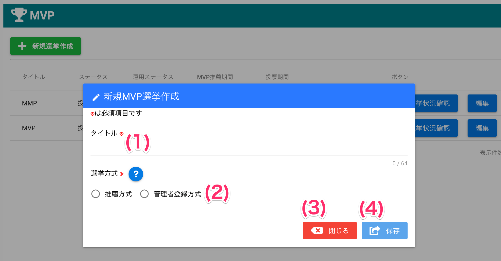
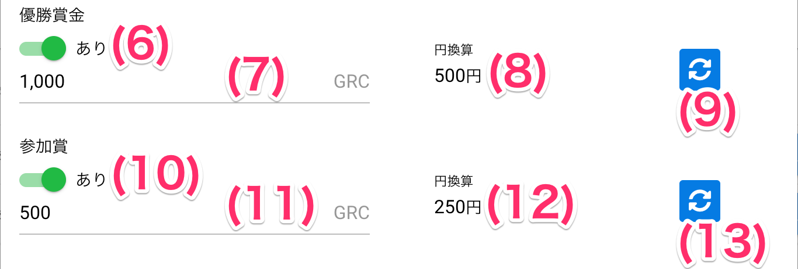
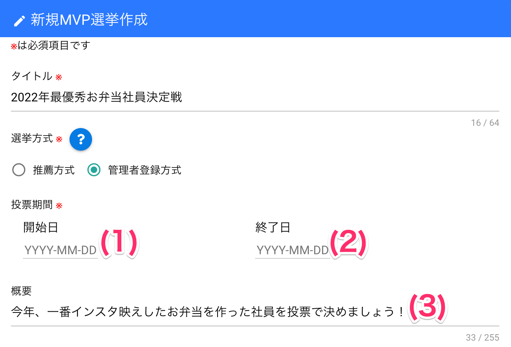
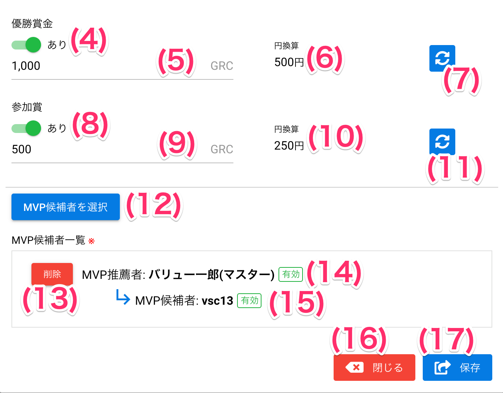

# 新規選挙作成

## 選挙一覧画面

### 項目

|   #   | 項目名               | 必須  | 説明                                     |
| :---: | :------------------- | :---: | :--------------------------------------- |
|   1   | 新規選挙作成ボタン   |   -   | ボタンを押すと新規選挙作成画面を開きます |
|   2   | 選挙一覧             |   -   | 選挙情報を一覧表示します                 |
|   3   | 選挙状況確認ボタン   |   -   | ボタンを押すと選挙状況確認画面を開きます |
|   4   | 編集ボタン           |   -   | ボタンを押すと選挙編集画面を開きます     |
|   5   | 削除ボタン           |   -   | ボタンを押すと選挙を削除します           |
|   6   | 有効・無効切替ボタン |   -   | ボタンを押すと選挙の状態を切り替えます   |

## 新規選挙作成画面（選挙方式選択前）

### 項目

|   #   | 項目名               | 必須  | 説明                                                                                                                                                                                                    |
| :---: | :------------------- | :---: | :------------------------------------------------------------------------------------------------------------------------------------------------------------------------------------------------------ |
|   1   | タイトル             |   ○   | ボタンを押すと新規選挙作成画面を開きます                                                                                                                                                                |
|   2   | 選挙方式選択スイッチ |   ○   | 選挙方式を選択します ・推薦方式選択時: **推薦あり**方式になります ・管理者登録方式選択時: **推薦なし**方式になります 選挙方式については[こちら](../オプション機能/option02.md)をご参照ください |
|   3   | 閉じるボタン         |   -   | ボタンを押すと画面を閉じます                                                                                                                                                                            |
|   4   | 保存ボタン           |   -   | ボタンを押すと入力内容で登録します                                                                                                                                                                      |

## 新規選挙作成画面（推薦**あり**方式選択時）
!!! info
    選択した選挙方式によって画面の入力内容が異なります

### 項目

|   #   | 項目名                     | 必須  | 説明                                                                                                                           |
| :---: | :------------------------- | :---: | :----------------------------------------------------------------------------------------------------------------------------- |
|   1   | MVP推薦期間開始日          |   ○   | 推薦者が候補者を選択できる期間の開始日を入力します                                                                             |
|   2   | MVP推薦期間終了日          |   ○   | 推薦者が候補者を選択できる期間の終了日を入力します                                                                             |
|   3   | 投票期間開始日             |   ○   | 候補者に投票できる期間の開始日を入力します                                                                                     |
|   4   | 投票期間終了日             |   ○   | 候補者に投票できる期間の終了日を入力します                                                                                     |
|   5   | 概要                       |   -   | 投票者に選挙の趣旨が伝えたい場合など、必要に応じて管理者からのコメントを入力します。                                           |
|   6   | 優勝賞金あり・なしスイッチ |   ○   | 「あり」を選択すると、一番投票が多かった候補者に賞金を授与することができます                                                   |
|   7   | 優勝賞金                   |   -   | 一番投票が多かった候補者に授与するコインの枚数を入力します。 優勝賞金なしの場合は、入力不要です                             |
|   8   | 円換算                     |   -   | レートオプションが有効な場合、優勝賞金をレート値で換算した金額を表示します。 **レートオプションが無効な場合は表示しません**   |
|   9   | 更新ボタン                 |   -   | 最新のレート値を取得し換算金額を更新します。 **レートオプションが無効な場合は表示しません**                                   |
|  10   | 参加賞あり・なしスイッチ   |   ○   | 「あり」を選択すると、選挙の候補者に賞金を授与することができます 候補者となるだけで参加賞の授与対象になります               |
|  11   | 参加賞賞金                 |   -   | 参加賞として授与するコインの枚数を入力します。 参加賞なしの場合は、入力不要です                                             |
|  12   | 円換算                     |   -   | レートオプションが有効な場合、参加賞賞金をレート値で換算した金額を表示します。 **レートオプションが無効な場合は表示しません** |
|  13   | 更新ボタン                 |   -   | 最新のレート値を取得し換算金額を更新します。 **レートオプションが無効な場合は表示しません**                                   |
|  14   | 推薦者選択ボタン           |   -   | ボタンを押すと候補者を推薦するユーザ（推薦者）を選択する画面を開きます                                                         |
|  15   | 推薦者削除ボタン           |   -   | ボタンを押すと推薦者として指定されたユーザを、推薦者から削除します                                                             |
|  16   | 推薦者情報                 |   -   | 推薦者として指定されたユーザの名前と、ユーザの状態（有効または無効）を表示します                                               |
|  17   | 候補者情報                 |   -   | 候補者として指定されたユーザの名前と、ユーザの状態（有効または無効）を表示します                                               |
|  18   | 閉じるボタン               |   -   | ボタンを押すと画面を閉じます                                                                                                   |
|  19   | 保存ボタン                 |   -   | ボタンを押すと入力内容で登録します                                                                                             |

## 新規選挙作成画面（推薦**なし**方式選択時）

### 項目
|   #   | 項目名                     | 必須  | 説明                                                                                                                           |
| :---: | :------------------------- | :---: | :----------------------------------------------------------------------------------------------------------------------------- |
|   1   | 投票期間開始日             |   ○   | 候補者に投票できる期間の開始日を入力します                                                                                     |
|   2   | 投票期間終了日             |   ○   | 候補者に投票できる期間の終了日を入力します                                                                                     |
|   3   | 概要                       |   -   | 投票者に選挙の趣旨が伝えたい場合など、必要に応じて管理者からのコメントを入力します。                                           |
|   4   | 優勝賞金あり・なしスイッチ |   ○   | 「あり」を選択すると、一番投票が多かった候補者に賞金を授与することができます                                                   |
|   5   | 優勝賞金                   |   -   | 一番投票が多かった候補者に授与するコインの枚数を入力します。 優勝賞金なしの場合は、入力不要です                             |
|   6   | 円換算                     |   -   | レートオプションが有効な場合、優勝賞金をレート値で換算した金額を表示します。 **レートオプションが無効な場合は表示しません**   |
|   7   | 更新ボタン                 |   -   | 最新のレート値を取得し換算金額を更新します。 **レートオプションが無効な場合は表示しません**                                   |
|   8   | 参加賞あり・なしスイッチ   |   ○   | 「あり」を選択すると、選挙の候補者に賞金を授与することができます 候補者となるだけで参加賞の授与対象になります               |
|   9   | 参加賞賞金                 |   -   | 参加賞として授与するコインの枚数を入力します。 参加賞なしの場合は、入力不要です                                             |
|  10   | 円換算                     |   -   | レートオプションが有効な場合、参加賞賞金をレート値で換算した金額を表示します。 **レートオプションが無効な場合は表示しません** |
|  11   | 更新ボタン                 |   -   | 最新のレート値を取得し換算金額を更新します。 **レートオプションが無効な場合は表示しません**                                   |
|  12   | MVP候補者選択ボタン        |   -   | ボタンを押すと候補者を推薦するユーザ（推薦者）を選択する画面を開きます                                                         |
|  13   | MVP候補者削除ボタン        |   -   | ボタンを押すと推薦者として指定されたユーザを、推薦者から削除します                                                             |
|  14   | 推薦者情報                 |   -   | 推薦者として指定されたユーザの名前と、ユーザの状態（有効または無効）を表示します                                               |
|  15   | 候補者情報                 |   -   | 候補者として指定されたユーザの名前と、ユーザの状態（有効または無効）を表示します                                               |
|  16   | 閉じるボタン               |   -   | ボタンを押すと画面を閉じます                                                                                                   |
|  17   | 保存ボタン                 |   -   | ボタンを押すと入力内容で登録します                                                                                             |

## 使い方

### 新規選挙を作成する（推薦あり方式）
<iframe src="https://scribehow.com/embed/__PrlldR-IQtKvcXUYsAf92Q" width="640" height="640" allowfullscreen frameborder="0"></iframe>

### 新規選挙を作成する（推薦なし方式）

<iframe src="https://scribehow.com/embed/__DM1TSSHSRKybnNofaSaYNg" width="640" height="640" allowfullscreen frameborder="0"></iframe>

