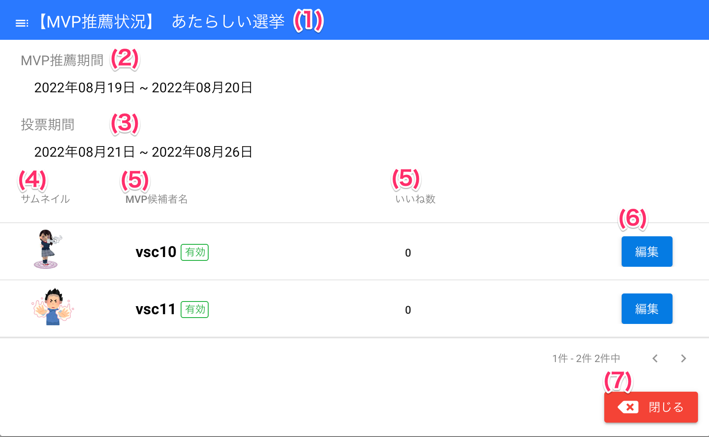
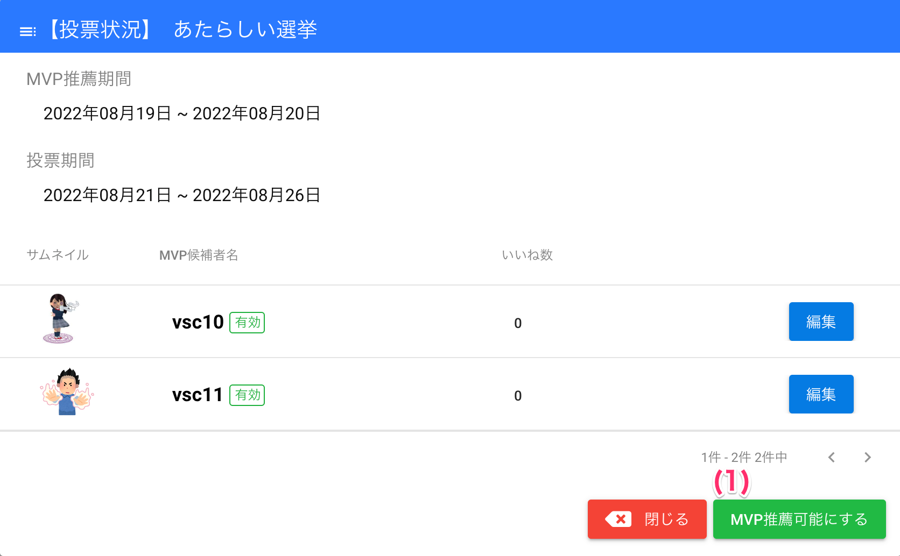
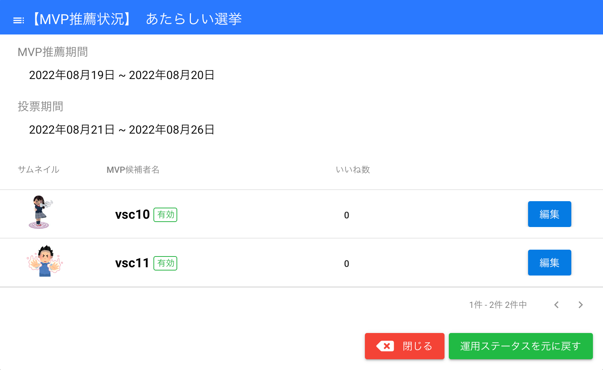
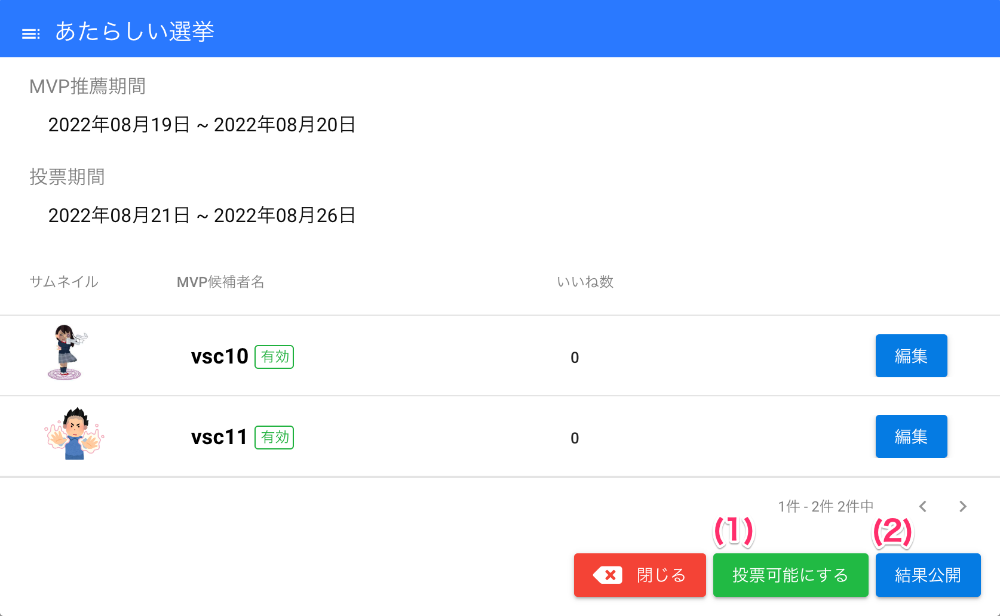
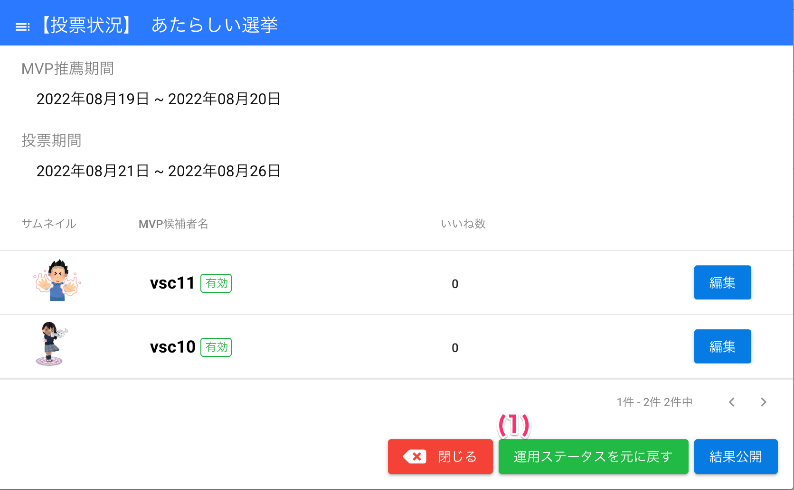
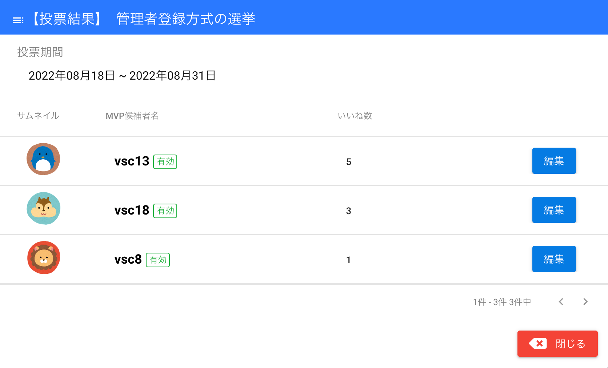

[管理者ユーザマニュアル](../../../管理者機能/) > [機能説明（オプション）](../../../管理者機能/#_29) > [MVP](../../../管理者機能/Mvp/) > [選挙状況の確認](#)
# 選挙状況の確認

管理者は選挙状況確認画面で、

- 選挙状況の確認
- 手動でステータスの変更
- 候補者の変更

を行うことができます。 
以下の表では、ステータスごとに選挙状況確認画面で行える操作をまとめています。

| 選挙ステータス         | 内容                 | 行える操作                               |
| ---------------------- | -------------------- | ---------------------------------------- |
| 推薦期間前             | なし                 |                                          |
| 推薦期間中             | 推薦されているユーザ | 推薦者の変更                             |
| 投票期間前             | 推薦されているユーザ | 推薦期間へのステータスの変更             |
| 投票期間中             | ユーザごとの得票数   |                                          |
| 投票終了（結果公開前） | ユーザごとの得票数   | 投票期間へのステータスの変更、結果の公開 |
| 投票終了（結果公開後） | ユーザごとの得票数   |                                          |

## ステータスごとの選挙状況確認画面
### 推薦期間中

#### 項目
|   #   | 項目名                 | 必須  | 説明                                                           |
| :---: | :--------------------- | :---: | :------------------------------------------------------------- |
|   1   | 選挙タイトル           |   -   | 選挙のタイトルです                                             |
|   2   | 推薦期間               |   -   | 選挙の推薦期間です                                             |
|   3   | 投票期間               |   -   | 選挙の投票期間です                                             |
|   4   | 候補者者サムネイル画像 |   -   | 候補者のサムネイル画像です                                     |
|   5   | 候補者者名             |   -   | 候補者のユーザ名と有効または無効の状態を表示しますhyoujisimasu |
|   6   | 編集ボタン             |   -   | ボタンを押すと候補者変更画面を開きます                         |
|   7   | 閉じるボタン           |   -   | ボタンを押すと画面を閉じます                                   |

### 投票期間前・投票期間中

#### 項目
|   #   | 項目名                  | 必須  | 説明                                                                                                   |
| :---: | :---------------------- | :---: | :----------------------------------------------------------------------------------------------------- |
|   1   | MVP推薦可能にするボタン |   -   | ボタンを押すとステータスを「**推薦期間中**」に変更します 一般ユーザに**選挙が表示されなくなります** |

### 投票終了（結果公開前） → 投票可能にステータス変更

#### 項目
|   #   | 項目名               | 必須  | 説明                                                       |
| :---: | :------------------- | :---: | :--------------------------------------------------------- |
|   1   | 運用ステータスを元に戻すボタン |   -   | ボタンを押すとステータスを「**投票期間中**」に変更します   |

### 投票終了（結果公開前）

#### 項目
|   #   | 項目名               | 必須  | 説明                                                       |
| :---: | :------------------- | :---: | :--------------------------------------------------------- |
|   1   | 投票可能にするボタン |   -   | ボタンを押すとステータスを「**投票期間中**」に変更します   |
|   2   | 結果公開ボタン       |   -   | ボタンを押すと投票結果を全ユーザが閲覧できるよう公開します |

### 投票終了（結果公開前） → 投票可能にステータス変更

#### 項目
|   #   | 項目名               | 必須  | 説明                                                       |
| :---: | :------------------- | :---: | :--------------------------------------------------------- |
|   1   | 運用ステータスを元に戻すボタン |   -   | ボタンを押すとステータスを「**投票終了（結果公開前）**」に変更します   |

### 投票終了（結果公開後）

!!! warning
    投票結果を公開後は、ステータスを変更することはできません

## 使い方

### 選挙のステータスを推薦可能に変更する
!!! info
    選挙のステータスが**投票期間前**または**投票期間中**の場合、一時的に推薦可能なステータスに変更できます
<iframe src="https://scribehow.com/embed/__SojmEaWSRBWl4vkTdlaSmQ" width="640" height="640" allowfullscreen frameborder="0"></iframe>

### 選挙のステータスを投票可能に変更する
!!! info
    選挙のステータスが**投票終了（結果公開前）**の場合、一時的に投票可能なステータスに変更できます

<iframe src="https://scribehow.com/embed/__Y3b43wcGQpmEiR-WPxBU3Q" width="640" height="640" allowfullscreen frameborder="0"></iframe>

### 選挙のステータスを元に戻す
!!! warning
    上記手順でステータスを変更した場合、必ず以下の手順で元のステータスに戻す必要があります

<iframe src="https://scribehow.com/embed/yuan__I7rhtViPT_KcxJ9KpYPQow" width="640" height="640" allowfullscreen frameborder="0"></iframe>

### 選挙結果を公開する
!!! info
    - 投票結果は管理者が手動で公開の操作をすることで、一般ユーザが結果を閲覧できるようになります
    - **選挙に賞金が設定されている場合、結果公開時に優勝者またはそれ以外の候補者に賞金を自動で授与します**

<iframe src="https://scribehow.com/embed/__ARvvyMzlTwig5U7EWSUFUA" width="640" height="640" allowfullscreen frameborder="0"></iframe>
