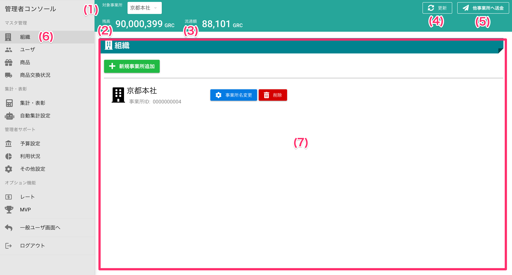
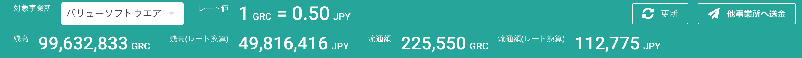

[管理者ユーザマニュアル](../../../管理者機能/) > [機能説明](../../../管理者機能/#_16) > [管理者コンソール](../../../管理者機能/#_17) > [メニュー](#)
# 管理者コンソールメニュー

## 画面

## 画面項目

|   #   | 項目名         | 必須  | 説明                                                                            |
| :---: | :------------- | :---: | :------------------------------------------------------------------------------ |
|   1   | [事業所](#_6)         |   -   | 現在表示中の事業所の名称です。 事業所を無効にしている場合は表示されません。 |
|   2   | 残高           |   -   | 現在表示中の会社または事業所が保有するコインの残高です。                        |
|   3   | 流通額         |   -   | 現在表示中の会社または事業所に所属するユーザが保有するコインの数量です。        |
|   4   | 更新ボタン     |   -   | 残高、流通額の表示を最新化します。                                              |
|   5   | [他事業所ボタン](#_7) |   -   | 現在表示中の事業所のコインを別の事業所を送金する画面を開きます。                |
|   6   | [メニュー](#_8)       |   -   | 表示中に管理者機能がハイライトされます。                                        |
|   7   | 機能表示領域   |   -   | メニューでハイライトされている機能を表示する領域です。                          |

### オプション有効時

!!! info
    レートオプション有効時には、画面項目が増えます

## 使い方

### 事業所の切り替え

!!! info
    事業所の切り替えはマスター管理者権限のユーザのみが行えます

<iframe src="https://scribehow.com/embed/__lip4Liu8R4C4x86ZWGe_TA" width="640" height="640" allowfullscreen frameborder="0"></iframe>

### 他事業所へ送金

<iframe src="https://scribehow.com/embed/__quyLyQY8TwGTgqhopxXAHQ" width="640" height="640" allowfullscreen frameborder="0"></iframe>

### メニュー選択

<iframe src="https://scribehow.com/embed/__my0F8I_QTpeWilQ0P7bKig" width="640" height="640" allowfullscreen frameborder="0"></iframe>
