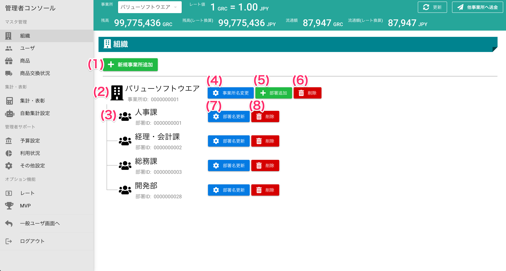
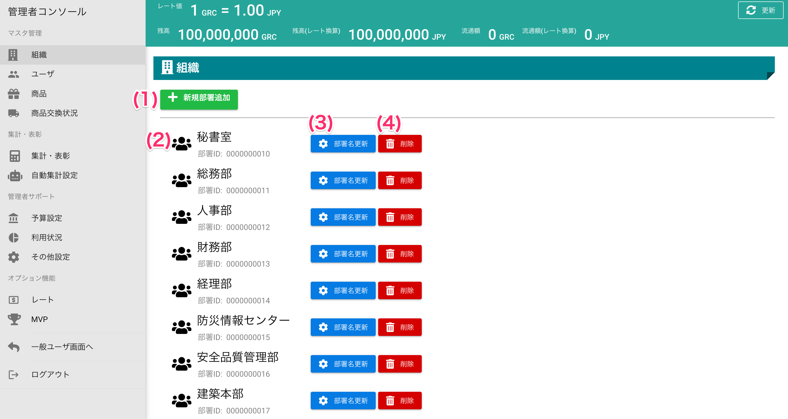

[管理者ユーザマニュアル](./index.md#) > [機能説明](./index.md#_16) > [組織](./index.md#_18) > [組織管理](#)
# 組織

## 画面(事業所有効時)
!!! info
    **事業所を有効**にする設定でご契約されている場合、以下の画面で表示されます。

## 画面項目(事業所有効時)

|   #   | 項目名               | 必須  | 説明                                   |
| :---: | :------------------- | :---: | :------------------------------------- |
|   1   | [新規事業所追加ボタン](#_7) |   -   | 新しく事業所を追加する画面を開きます。 |
|   2   | 事業所名             |   -   | 事業所名と事業所IDを表示します。       |
|   3   | 部署名               |   -   | 部署名と部署IDを表示します。           |
|   4   | [事業所名変更ボタン](#_8)   |   -   | 事業所名を変更する画面を開きます。     |
|   5   | [新規部署追加ボタン](#_9)   |   -   | 新しく部署を追加する画面を開きます。   |
|   6   | [削除ボタン(事業所)](#_10)   |   -   | 事業所を削除します。                   |
|   7   | [部署名変更ボタン](#_11)     |   -   | 部署名を変更する画面を開きます。       |
|   8   | [削除ボタン(部署)](#_12)     |   -   | 部署を削除します。                     |

## 画面(事業所無効、部署有効設定時)
!!! info
    **事業所を無効・部署を有効**にする設定でご契約されている場合、以下の画面で表示されます。

## 画面項目(事業所無効、部署有効設定時)

|   #   | 項目名             | 必須  | 説明                                 |
| :---: | :----------------- | :---: | :----------------------------------- |
|   1   | [新規部署追加ボタン](#_9) |   -   | 新しく部署を追加する画面を開きます。 |
|   2   | 部署名             |   -   | 部署名と部署IDを表示します。         |
|   3   | [部署名変更ボタン](#_11)   |   -   | 部署名を変更する画面を開きます。     |
|   4   | [削除ボタン(部署)](#_12)   |   -   | 部署を削除します。                   |

## 使い方

### 新規事業所追加

<iframe src="https://scribehow.com/embed/__7o5LuQdyTt-L7rfSD8_h7g" width="640" height="640" allowfullscreen frameborder="0"></iframe>

### 事業署名変更

<iframe src="https://scribehow.com/embed/__hl-t22K5SiyAf5jRt1i83A" width="640" height="640" allowfullscreen frameborder="0"></iframe>

### 部署追加

<iframe src="https://scribehow.com/embed/__x3kDpXJWQ4yNNNWglQGeMw" width="640" height="640" allowfullscreen frameborder="0"></iframe>

### 事業署削除

!!! warning
    事業所を削除すると、**商品と集計結果が全て削除され、戻すことができなくなります**。 
    削除する事業所に所属していたユーザは無所属となるため、削除する事業所にユーザが存在する場合は、別事業所への所属変更を行なってください。

<iframe src="https://scribehow.com/embed/__NT6cdbZdRgWIbb5XLbsm1g" width="640" height="640" allowfullscreen frameborder="0"></iframe>

### 部署名変更

<iframe src="https://scribehow.com/embed/__6RawL58NQCCJ-_ZzRTex3w" width="640" height="640" allowfullscreen frameborder="0"></iframe>

### 部署削除
!!! warning
    削除する部署に所属していたユーザは無所属となるため、新しい組織に所属させてください。

<iframe src="https://scribehow.com/embed/__3d1mpoMETuyQMInVibNV8A" width="640" height="640" allowfullscreen frameborder="0"></iframe>

