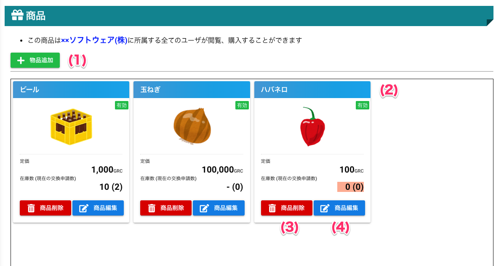

# 商品

## 画面
### 商品一覧

### 商品登録

## 画面項目
### 商品一覧
|   #   | 項目名         | 必須  | 説明                                                                            |
| :---: | :------------- | :---: | :------------------------------------------------------------------------------ |
|   1   | 物品追加ボタン |   -   | 現在表示中の事業所の名称です。 事業所を無効にしている場合は表示されません。 |
|   2   | 商品情報       |   -   | 商品の情報（名称・商品画像・価格）を表示します                                  |
|   3   | 商品削除ボタン |   -   | 商品を削除します。                                                              |
|   4   | 商品編集ボタン |   -   | 商品情報を変更する画面を開きます。                                              |

### 商品登録
|   #   | 項目名             | 必須  | 説明                                                            |
| :---: | :----------------- | :---: | :-------------------------------------------------------------- |
|   5   | 商品画像選択ボタン |   -   | 商品がわかる画像を指定します。                                  |
|   6   | 商品名             |   ○   | 商品名を入力します。                                            |
|   7   | 金額               |   ○   | 商品のコイン価格を入力します。                                  |
|   8   | 表示優先度         |   -   | 一般ユーザが商品交換する際に、表示する優先度を3段階で決めます。 |
|   9   | 閉じるボタン       |   -   | 登録を中止して、画面を閉じます。                                |
|  10   | 保存ボタン         |   -   | 商品情報を登録します。                                          |

## 使い方

### 商品登録

<iframe src="https://scribehow.com/embed/__xVHqTH6iTsSim-gSHY68LA" width="640" height="640" allowfullscreen frameborder="0"></iframe>

### 商品編集

<iframe src="https://scribehow.com/embed/__RgngFh7yQeGRJZJKTTO_vg" width="640" height="640" allowfullscreen frameborder="0"></iframe>

!!! info
    価格の変更や商品在庫がなくなった場合、商品を無効化することで一時的にユーザが閲覧する商品一覧から非表示にできます。

### 商品削除
!!! warning
    商品を削除すると元に戻すことができません。 
    一時的にユーザに見せなくしたい場合は、商品編集で商品を無効化することをおすすめします。

<iframe src="https://scribehow.com/embed/Workflow__alsQmC-JQX2TAzbjy75fQg" width="640" height="640" allowfullscreen frameborder="0"></iframe>

