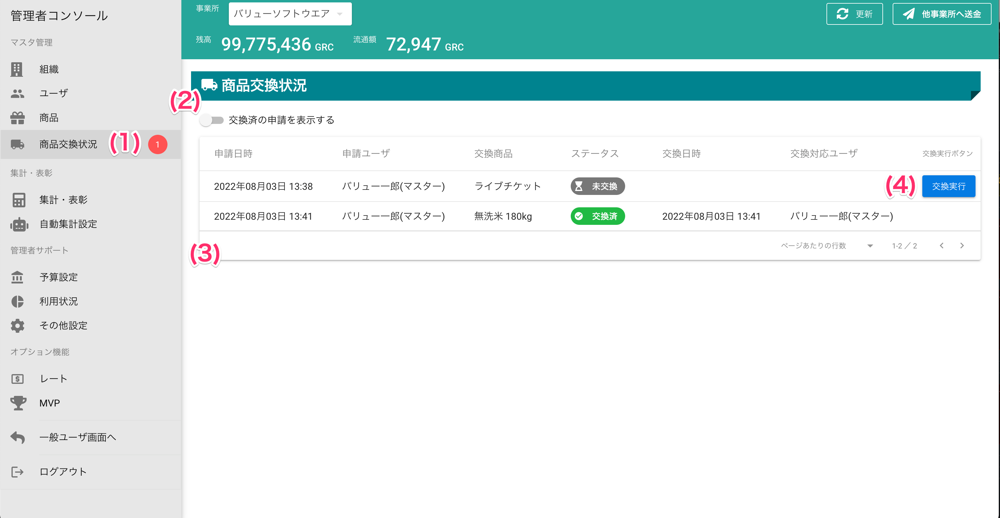

# 商品交換状況

!!! tip
    本機能はユーザからの商品交換の状況を管理するための画面です。
    「いつ」「誰が」「何を」交換したかを確認するためにお使いください。

### 商品交換の流れ

1. ユーザが商品を交換します
2. システムから管理者ユーザへ「商品交換」が実行されたメールが送信されます
    - これを「**商品交換申請**」 といいます
3. 管理者ユーザは、管理者コンソール上で未交換の**商品交換申請**を確認します
4. 管理者ユーザから**商品交換申請**をしたユーザに商品を渡します
5. 管理者ユーザは該当の**商品交換申請**を「交換済み」にします

## 画面

## 画面項目
|   #   | 項目名                   | 必須  | 説明                                                                                          |
| :---: | :----------------------- | :---: | :-------------------------------------------------------------------------------------------- |
|   1   | 未交換申請数             |   -   | 交換が実行されていない申請の数です。                                                          |
|   2   | 交換済み申請表示スイッチ |   -   | スイッチONの状態にすると、交換済みの申請が一覧に表示されます。 初期状態はスイッチOFFです。 |
|   3   | 交換申請一覧             |   -   | 申請を一覧表示します。                                                                        |
|       | 申請日時                 |   -   | ユーザが商品交換を行なった日時です。                                                          |
|       | 申請ユーザ               |   -   | 商品交換をしたユーザの名前です。                                                              |
|       | 交換商品                 |   -   | 交換申請された商品の名前です。                                                                |
|       | ステータス               |   -   | 申請の状況を表示します。                                                                   |
|       | 交換日時                 |   -   | **交換実行**ボタンを押した日時です。                                                          |
|       | 交換対応ユーザ           |   -   | 交換実行ボタンを押したユーザの名前です。                                                      |
|   4   | 交換実行ボタンボタン     |   -   | ボタンを押すと、交換申請のステータスが**交換済**に変わります。                                |

## 使い方
### 商品交換申請を交換済みにする

<iframe src="https://scribehow.com/embed/__yvL5lsYSTsebWkjL41CX-g" width="640" height="640" allowfullscreen frameborder="0"></iframe>
