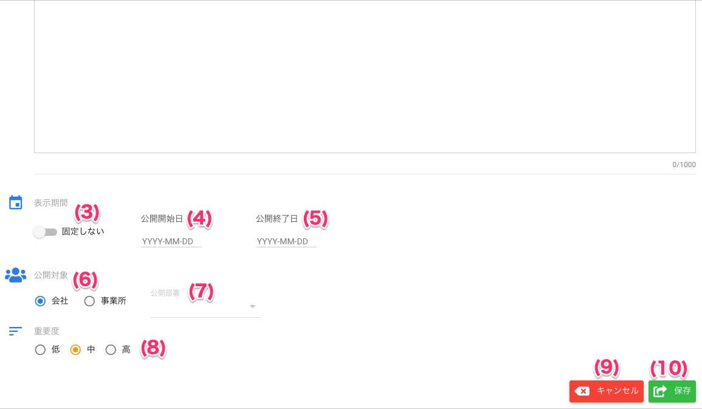

[管理者ユーザマニュアル](../../../管理者機能/) > [機能説明](../../../管理者機能/#_16) > [お知らせ一覧](announce01.md) > [お知らせ登録](#)
# お知らせ追加画面

## ❓お知らせ追加画面とは

「お知らせ追加画面」は、管理者が新しいお知らせを作成・登録するための入力ダイアログです。タイトルや本文、公開期間、公開対象、重要度などを柔軟に設定できます。

### 主な機能
- お知らせタイトル・本文の入力
- お知らせの固定表示設定
- 公開期間（開始日・終了日）の設定
- 公開対象（会社・事業所・部署）の選択
- 重要度（低・中・高）の選択
- キャンセル・保存ボタン

### [<u>本文リッチテキストエディタの使い方</u>](announce04.md)
本文入力欄では、リッチテキスト編集が可能です。
> ※リッチテキストの装飾はツールバーから選択できます。

## 画面

（クリックすると拡大します）

## 画面項目
|   #   | 項目名                | 必須  | 説明                                                                 |
| :---: | :-------------------- | :---: | :------------------------------------------------------------------- |
|  1    | タイトル              |  ○    | お知らせのタイトルを1～64文字で入力します                            |
|  2    | 本文                  |  ○    | お知らせの本文を1～1000文字で入力します（リッチテキスト対応）        |
|  3    | 固定フラグ            |  -    | お知らせを一覧画面で上部に固定表示するか選択します                  |
|  4    | 公開開始日            |  -    | お知らせの公開開始日を選択します                                    |
|  5    | 公開終了日            |  -    | お知らせの公開終了日を選択します                                    |
|  6    | 公開対象              |  ○    | 会社・事業所・部署単位で公開範囲を選択します                        |
|  7    | 公開部署              |  -    | 公開対象が部署の場合に選択必須                                      |
|  8    | 重要度                |  ○    | 低・中・高から選択します                                            |
|  9    | キャンセルボタン      |  -    | 入力内容を破棄してダイアログを閉じます                              |
| 10    | 保存ボタン            |  ○    | 入力内容を保存し、お知らせを追加します                              |

## 使い方
### お知らせを追加する
<iframe src="https://scribehow.com/embed/__4sS8ABvjTreCRKDuiO4EOw" width="640" height="640" allowfullscreen frameborder="0"></iframe>

---

> ※タイトル・本文は必須です。未入力や文字数超過の場合はエラーが表示されます。 
> ※保存後は自動的にお知らせ一覧が更新されます。
