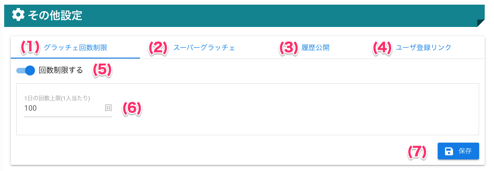

# グラッチェ回数制限

## 画面

（クリックすると拡大します）

## 画面項目
|   #   | 項目名                 | 必須  | 説明                                                     |
| :---: | :--------------------- | :---: | :------------------------------------------------------- |
|   1   | グラッチェ回数制限タブ |   -   | グラッチェ回数制限を設定するタブです                     |
|   2   | スーパーグラッチェタブ |   -   | スーパーグラッチェを設定するタブです                     |
|   3   | ユーザ登録リンクタブ   |   -   | ユーザ登録リンクを設定するタブです                       |
|   4   | 回数制限スイッチ       |   -   | グラッチェの回数制限を有効・無効を切り替えるスイッチです |
|   5   | グラッチェ上限回数     |   -   | ユーザが1日にできるグラッチェの回数上限を設定します      |
|   6   | 保存ボタン             |   -   | ボタンを押すと設定を保存します                           |

## 使い方
### 回数制限を設定する

<iframe src="https://scribehow.com/embed/__ZVmQEtgOR12DpARigo_Ecw" width="640" height="640" allowfullscreen frameborder="0"></iframe>

### 回数制限を無効にする

<iframe src="https://scribehow.com/embed/__IY8XyY8ARMG8_BuHanZgXA" width="640" height="640" allowfullscreen frameborder="0"></iframe>
