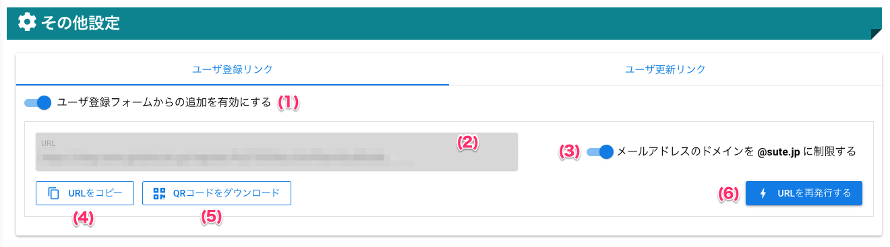
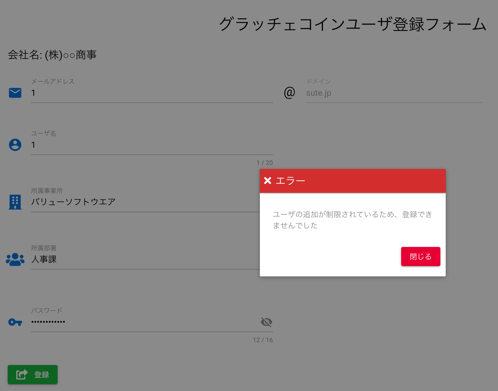

# ユーザ登録フォーム

## 画面

（クリックすると拡大します）

## 画面項目
|   #   | 項目名                             | 必須  | 説明                                                                                                                               |
| :---: | :--------------------------------- | :---: | :--------------------------------------------------------------------------------------------------------------------------------- |
|   1   | グラッチェ回数制限タブ             |   -   | グラッチェ回数制限を設定するタブです                                                                                               |
|   2   | スーパーグラッチェタブ             |   -   | スーパーグラッチェを設定するタブです                                                                                               |
|   3   | ユーザ登録リンクタブ               |   -   | ユーザ登録リンクを設定するタブです                                                                                                 |
|   4   | ユーザ登録フォーム有効スイッチ     |   -   | ユーザ登録フォームからのユーザ登録の有効・無効を切り替えるスイッチです                                                             |
|   5   | ユーザ登録URL                      |   -   | ユーザ登録フォームのURLを表示します                                                                                                |
|   6   | メールアドレスドメイン制限スイッチ |   -   | ユーザ登録フォームから登録するユーザのメールアドレスを、マスター管理者と同じドメインとする制限の有効・無効を切り替えるスイッチです |
|   7   | URLをコピーボタン                  |   -   | ボタンを押すとユーザ登録URLをクリップボードにコピーします                                                                          |
|   8   | URLを再発行するボタン              |   -   | ボタンを押すとユーザ登録URLをランダムに生成しなおします                                                                            |

## 使い方
### ユーザ登録フォームを有効にする
<iframe src="https://scribehow.com/embed/__Aspc7nCESL6mjfuKrfBEcg" width="640" height="640" allowfullscreen frameborder="0"></iframe>

### ユーザ登録フォームを無効にする

<iframe src="https://scribehow.com/embed/__q4MKbL0HTLO-2mkm8P0Aeg" width="640" height="640" allowfullscreen frameborder="0"></iframe>

!!! info
    ユーザ登録フォームが無効な場合、ユーザを登録しようとすると以下のエラーが表示されます。

