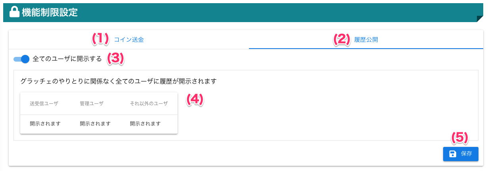

# 履歴公開設定

!!! info
    - ポイント/コイン履歴を一般ユーザーに公開/非公開の設定をすることができます
    - 履歴公開設定は一般ユーザーのみ適用されます
    - 「全てのユーザーに開示する」
        - 全ての履歴を一般ユーザーに公開します
    - 「送受信ユーザーのみ開示する」
        - やりとりに関係している履歴のみ一般ユーザーに公開します

## 画面

（クリックすると拡大します）

## 画面項目
|   #   | 項目名                             | 必須  | 説明                                                                                                                               |
| :---: | :--------------------------------- | :---: | :--------------------------------------------------------------------------------------------------------------------------------- |
|   1   | グラッチェ回数制限タブ             |   -   | グラッチェ回数制限を設定するタブです                                                                                               |
|   2   | スーパーグラッチェタブ             |   -   | スーパーグラッチェを設定するタブです|
|   3   | 履歴公開タブ   |   -   | 履歴公開を設定するタブです                       |
|   4   | ユーザ登録リンクタブ               |   -   | ユーザ登録リンクを設定するタブです                                                                                                 |
|   5   | 履歴公開有効スイッチ     |   -   | ユーザが見ることができる履歴の公開範囲の有効・無効を切り替えるスイッチです                                                             |
|   6   | 説明表                      |   -   | 現在選択している、履歴公開設定の説明です。表を見ることで公開範囲を確認することができます|
|   7   | 保存ボタン |   -   | ボタンを押すと設定を保存します |

## 使い方
### 履歴公開範囲を全てのユーザーに開示する
<iframe src="https://scribehow.com/embed/__nemzL8QET8OCXKe5ful1uA" width="640" height="640" allowfullscreen frameborder="0"></iframe>

### 履歴公開範囲を送受信ユーザーのみに開示する

<iframe src="https://scribehow.com/embed/__tGUoZggLSP6WPExvVmvS7A" width="640" height="640" allowfullscreen frameborder="0"></iframe>
