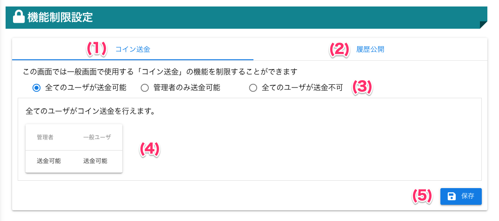

[管理者ユーザマニュアル](/管理者機能/) > [機能説明](/管理者機能/#_16) > [機能制限設定](/管理者機能/#_27) > [コイン送金制限設定](#)
# コイン送金制限設定

!!! info
    - 一般画面のコイン送金機能の制限を設定をすることができます
    - 「**全てのユーザが送金可能**」
        - 全てのユーザがコイン送金できます
    - 「**管理者のみ送金可能**」
        - 管理者のみコイン送金できます
    - 「**全てのユーザが送金不可**」
        - 全てのユーザがコイン送金できません

## 画面

（クリックすると拡大します）

### 制限中の画面
- 制限されたユーザは「コインを送る」ボタンが表示されません

## 画面項目
|   #   | 項目名                             | 必須  | 説明                                                                                                                               |
| :---: | :--------------------------------- | :---: | :--------------------------------------------------------------------------------------------------------------------------------- |
|   1   | コイン送金制限タブ             |   -   | コイン送金制限制限を設定するタブです                                                                                               |
|   2   | [履歴公開タブ](other04.md)   |   -   | 履歴公開を設定するタブです                       |
|   3  | [送金制限設定スイッチ](#_6)               |   -   | コイン送金機能の制限を切り替えるスイッチです                                                                                                 |
|   4   | 説明表                      |   -   | 現在選択している、コイン送金制限設定の説明です。表を見ることで制限範囲を確認することができます|
|   5   | 保存ボタン |   -   | ボタンを押すと設定を保存します |

## 使い方
### コイン送金機能を制限する
<iframe src="https://scribehow.com/embed/__BJmWkja5T_iTnWOBR-O_QA" width="640" height="640" allowfullscreen frameborder="0"></iframe>

