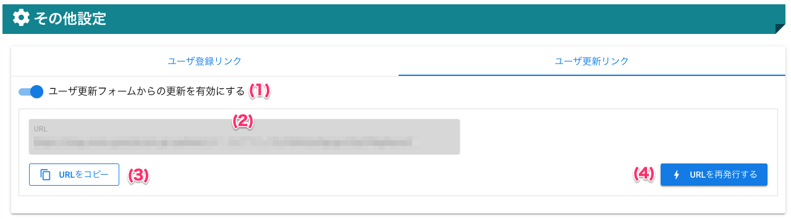
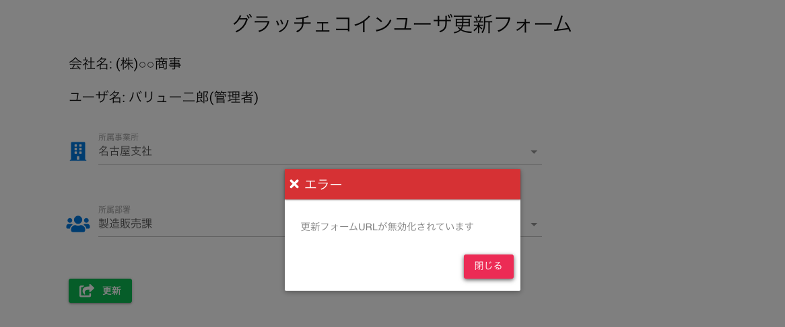

[管理者ユーザマニュアル](../../../管理者機能/) > [機能説明](../../../管理者機能/#_16) > [その他設定](../../../管理者機能/#_28) > [ユーザ更新リンク](#)
# ユーザ更新フォーム

## 画面

（クリックすると拡大します）

## 画面項目
|   #   | 項目名                             | 必須  | 説明                                                                                                                               |
| :---: | :--------------------------------- | :---: | :--------------------------------------------------------------------------------------------------------------------------------- |
|   1   | ユーザ更新フォーム有効スイッチ     |   -   | ユーザ更新フォームからのユーザ更新の[有効](#_5)・[無効](#_6)を切り替えるスイッチです                                                             |
|   2   | ユーザ更新URL                      |   -   | ユーザ更新フォームのURLを表示します                                                                                                |
|   3   | URLをコピーボタン                  |   -   | ボタンを押すとユーザ更新URLをクリップボードにコピーします                                                                          |
|   4   | URLを再発行するボタン              |   -   | ボタンを押すとユーザ更新URLをランダムに生成しなおします                                                                            |

## 使い方
### ユーザ更新フォームを有効にする
<iframe src="https://scribehow.com/embed/__dOhGOwFqQ8WMAahr-6z19Q" width="640" height="640" allowfullscreen frameborder="0"></iframe>

### ユーザ更新フォームを無効にする
<iframe src="https://scribehow.com/embed/__MDENT2jYRh2vTLhKA8HYRg" width="640" height="640" allowfullscreen frameborder="0"></iframe>

!!! info
    ユーザ更新フォームが無効な場合、ユーザ情報を更新しようとすると以下のエラーが表示されます。

