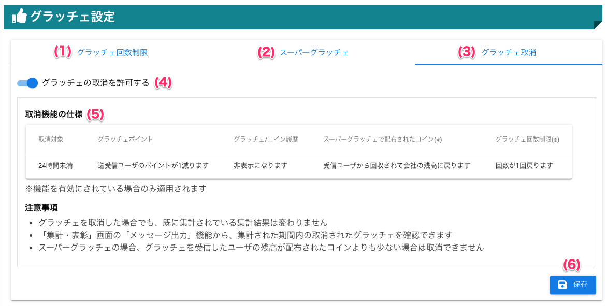

[管理者ユーザマニュアル](../../../管理者機能/) > [機能説明](../../../管理者機能/#_16) > [グラッチェ設定](../../../管理者機能/#_26) > [グラッチェ取消](#)
# グラッチェ取消

## ❓グラッチェ取消とは

グラッチェを**送った**ユーザが、グラッチェを取り消すことができる機能です。

グラッチェ取消の設定が有効であれば、グラッチェを送ってから**24時間以内**であれば取り消すことができます

グラッチェが取り消されると**履歴に表示されなくなり、付与されたグラッチェポイントや、スーパーグラッチェで送られたコインは送信前に戻ります**

### グラッチェ取消機能の仕様
|   取消対象   | グラッチェポイント    | グラッチェ/コイン履歴  | スーパーグラッチェで配布されたコイン(※)  | グラッチェ回数制限(*)  |
| :---: | :---: | :---: | :---: | :---: |
| 24時間未満 | 送受信ユーザのポイントが1減ります | 非表示になります | 受信ユーザから回収されて会社の残高に戻ります | 回数が1回戻ります |

**※機能を有効にされている場合にのみ適用されます**

### グラッチェ取消設定の有効範囲

事業所が有効な場合、**事業所ごとに設定を行う必要があります**。

!!! example
    - 横浜事業所 : グラッチェ取消有効
    - 千葉事業所 : グラッチェ取消無効

    上記のような設定がされている場合、横浜事業所のユーザはグラッチェ取消できますが、千葉事業所ユーザはグラッチェ取消ができません

### 注意事項

!!! warning
    - グラッチェを取消した場合でも、既に集計されている集計結果は変わりません
    - 「集計・表彰」画面の「メッセージ出力」機能から、集計された期間内の取消されたグラッチェを確認できます
    - スーパーグラッチェの場合、グラッチェを受信したユーザの残高が配布されたコインよりも少ない場合は取消できません

## 画面

（クリックすると拡大します）

## 画面項目
|   #   | 項目名                                 | 必須  | 説明                                                                           |
| :---: | :------------------------------------- | :---: | :----------------------------------------------------------------------------- |
|   1   | [グラッチェ回数制限タブ](other01.md)                 |   -   | グラッチェ回数制限を設定するタブです                                           |
|   2   | [スーパーグラッチェタブ](other02.md)                 |   -   | スーパーグラッチェを設定するタブです                                           |
|   3   | グラッチェ取消タブ         |   -   | グラッチェ取消機能を設定するタブです                     |
|   4   | グラッチェ取消機能有効スイッチ |   -   | グラッチェ取消設定の有効・無効を切り替えるスイッチです |
|   5   | 取消機能の仕様          |   -   | グラッチェ取消機能の仕様が表示されます                    |
|   6   | 保存ボタン                             |   -   | ボタンを押すと設定を保存します                                                 |

## 使い方
### グラッチェ取消機能を設定する
<iframe src="https://scribehow.com/embed/__twp2K_5ZSoWIsflhNNNeUw" width="640" height="640" allowfullscreen frameborder="0"></iframe>