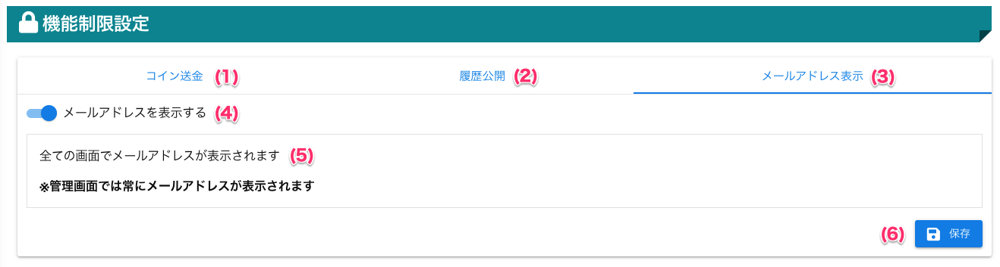
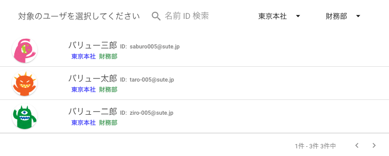
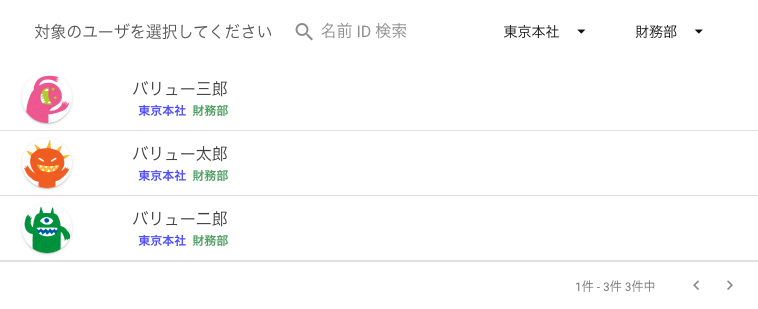

[管理者ユーザマニュアル](../../../管理者機能/) > [機能説明](../../../管理者機能/#_16) > [機能制限設定](../../../管理者機能/#_27) > [メールアドレス表示設定](#)
# :material-new-box: メールアドレス表示設定

!!! info
    - 一般画面でのメールアドレスを表示/非表示の設定をすることができます 
        - **管理画面では設定に関わらず表示されます**
    - 「メールアドレスを表示する」
        - 従来通り、一般画面でもメールアドレスが表示されます
    - 「メールアドレスを表示しない」
        - 管理画面でのみメールアドレスが表示されます
        - **メールアドレスでの絞り込みは従来通り可能です**
    

## 画面

（クリックすると拡大します）

## 画面項目
|   #   | 項目名                             | 必須  | 説明                                                                                                                               |
| :---: | :--------------------------------- | :---: | :--------------------------------------------------------------------------------------------------------------------------------- |
|   1   | [コイン送金制限タブ](other05.md)             |   -   | コイン送金制限を設定するタブです                                                                                               |
|   2   | [履歴公開タブ](other04.md)     |   -   | 履歴公開を設定するタブです                       |
|   3   | メールアドレス表示タブ   |   -   | メールアドレスの表示/非表示を設定するタブです                       |
|   4   | [メールアドレス表示有効スイッチ](#_4)     |   -   | 一般画面でメールアドレスの表示/非表示を切り替えるスイッチです（管理画面では常に表示されます）                                                             |
|   5   | 設定内容文                     |   -   | 現在選択している、メールアドレス表示設定の説明です|
|   6   | 保存ボタン |   -   | ボタンを押すと設定を保存します |

## 「メールアドレスを表示する」を設定した状態

## 「メールアドレスを表示しない」を設定した状態

## 使い方
### メールアドレス表示設定を有効にする
<iframe src="https://scribehow.com/embed/__W5W8ooUpSUubLd6Pv8r3NA" width="640" height="640" allowfullscreen frameborder="0"></iframe>

### メールアドレス表示設定を無効にする
<iframe src="https://scribehow.com/embed/__-7Aqdfv2QIOXQepnDAQumw" width="640" height="640" allowfullscreen frameborder="0"></iframe>