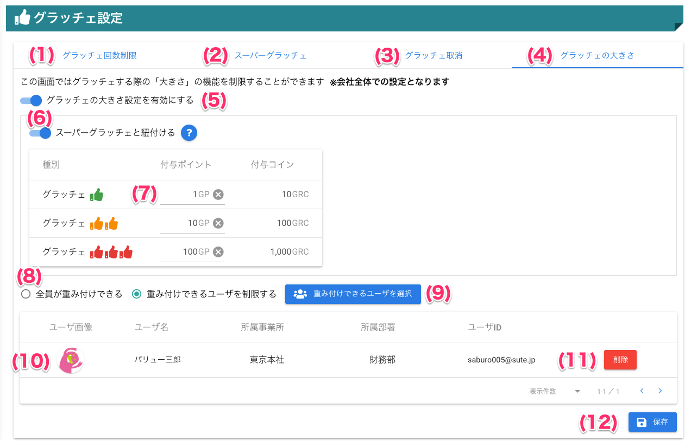

[管理者ユーザマニュアル](../../../管理者機能/) > [機能説明](../../../管理者機能/#_16) > [グラッチェ設定](../../../管理者機能/#_26) > [グラッチェの大きさ](#)
# グラッチェの大きさ

## ❓グラッチェの大きさ設定とは

グラッチェの大きさ設定は、グラッチェを送信する際に「大きさ（重み）」を選択できる機能です。

この設定を有効にすると、**送信時に複数の大きさ（例：1～3段階）から選択**でき、選択した大きさに応じて**受信者に付与されるグラッチェポイントが変化**します。

また、会社全体で有効／無効を切り替えることができ、重み付けできるユーザを制限することも可能です

スーパーグラッチェと紐付ける設定もでき、連動させることでコイン配布にも影響します。

**※グラッチェの大きさ設定は会社単位で管理されます。**

### 注意事項

!!! warning
    - 大きさ設定を有効にした場合、1種類以上の大きさ（ポイント）を設定してください。
    - 重み付け可能ユーザを制限する場合は、必ず1人以上選択してください。
    - スーパーグラッチェ連動時は、コイン配布数も大きさに応じて変動します。

## 画面

## 画面項目

|   #   | 項目名                                 | 必須  | 説明                                                                           |
| :---: | :------------------------------------- | :---: | :----------------------------------------------------------------------------- |
|   1   | [グラッチェ回数制限タブ](other01.md)                 |   -   | グラッチェ回数制限を設定するタブです                                           |
|   2   | [スーパーグラッチェタブ](other02.md)                 |   -   | スーパーグラッチェを設定するタブです                                           |
|   3   | グラッチェの大きさ設定タブ |   -   | グラッチェの大きさ（重み）を設定するタブです |
|   4   | [グラッチェ取消タブ](other07.md)         |   -   | グラッチェ取消機能を設定するタブです                     |
|   5   | グラッチェの大きさ設定有効スイッチ |   -   | グラッチェの大きさ設定の有効・無効を切り替えるスイッチです |
|   6   | スーパーグラッチェ連動スイッチ |   -   | スーパーグラッチェと紐付けるかどうかを切り替えるスイッチです |
|  7   | グラッチェの大きさ入力欄 |   -   | 設定した大きさごとのポイント一覧が表示されます |
|   8   | :material-new-box: スーパーグラッチェ換算 |   -   | グラッチェの大きさ×スーパーグラッチェの換算額を表示している表です。**※グラッチェの大きさ設定がスーパーグラッチェと紐づいている場合にのみ表示されます** |
|  9   | 重み付け可能ユーザ制限ボタン |   -   | 全員／制限したユーザのみ重み付け可能を選択するボタンです |
|  10   | 重み付け可能ユーザ選択ボタン |   -   | 重み付け可能ユーザを選択するボタンです |
|  11   | 重み付け可能ユーザリスト |   -   | 設定された重み付けが可能なユーザの一覧です |
|  12   | 重み付け可能ユーザ削除ボタン |   -   | 重み付けが可能なユーザを削除するボタンです |
|   13   | 保存ボタン                             |   -   | ボタンを押すと設定を保存します                                                 |

## 使い方

### グラッチェの大きさ設定を行う
<iframe src="https://scribehow.com/embed/__t88G6JJsQcy76myEg7E00w" width="640" height="640" allowfullscreen frameborder="0"></iframe>

### 重み付けされたグラッチェする
- [重み付けされたグラッチェする](../../一般機能/GraziePoint/grazie02.md#_8)