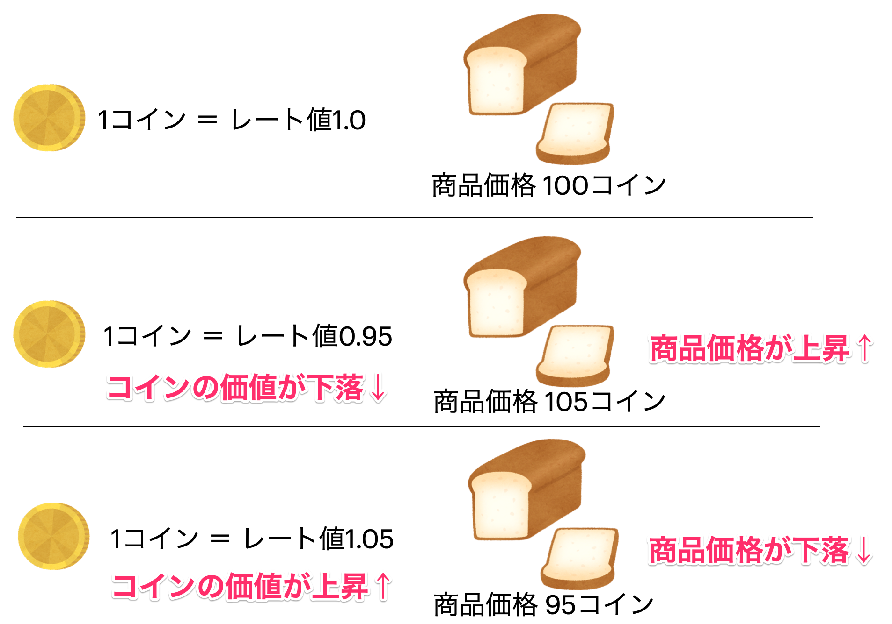

[管理者ユーザマニュアル](/管理者機能/) > [機能説明（オプション）](/管理者機能/#_29) > [レート](#)
# レート

!!! info
    レート機能はオプション機能です。機能の有効化をご希望の際は、バリューソフトウエアまでご連絡ください。

## レートとは

レート機能を利用することで、コインの価値を為替相場のように変動させることができます。

例えば「**1コイン＝自社の株価**」という設定をすれば、コインの価値が株価に連動して価値が上下するといった動きになります。

## レートと商品価格の関係
まず、レート値の基本的な考え方として**1コイン = 1.00(円)** が基準になります。そのため、レート値によってコインの価値が変わるので、商品価格が変動するようになります。

下図のようにレート値が下落したケースでは、 **1コイン = 0.95(円)** となった時、1コインの価値が目減りするため商品価格が上昇します

反対に、レート値が上昇したケースでは、 **1コイン = 1.05(円)** となった時、1コインの価値が増すため商品価格が下落します

## レート機能のメリット

上述のように「**1コイン＝自社の株価**」として、四半期ごとにレート値を更新するといったルールを導入した場合、会社の業績が好調で株価が上昇した際は、コインの価値も上昇するため**コインを保有している従業員のモチベーションも上がる**といった効果が期待できます

## レート機能を運用する際の注意点

レート値の変更を手動で行う必要があるため、**運用が煩雑**になります。また、メリットでも述べたとおり、コインの価値が上がる状況が続けば問題はないですが、価値が下がる状況になった場合、コインの価値が目減りしてしまうためコインを保有する従業員のモチベーションが下がってしまう恐れがあります。

そのため、レート値を何かの指標と連動して運用する場合は、**コイン価値が下がった時に従業員が頑張ろうと思える指標**を設定することが大切です。

!!! example
    【ルール】前年度売上と今年度売上の比率をレート値とする

    - ケース1: 売上前年比**105%**の場合
        - レート値を **1.05** とする
        - 商品価格: 100コインのものが、時価95コインで購入可能
    - ケース2: 売上前年比**95%**の場合
        - レート値を **0.95** とする
        - 商品価格: 100コインのものが、時価105コインで購入可能

## レート機能により表示項目が増える画面

レート機能を有効にすると、コインにレート値をかけた換算金額を表示されるようになります。以下の一覧に、換算金額が表示される機能・画面をまとめています。

| 区分 | 機能                | 画面               | 内容                                                                             |
| ---- | ------------------- | ------------------ | -------------------------------------------------------------------------------- |
| 一般 | GrazieCoin          | トップ             | コイン残高をレート換算した金額を表示する                                         |
| 一般 | GrazieCoin          | 商品交換一覧       | 商品交換価格の下に時価（元々の価格と、元々の価格をレート換算した価格）を表示する |
| 管理 | 管理コンソール      | コンソールヘッダー | ・レート値を常に表示する ・残高と流通額にそれぞれレート換算した金額を表示する |
| 管理 | 管理コンソール      | 他事業所への送金   | 入力された送金金額をレート換算した金額を表示する                                 |
| 管理 | ユーザ              | 送金               | 入力された送金金額をレート換算した金額を表示する                                 |
| 管理 | ユーザ              | 回収               | 入力された回収金額をレート換算した金額を表示する                                 |
| 管理 | 商品                | 一覧               | 商品交換価格の下に時価（元々の価格と、元々の価格をレート換算した価格）を表示する |
| 管理 | 商品                | 登録・編集         | 入力された商品価格をレート換算した金額を表示する                                 |
| 管理 | MVP(オプション機能) | 登録・編集         | 入力された優勝賞金・参加賞金をレート換算した金額を表示する                       |

## 画面

## 項目
|   #   | 項目名                   | 必須  | 説明                                                                                                                                               |
| :---: | :----------------------- | :---: | :------------------------------------------------------------------------------------------------------------------------------------------------- |
|   1   | レート値                 |   ○   | レート値を入力します                                                                                                                               |
|   2   | レート換算結果プレビュー |   -   | 入力されたレート値を元に以下の計算結果を表示します ・会社または事業所ウォレットの残高とレート換算した金額 ・コイン流通額とレート換算した金額 |
|   3   | 保存ボタン               |   -   | ボタンを押すと入力されたレート値で登録します                                                                                                       |

## 使い方
### レートを変更する
<iframe src="https://scribehow.com/embed/__CpS5NSnOQDSnndLg7GllHw" width="640" height="640" allowfullscreen frameborder="0"></iframe>

