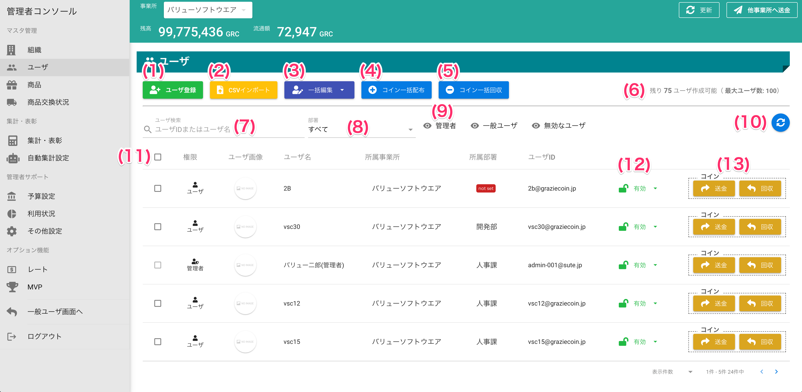

[管理者ユーザマニュアル](/管理者機能/) > [機能説明](/管理者機能/#_16) > [ユーザ](/管理者機能/#_19) > [ユーザ一覧](#)
# ユーザ一覧

## 画面

（クリックすると拡大します）

## 画面項目
|   #   | 項目名                   | 必須  | 説明                                                                                                                              |
| :---: | :----------------------- | :---: | :-------------------------------------------------------------------------------------------------------------------------------- |
|   1   | [ユーザ登録ボタン](user02.md)         |   -   | 新規ユーザを登録する画面を開きます                                                                                                |
|   2   | [CSVインポートボタン](user04.md)      |   -   | CSVファイルからユーザを一括登録する画面を開きます                                                                                 |
|   3   | 一括編集ボタン           |   -   | 複数ユーザの[有効・無効化](#_9)や[所属部署一括変更](#_10)ができます                                                                  |
|   4   | [コイン一括配布ボタン](user05.md)     |   -   | コインを複数のユーザへ一括で配る画面を開きます                                                                                    |
|   5   | [コイン一括回収ボタン](user06.md)     |   -   | 複数のユーザからコインを一括で回収する画面を開きます                                                                              |
|   6   | ユーザ数表示             |   -   | 作成可能なユーザ数と最大ユーザ数です                                                                                              |
|   7   | ユーザ検索               |   -   | ユーザID(メールアドレス)とユーザ名で一覧に表示するユーザを絞り込みます                                                            |
|   8   | 部署                     |   -   | 選択した部署に所属するユーザを一覧に表示します                                                                                    |
|   9   | 管理者表示スイッチ       |   -   | スイッチのON/OFFを切り替えると、一覧表示から管理者を表示または除外します                                                          |
|       | 一般ユーザ表示スイッチ   |   -   | スイッチのON/OFFを切り替えると、一覧表示から一般ユーザを表示または除外します                                                      |
|       | 無効なユーザ表示スイッチ |   -   | スイッチのON/OFFを切り替えると、一覧表示から無効なユーザを表示または除外します                                                    |
|  10   | 更新ボタン               |   -   | 一覧の表示を最新化します                                                                                                          |
|  11   | [ユーザ一覧](user03.md)               |   -   | 検索条件に該当するユーザを表示します                                                                                              |
|       | 行選択チェックボックス   |   -   | 選択されているユーザは、一括編集・一括無効化・一括有効化の対象になります                                                          |
|       | 権限                     |   -   | ユーザの権限です                                                                                                                  |
|       | ユーザ画像               |   -   | ユーザが設定しているプロフィール画像です                                                                                          |
|       | ユーザ名                 |   -   | ユーザの名前です                                                                                                                  |
|       | 所蔵事業所               |   -   | ユーザの所属する事業所です。事業所が有効な設定でなければ列が表示されません。                                                      |
|       | 所属部署                 |   -   | ユーザの所属する部署です。部署が有効な設定でなければ列が表示されません。  部署に所属していない場合、**無所属**と表示されます。 |
|       | ユーザID                 |   -   | ユーザのIDです                                                                                                                    |
|  12   | 有効・無効               |   -   | ユーザが有効または無効状態かを表します                                                                                            |
|  13   | [送金ボタン](#1)               |   -   | ユーザへコインを送る画面を開きます                                                                                                |
|       | [回収ボタン](#1_1)               |   -   | ユーザからコインを回収する画面を開きます                                                                                          |

## 使い方
### 一覧に表示したいユーザを検索または絞り込む

<iframe src="https://scribehow.com/embed/__DrxHha6-QjOnnb1-XcZWrw" width="640" height="640" allowfullscreen frameborder="0"></iframe>

### [ユーザを登録する](user02.md)

### [ユーザを編集する](user03.md)

### [ユーザを一括登録する](user04.md)

### 複数ユーザを一括で有効・無効化する
ユーザ無効化による影響は[こちら](#_13)をご参照ください。

<iframe src="https://scribehow.com/embed/__RjJjzSDJRTmQgaW2UFZ8ww" width="640" height="640" allowfullscreen frameborder="0"></iframe>

### 複数ユーザの所属組織を一括で変更する
<iframe src="https://scribehow.com/embed/Workflow__5U_3RobQT8q2UXaGUlrcKg" width="640" height="640" allowfullscreen frameborder="0"></iframe>

### 1人のユーザにコインを送る

!!! info
    管理者は一般ユーザに対してコインを付与することができます 
    付与するコインは、会社または事業所のウォレットから支払われます 
    ウォレット残高は[管理者コンソール](../adminconsole.md)に表示されています

<iframe src="https://scribehow.com/embed/1__qIm60GrJQVqGEqmmpfoQvA" width="640" height="640" allowfullscreen frameborder="0"></iframe>

### 1人のユーザからコインを回収する

!!! info
    管理者は一般ユーザに対して誤ってコインを付与してしまった際などに付与したコインを回収することができます

<iframe src="https://scribehow.com/embed/1__ad_EZiolQDmMwd7MrspOBg" width="640" height="640" allowfullscreen frameborder="0"></iframe>

### [複数ユーザに一括でコインを送る](user05.md)

### [複数ユーザから一括でコインを回収する](user06.md)

## 無効化されたユーザ

無効となったユーザは、グラッチェコイン上では以下の挙動となります

!!! info
    - 無効となったユーザは、ログインができなくなります
    - 無効となったユーザに対して、一般ユーザからコインの送金やグラッチェをすることができなくなります
    - 履歴では、無効となったユーザが関わる取引は閲覧できなくなります
    - 無効となったユーザは、ランキングや集計の対象外になります

