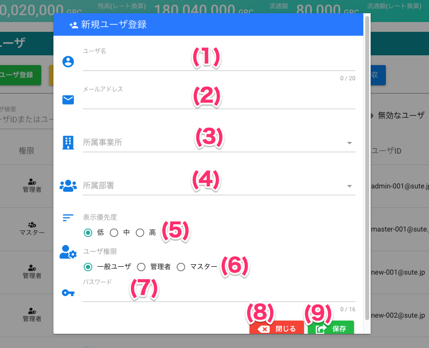

# ユーザ登録

## 画面

## 画面項目
|   #   | 項目名         | 必須  | 説明                                                                                               |
| :---: | :------------- | :---: | :------------------------------------------------------------------------------------------------- |
|   1   | ユーザ名       |   ○   | サービス上で表示されるユーザの名前です。                                                           |
|   2   | メールアドレス |   ○   | ログインするためのIDです。                                                                         |
|   3   | 所属事業所     |   ○   | 所属する事業所を設定します。 **事業所が有効ではない場合は表示されません。**                            |
|   4   | 所属部署       |   ○   | 所属する部署を設定します。 **部署が有効ではない場合は表示されません。**                                 |
|   5   | 表示優先度     |   ○   | グラッチェ先ユーザ選択画面など、一覧画面で表示する際の優先度です。 高＞中＞小の順で先頭に表示します。 |
|   6   | ユーザ権限     |   ○   | ユーザの権限です。管理者ユーザのみが管理者コンソールを使用できます。                               |
|   7   | パスワード     |   ○   | ログインするためのパスワードです。                                                                 |
|   8   | 閉じるボタン   |   -   | ボタンを押すと登録画面を閉じます                                                                   |
|   9   | 保存ボタン     |   -   | ボタンを押すとユーザを登録します                                                                   |

## 使い方
### ユーザを登録する
<iframe src="https://scribehow.com/embed/__nky4IBdrTKCZA5kiGk81Hg" width="640" height="640" allowfullscreen frameborder="0"></iframe>

