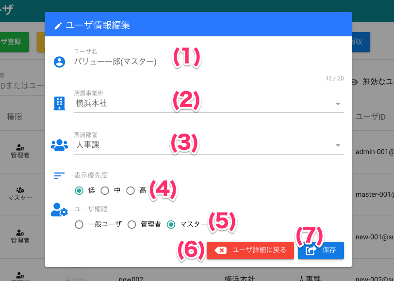

[管理者ユーザマニュアル](../../../管理者機能/) > [機能説明](../../../管理者機能/#_16) > [ユーザ](../../../管理者機能/#_19) > [ユーザ一覧](./user01.md) > [ユーザ編集](#)
# ユーザ編集
## 画面

### ユーザ情報参照

#### 画面項目
|   #   | 項目名               | 必須  | 説明                                         |
| :---: | :------------------- | :---: | :------------------------------------------- |
|   1   | ユーザ情報           |   -   | 変更するユーザの画像・名称・所属を表示します |
|   2   | [閉じるボタン](user01.md)         |   -   | ボタンを押すと画面を閉じます                 |
|   3   | [ユーザ情報変更ボタン](#_5) |   -   | ボタンを押すとユーザ情報編集画面を開きます   |
|   4   | [パスワード変更ボタン](#_7) |   -   | ボタンを押すとパスワード変更画面を開きます   |
|   5   | [ユーザ削除ボタン](#_12)     |   -   | ボタンを押すとユーザ削除を行います           |

### ユーザ情報編集

#### 画面項目
|   #   | 項目名                 | 必須  | 説明                                                                                                     |
| :---: | :--------------------- | :---: | :------------------------------------------------------------------------------------------------------- |
|   1   | ユーザ名               |   ○   | サービス上で表示されるユーザの名前です。                                                                 |
|   2   | 所属事業所             |   ○   | 所属する事業所を設定します。 **事業所が有効ではない場合は表示されません。 **                          |
|   3   | 所属部署               |   ○   | 所属する部署を設定します。 **部署が有効ではない場合は表示されません。**                               |
|   4   | 表示優先度             |   ○   | グラッチェ先ユーザ選択画面など、一覧画面で表示する際の優先度です。 高＞中＞小の順で先頭に表示します。 |
|   5   | ユーザ権限             |   ○   | ユーザの権限です。管理者ユーザのみが管理者コンソールを使用できます。                                     |
|   6   | [ユーザ詳細に戻るボタン](#) |   -   | ボタンを押すと編集画面を閉じます                                                                         |
|   7   | 保存ボタン             |   -   | ボタンを押すとユーザ情報を更新します                                                                     |

### パスワード変更

#### 画面項目
|   #   | 項目名                 | 必須  | 説明                                       |
| :---: | :--------------------- | :---: | :----------------------------------------- |
|   1   | パスワード             |   ○   | 変更するパスワードを入力します             |
|   2   | [ユーザ詳細に戻るボタン](#) |   -   | ボタンを押すとパスワード変更画面を閉じます |
|   3   | 保存ボタン             |   -   | ボタンを押すとユーザのパスワードを更新します           |

## 使い方
### ユーザ情報を編集する
<iframe src="https://scribehow.com/embed/__kjlytS5hSl2B3UTlKKBGyQ" width="640" height="640" allowfullscreen frameborder="0"></iframe>

### ユーザのパスワードを変更する

!!! info
    ユーザ自身によるパスワード変更も可能です。 
    手順は[こちら]()をご参照ください。

<iframe src="https://scribehow.com/embed/__2FW2minoRYOJfylhBoKMHw" width="640" height="640" allowfullscreen frameborder="0"></iframe>

### ユーザを削除する
削除されたユーザに対し、システムで以下の処理が行われます。以下の点を留意の上、削除を行ってください。

!!! warning
    - 全てのデータが削除されます（**元に戻すことができません**）
    - サービスへログインできなくなります
    - 削除ユーザが保有していたコインは会社または事業所のウォレットへ移動します
    - 履歴等での表示が「削除されたユーザ」と表示されます

!!! info
    一時的に利用を止めたい場合は、[ユーザの無効化](user01.md#_9)をおすすめします（ただし無効化ユーザは**ご利用料金の請求対象に含まれます**）

<iframe src="https://scribehow.com/embed/__O7RznqFMT1S3SB1s9cFDVg" width="640" height="640" allowfullscreen frameborder="0"></iframe>

