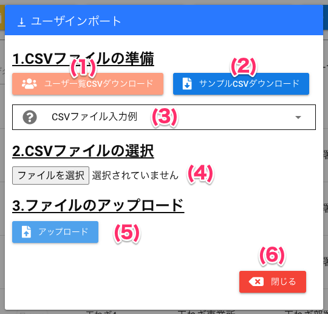
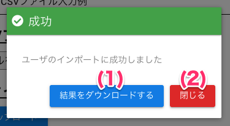
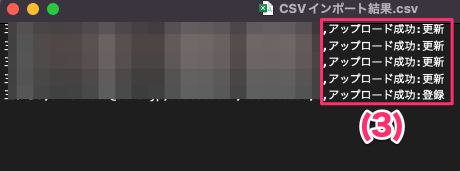
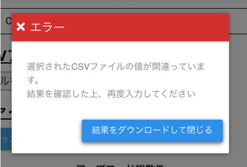
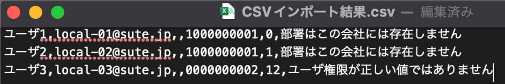

[管理者ユーザマニュアル](/管理者機能/) > [機能説明](/管理者機能/#_16) > [ユーザ](/管理者機能/#_19) > [ユーザ一覧](./user01.md) > [CSVインポート](#)
# CSVインポート
## ユーザインポート画面
<a href="../../../images/user/4-1.png" data-lightbox="スクリーンショット" data-title="スクリーンショット">
    
</a>

### 画面項目
|   #   | 項目名                | 必須  | 説明                                                                                                                                         |
| :---: | :-------------------- | :---: | :------------------------------------------------------------------------------------------------------------------------------------------- |
|   1   | ユーザ一覧CSVダウンロードボタン     |   -   | クリックすると、現在登録されているユーザをCSV形式でダウンロードすることができます。<br>ダウンロードしたファイルを直接変更することでそのままファイルを使用いただけます。 |
|   2   | サンプルCSVダウンロードボタン |   -   | ボタンを押すとCSVファイルのサンプルをダウンロードすることができます。
|   3   | CSVファイル入力例     |   -   | CSVファイルによるデータインポートの説明です。クリックすると、説明を表示します。|                                                                            |
|   4   | CSVファイル選択ボタン |   -   | ボタンを押すとインポートするCSVファイルを選択する画面が開きます。
|   5   | [アップロードボタン](#csv_1)    |   -   | ボタンを押すと選択したCSVファイルのインポートを行います。                                                                                    |
|   6   | 閉じるボタン  |   -   | クリックするとユーザインポート画面を閉じます。                                                                                          |


## CSVファイルインポート結果表示画面
<a href="../../../images/user/4-2.png" data-lightbox="スクリーンショット" data-title="スクリーンショット">
    
</a>

- 結果ダウンロードCSVファイルの中身
<a href="../../../images/user/4-5.png" data-lightbox="スクリーンショット" data-title="スクリーンショット">
    
</a>


### 画面項目
|   #   | 項目名                   | 必須  | 説明                                                                                                                                                                   |
| :---: | :----------------------- | :---: | :--------------------------------------------------------------------------------------------------------------------------------------------------------------------- |
|   1   | 結果をダウンロードするボタン                     |   -   | CSVインポートの結果を記載したCSVファイルをダウンロードすることができます。<br>ダウンロード後、成功ダイアログ画面が自動的に閉じます                           |
|   2   | [閉じるボタン](#)|   -   | 成功ダイアログ画面を閉じることができます。                                                                                                        |
|   3   | インポート結果                     |   -   | `アップロード成功:追加`の場合は新規登録、 `アップロード成功:更新`になっている場合はユーザ情報を更新しています。 |


## CSVファイルについて

- CSVファイル（データがカンマ区切り、拡張子が.csv）の内容をユーザ情報に変換し一括登録します

- 事業所または部署は、[組織](../groupmaintenance.md)よりIDを確認し入力してください

- 事業所または部署が無い場合、該当箇所に 空文字を設定してください

| ユーザ名 | メールアドレス | 事業所 | 部署 | 権限                       |
| -------- | -------------- | ------ | ---- | -------------------------- |
| 1〜20桁  | 1〜255桁       | 10桁   | 10桁 | 0: 一般ユーザ<br>1: 管理者 |

!!! info
    CSVインポートでユーザ登録をすると、登録したユーザのメールアドレスへ仮パスワードを連絡するメールが届きます。


### CSVファイルの例

- ファイル名: `sample.csv`

```csv
VSC太郎,vsctaro@graziecoin.jp,0000000000,1111111111,0
VSC二郎,vscjiro@graziecoin.jp,0000000000,1111111111,0
VSC管理者,vsckanri@graziecoin.jp,0000000000,1111111111,1
```

### インポートエラー時の表示
!!! warning
    以下の登録結果が表示された場合、CSVデータの見直しが必要です<br>
    [よくあるインポートエラーの例](#_6)を参考に修正をお願いいたします<br>
    **また、ダウンロードした結果ファイルをそのまま編集し、アップロードいただけます。**

<a href="../../../images/user/4-2.png" data-lightbox="スクリーンショット" data-title="スクリーンショット">
    
</a>

- エラー結果ダウンロードCSVファイルの中身
<a href="../../../images/user/4-4.png" data-lightbox="スクリーンショット" data-title="スクリーンショット">
    
</a>

### 追加したユーザに対して、アカウント作成メール通知がこない場合

!!! warning
    対象ユーザのメールアドレスが存在しない場合等でログイン用のパスワードが**通知できないことがございます**<br>
    お手数ですが、対象のユーザへ[パスワード再設定方法](../../howto/howto04.md)をご案内ください


### よくあるインポートエラーの例

!!! fail
    - CSVファイルの末尾に空行がある
    - 事業所ID、部署IDが間違っている
        - 組織からIDをコピーして入力してください
    - 権限の値が間違っている
        - 0または1を指定してください
            - 0: 一般ユーザ
            - 1: 管理者
    - 事業所ID、部署ID、権限を全角数字で入力している
        - 半角で入力してください
    - 上記に気をつけてCSVファイルを作成したがエラーになってしまう
        - お手数ですが作成したCSVファイルを添付して、バリューソフトウエア問合せ窓口（`app_dev@valunet.co.jp`）へお問い合わせください

<a href="../../../images/user/4-6.png" data-lightbox="スクリーンショット" data-title="スクリーンショット">
    
</a>


| # | エラー原因 |
| -------- | -------------- |
| 1  | 事業所コードの桁数が10桁ではない、または存在しない事業所コードを指定している場合などはエラーが発生します。 |
| 2  | 部署コードの桁数が10桁ではない、または存在しない部署コードを指定している場合などはエラーが発生します。 |
| 3  | ユーザ権限の数値が0(一般)、1(管理者)以外の場合は、エラーが発生します。 |

#### よくあるお問合せ
!!! warning
    - 仮パスワードのメールが届かない
        - メールアドレスが間違っている可能性があります。[ユーザ一覧](user01.md)でIDをご確認ください。


## 使い方
### CSVインポートでユーザを登録する

<iframe src="https://scribehow.com/embed/CSV__qWBjRs_mSheVowOz3WLEXg" width="640" height="640" allowfullscreen frameborder="0"></iframe>
