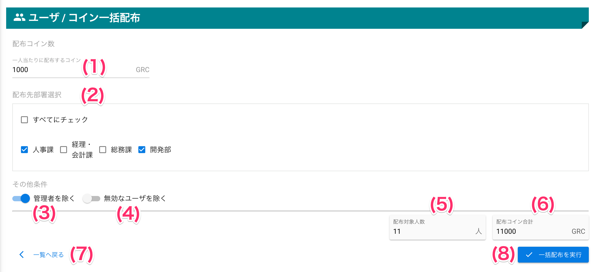
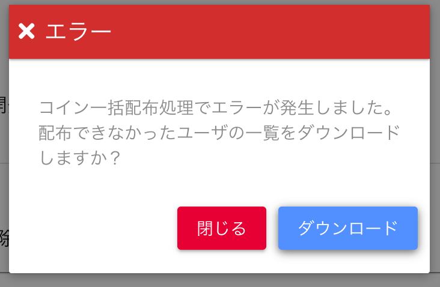

[管理者ユーザマニュアル](/管理者機能/) > [機能説明](/管理者機能/#_16) > [ユーザ](/管理者機能/#_19) > [ユーザ一覧](./user01.md) > [コイン一括配布](#)
# コイン一括配布
## 画面
<a href="../../../images/user/5.png" data-lightbox="スクリーンショット" data-title="スクリーンショット">
    
</a>


## 画面項目
|   #   | 項目名                         | 必須  | 説明                                                                     |
| :---: | :----------------------------- | :---: | :----------------------------------------------------------------------- |
|   1   | 一人当たりに配布するコイン     |   ○   | ユーザ1人に配布するコインを入力します                                    |
|   2   | 配布先部署選択チェックボックス |   -   | 部署ごとに配布したい場合、対象となる部署を選択します                     |
|       | その他条件                     |       |                                                                          |
|   3   | 管理者を除くスイッチ           |   -   | 配布対象から管理者権限を持つユーザを除く場合、スイッチをONにします       |
|   4   | 無効なユーザを除くスイッチ     |   -   | 配布対象から無効なユーザを除く場合、スイッチをONにします                 |
|   5   | 配布対象人数                   |       | 選択された部署とその他条件スイッチの条件に当てはまるユーザ数を表示します |
|   6   | 配布コイン合計                 |       | 一人当たりに配布するコイン x 配布対象人数 による合計コイン数を表示します |
|   7   | 一覧へ戻るリンク               |       | リンクを押すと、ユーザ一覧へ戻ります                                     |
|   8   | 一括配布を実行ボタン           |       | ボタンを押すと、入力内容で一括配布を実行します                           |


## 使い方
### コインを一括配布する

<iframe src="https://scribehow.com/embed/__8wS5fzBISiK857UOjHEL6g" width="640" height="640" allowfullscreen frameborder="0"></iframe>

!!! warning
    一括配布は会社または事業所のコイン残高から支払われます。<br>
    配布コイン合計が組織の残高を超える一括配布はできません。


#### 残高エラー発生時
!!! fail
    配布実行中に残高不足が発生すると、エラーとして処理を中断します。<br>
    その場合、配布されなかったユーザの一覧をCSVファイルとしてダウンロードすることができます。

<a href="../../../images/user/5-2.png" data-lightbox="スクリーンショット" data-title="スクリーンショット">
    
</a>


##### ファイル内容
- ファイル名: `コイン一括配布エラーユーザ一覧.csv`
```csv
ID,ユーザ名,事業所,部署,送金金額
vsc4@graziecoin.jp,vsc4,バリューソフトウエア,開発部,99778366
```