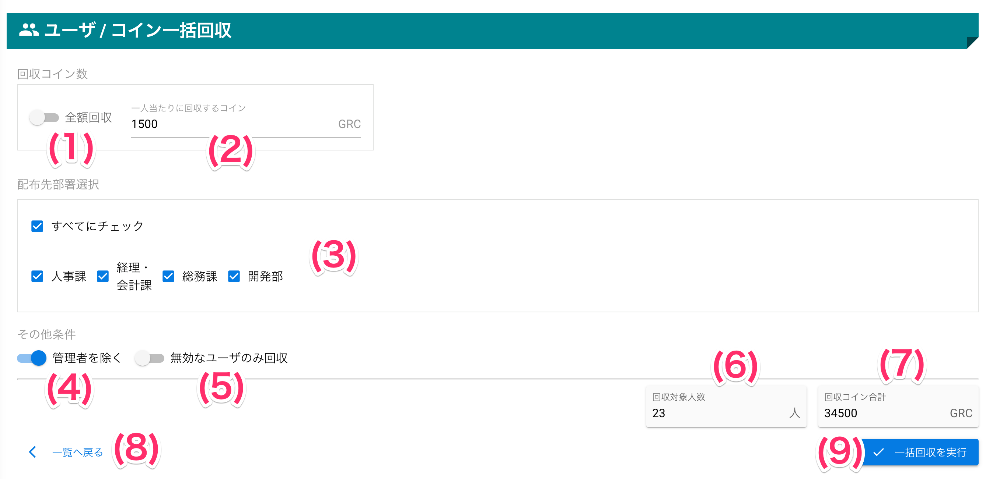
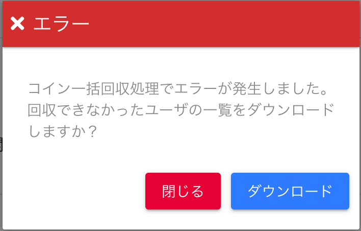

# コイン一括回収

## 画面
<a href="../../../images/user/6-1.png" data-lightbox="スクリーンショット" data-title="スクリーンショット">
    
</a>


## 画面項目
|   #   | 項目名                         | 必須  | 説明                                                                     |
| :---: | :----------------------------- | :---: | :----------------------------------------------------------------------- |
|   1   | 全額回収スイッチ               |   △   | スイッチをONにするとユーザのコインを全て回収します                       |
|   2   | 一人当たりに回収するコイン     |   △   | ユーザ1人から回収するコインを入力します                                  |
|   3   | 回収先部署選択チェックボックス |   -   | 部署ごとに回収したい場合、対象となる部署を選択します                     |
|       | その他条件                     |       |                                                                          |
|   4   | 管理者を除くスイッチ           |   -   | 回収対象から管理者権限を持つユーザを除く場合、スイッチをONにします       |
|   5   | 無効なユーザのみ回収スイッチ   |   -   | 回収対象を無効なユーザのみに限定する場合、スイッチをONにします           |
|   6   | 回収対象人数                   |   -   | 選択された部署とその他条件スイッチの条件に当てはまるユーザ数を表示します |
|   7   | 回収コイン合計                 |   -   | 一人当たりに回収するコイン x 回収対象人数 による合計コイン数を表示します |
|   8   | 一覧へ戻るリンク               |   -   | リンクを押すと、ユーザ一覧へ戻ります                                     |
|   9   | 一括回収を実行ボタン           |   -   | ボタンを押すと、入力内容で一括回収を実行します                           |

## 使い方
### コインを一括回収する

<iframe src="https://scribehow.com/embed/__nGwZ-fgtTnWz_iPDEhAmGw" width="640" height="640" allowfullscreen frameborder="0"></iframe>


#### 残高エラー発生時
!!! fail
    回収実行中にユーザの残高不足が発生すると、エラーとして処理を中断します。<br>
    その場合、回収されなかったユーザの一覧をCSVファイルとしてダウンロードすることができます。

<a href="../../../images/user/6-2.png" data-lightbox="スクリーンショット" data-title="スクリーンショット">
    
</a>


##### ファイル内容
- ファイル名: `コイン一括回収エラーユーザ一覧.csv`
```csv
ID,ユーザ名,事業所,部署,回収金額
vsc3@graziecoin.jp,vsc3,バリューソフトウエア,総務課,10
vsc5@graziecoin.jp,vsc5,バリューソフトウエア,総務課,20
```