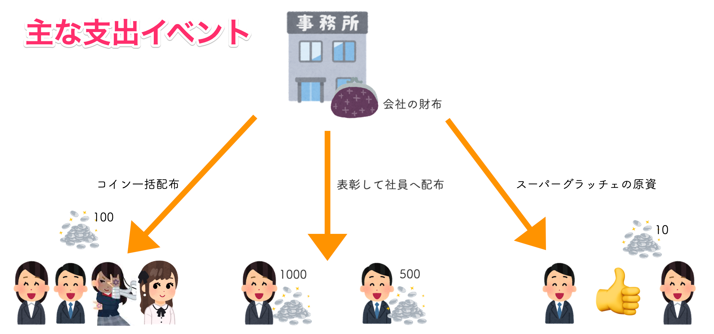

# 予算管理について

## 予算管理画面

## 基本的な考え方

予算管理は**会社または事業所ウォレットの収入と支出の見える化**を目的としています。

会社または事業所が持っているコインが、

- どのイベントでユーザに配られたか
- 商品交換にどれだけ使われたか
- ユーザからどれだけ回収したか

を収入・支出に分けた上で細かい科目として計上します。

これによりグラッチェコインに割り当てられた福利厚生予算の消費状況を管理者ユーザが把握できようにしています。

### 支出の例

これらのイベントを履歴から拾い上げることは難しいですが、予算管理機能を使えばコインの使用状況が把握できます。

## サービス内のイベントと科目の紐付き

グラッチェコインの各機能の操作が、予算管理のどの科目として計上されるかを下記の一覧にまとめています。

| 機能           | 操作                                   | 予算管理の分類      | 予算管理の 計上先科目 | 備考                                                                                                 |
| -------------- | -------------------------------------- | ------------------- | ------------------------ | ---------------------------------------------------------------------------------------------------- |
| 管理コンソール | コイン補充                             | 🟦予算の部           | 年度予算                 |                                                                                                      |
| 管理コンソール | コイン一括回収                         | 🟩収入の部           | コイン回収               |                                                                                                      |
| 管理コンソール | 管理者が個別ユーザから回収             | 🟩収入の部           | コイン回収               |                                                                                                      |
| 管理コンソール | 事業所間送金(他事業所からの受け取り)   | 🟩収入の部           | 事業所間送金             |                                                                                                      |
| 管理コンソール | 管理者が個別ユーザへ送金               | 🟧支出の部           | 管理者送金               |                                                                                                      |
| 管理コンソール | コイン一括配布                         | 🟧支出の部           | コイン配布               |                                                                                                      |
| 管理コンソール | 事業所間送金(他事業所へ送金)           | 🟧支出の部           | 事業所間送金             |                                                                                                      |
| グラッチェ     | グラッチェ実行(スーパグラッチェ有効時) | 🟧支出の部           | スーパーグラッチェ       | グラッチェをしたユーザが所属する事業所のウォレットから支払われます                                   |
| 管理コンソール | MVP優勝ユーザを表彰                    | 🟧支出の部           | MVP優勝賞金              | MVP(人気投票)はオプション機能です                                                                    |
| 管理コンソール | MVP候補ユーザを表彰                    | 🟧支出の部           | MVP参加賞                | MVP(人気投票)はオプション機能です                                                                    |
| 管理コンソール | 集計結果から表彰を実行                 | 🟧支出の部           | 表彰                     | 自動集計で表彰した場合もこちらに計上されます                                                         |
| 商品交換       | ユーザが商品を交換                     | 🟥ユーザに消費されたコイン | 商品交換                 | 使われたコインは無くなります(**事業所のウォレットに戻りません**)                                         |
| 商品交換       | ユーザが換金商品を交換                 | 🟥ユーザに消費されたコイン | 換金商品交換             |・使われたコインは無くなります(**事業所のウォレットに戻りません**) ・換金商品交換がオプション機能です |
