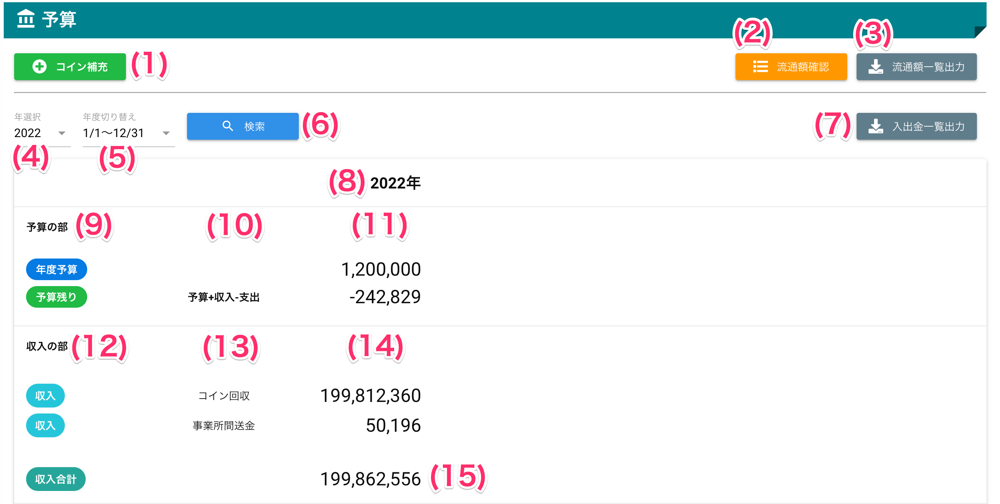
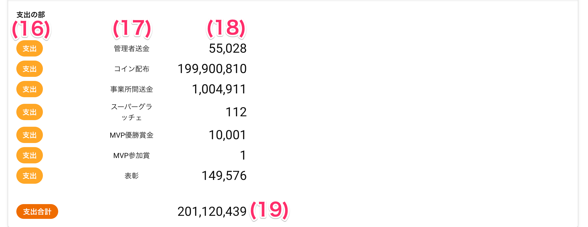
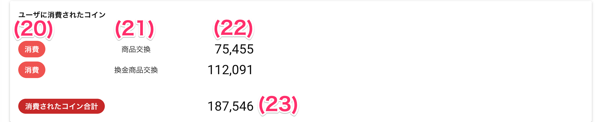
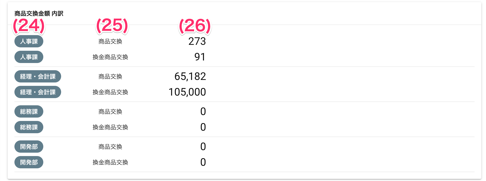

# 予算管理

!!! tip
    本機能の利用方法については、[予算管理について](budget00.md)をご参照ください。


## 画面
<a href="../../../images/budget/1-1.png" data-lightbox="スクリーンショット" data-title="スクリーンショット">
    
</a>
<a href="../../../images/budget/1-2.png" data-lightbox="スクリーンショット" data-title="スクリーンショット">
    
</a>
<a href="../../../images/budget/1-3.png" data-lightbox="スクリーンショット" data-title="スクリーンショット">
    
</a>
<a href="../../../images/budget/1-4.png" data-lightbox="スクリーンショット" data-title="スクリーンショット">
    
</a>

（クリックすると拡大します）


## 画面項目
|   #   | 項目名                   | 必須  | 説明                                                                                        |
| :---: | :----------------------- | :---: | :------------------------------------------------------------------------------------------ |
|   1   | コイン補充ボタン         |   -   | ボタンを押すとコイン補充画面を開きます                                                      |
|   2   | 流通額確認ボタン         |   -   | ボタンを押すと流通額確認画面を開きます                                                      |
|   3   | 流通額一覧出力ボタン     |   -   | ボタンを押すとユーザごとのコイン保有額を記録したCSVファイルをダウンロードします             |
|   4   | 年選択プルダウン         |   ○   | 予算表示する年を選択します                                                                  |
|   5   | 年度切り替えプルダウン   |   ○   | 予算表示する年度を選択します                                                                |
|   6   | 検索ボタン               |   -   | ボタンを押すと年・年度の選択内容で入出金データを検索して表示します                          |
|   7   | 入出金一覧出力           |   -   | ボタンを押すと年・年度の選択内容でコインの取引履歴を記録したCSVファイルをダウンロードします |
|   8   | 年度                     |   -   | 年度の表示です                                                                              |
|       | 予算の部                 |   -   |                                                                                             |
|   9   | 大科目                   |   -   | 「年度予算」「予算残り」を表示します                                                        |
|  10   | 科目                     |   -   | 大科目の内訳を表示します                                                                    |
|  11   | 金額                     |   -   | 科目に対応するコイン取引の合計額を表示します                                                |
|       | 収入の部                 |   -   |                                                                                             |
|  12   | 大科目                   |   -   | 「収入」を表示します                                                                        |
|  13   | 科目                     |   -   | 収入の内訳を表示します                                                                      |
|  14   | 金額                     |   -   | 科目に対応するコイン取引の合計額を表示します                                                |
|  15   | 収入合計                 |   -   | 収入の各科目を合計した金額です                                                              |
|       | 支出の部                 |   -   |                                                                                             |
|  16   | 大科目                   |   -   | 「支出」を表示します                                                                        |
|  17   | 科目                     |   -   | 支出の内訳を表示します                                                                      |
|  18   | 金額                     |   -   | 科目に対応するコイン取引の合計額を表示します                                                |
|  19   | 支出合計                 |   -   | 支出の各科目を合計した金額です                                                              |
|       | ユーザに消費されたコイン |   -   |                                                                                             |
|  20   | 大科目                   |   -   | 「消費」を表示します                                                                        |
|  21   | 科目                     |   -   | 消費されたコインの内訳を表示します                                                          |
|  22   | 金額                     |   -   | 科目に対応するコイン取引の合計額を表示します                                                |
|  23   | 消費されたコイン合計     |   -   | 消費の各科目を合計した金額です                                                              |
|       | 商品交換金額 内訳        |   -   |                                                                                             |
|  24   | 部署                     |   -   | 商品交換をしたユーザが所属している部署を表示します                                          |
|  25   | 科目                     |   -   | 商品交換または換金商品(オプション機能)を表示します                                          |
|  26   | 金額                     |   -   | 部署内で商品交換または換金商品交換が行われた金額です                                        |


## 使い方

### 会社または事業所のウォレットにコインを補充する

<iframe src="https://scribehow.com/embed/__M3Dd2cEsRVKY5IusBD_hhg" width="640" height="640" allowfullscreen frameborder="0"></iframe>


### [流通額を確認する](budget02.md)


### 指定した年度の予算状況を表示する

<iframe src="https://scribehow.com/embed/__bGKnHWzhT92HradXy94aOQ" width="640" height="640" allowfullscreen frameborder="0"></iframe>

### 指定した年度のコイン取引データをダウンロードする

<iframe src="https://scribehow.com/embed/__S9I2Ef7eRjCr8shA9TnsjA" width="640" height="640" allowfullscreen frameborder="0"></iframe>

#### CSVファイルの内容
- ファイル名: `入出金一覧_会社名_事業所名_ダウンロード日時.csv`


```csv
日付,イベント,送り元(事業部),送り元(部署),送り元(ユーザ),受け取り(事業部),受け取り(部署),受け取り(ユーザ),金額,備考(メッセージ等)
2022/06/07 06:22:18,ユーザ間送金,バリューソフトウエア,人事課,バリュー一郎(マスター),バリューソフトウエア,人事課,バリュー二郎(管理者),,おめでとうございます
2022/06/09 02:46:27,ユーザ間送金,バリューソフトウエア,人事課,バリュー一郎(マスター),バリューソフトウエア,人事課,経理,,b
2022/06/09 02:48:04,表彰,バリューソフトウエア,人事課,バリュー一郎(マスター),バリューソフトウエア,人事課,経理,100,グラッチェされたで賞の受賞おめでとうございます！
2022/06/09 05:38:36,事業所間送金,バリューソフトウエア,人事課,バリュー一郎(マスター),バリューソフトウエアネクスト,人事課,,798,拠点間送金
2022/06/09 05:39:22,事業所間送金,バリューソフトウエア,人事課,バリュー一郎(マスター),バリューソフトウエアアドバンス,人事課,,1000,拠点間送金
2022/06/09 05:41:31,事業所間送金,バリューソフトウエア,人事課,バリュー一郎(マスター),バリューソフトウエア,人事課,,98,拠点間送金
2022/06/09 08:23:46,事業所間送金,バリューソフトウエア,人事課,バリュー一郎(マスター),,人事課,,98,拠点間送金
2022/06/09 08:23:58,事業所間送金,,人事課,バリュー一郎(マスター),バリューソフトウエア,人事課,,98,コイン回収
2022/06/13 10:00:56,ユーザ間送金,バリューソフトウエア,人事課,バリュー一郎(マスター),バリューソフトウエア,人事課,バリュー二郎(管理者),,l
2022/06/13 10:48:13,管理者送金,バリューソフトウエア,人事課,バリュー一郎(マスター),バリューソフトウエア,人事課,バリュー一郎(マスター),10000,持続化給付金
2022/06/13 10:48:27,換金商品交換,バリューソフトウエア,人事課,バリュー一郎(マスター),バリューソフトウエア,人事課,バリュー一郎(マスター),91,物品交換: プラチナチケット
2022/06/13 10:51:07,商品交換,バリューソフトウエア,人事課,バリュー一郎(マスター),バリューソフトウエア,人事課,バリュー一郎(マスター),91,物品交換: 米俵
2022/06/13 10:54:19,商品交換,バリューソフトウエア,人事課,バリュー一郎(マスター),バリューソフトウエア,人事課,バリュー一郎(マスター),91,物品交換: 米俵
2022/06/13 10:54:19,予算補充,バリューソフトウエア,,バリュー一郎(マスター),,,バリュー一郎(マスター),150000,予算補充
2022/06/13 10:54:20,予算補充,バリューソフトウエア,,バリュー一郎(マスター),,,バリュー一郎(マスター),300000,予算補充
```

##### 各項目の説明
| 列名               | 説明                                                                                                                                                                             |
| ------------------ | -------------------------------------------------------------------------------------------------------------------------------------------------------------------------------- |
| 日付               | コイン取引が行われた日時です                                                                                                                                                     |
| イベント           | コイン取引が行われた取引内容です                                                                                                                                                 |
| 送り元(事業部)     | コインを送ったユーザの事業所名です                                                                                                                                               |
| 送り元(部署)       | コインを送ったユーザの部署名です                                                                                                                                                 |
| 送り元(ユーザ)     | コインを送ったユーザの名前です                                                                                                                                                   |
| 受け取り(事業部)   | コインを送ったユーザの事業所名です                                                                                                                                               |
| 受け取り(部署)     | コインを送ったユーザの部署名です                                                                                                                                                 |
| 受け取り(ユーザ)   | コインを送ったユーザの名前です                                                                                                                                                   |
| 金額               | 送金された金額です                                                                                                                                                               |
| 備考(メッセージ等) | 取引に付与されたメッセージです。管理者がユーザへ送金した際のメッセージなどが表示されます。<br>メッセージを入力しない取引の場合、システムが付与したメッセージが設定されています。 |

