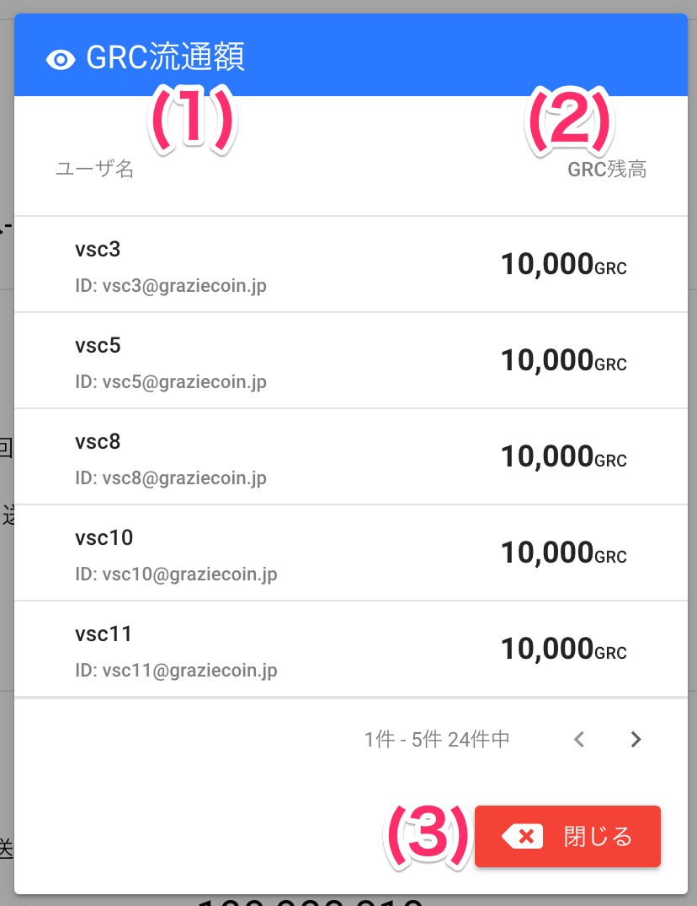

[管理者ユーザマニュアル](/管理者機能/) > [機能説明](/管理者機能/#_16) > [予算管理](/管理者機能/#_24) > [予算管理](budget01.md) > [流通額確認](#)
# 流通額確認
## 画面
<a href="../../../images/budget/2-1.png" data-lightbox="スクリーンショット" data-title="スクリーンショット">
    
</a>

（クリックすると拡大します）


## 画面項目
|   #   | 項目名       | 必須  | 説明                                       |
| :---: | :----------- | :---: | :----------------------------------------- |
|   1   | ユーザ名     |   -   | ユーザ名とID(メールアドレス)を表示します   |
|   2   | GRC残高      |   -   | ユーザが保有しているコイン残高を表示します |
|   3   | [閉じるボタン](budget01.md) |   -   | ボタンを押すと画面を閉じます               |


## 使い方

### 会社または事業所内のコイン流通額を確認する
<iframe src="https://scribehow.com/embed/___y0jAJ4dQI2nVkJypdVJhw" width="640" height="640" allowfullscreen frameborder="0"></iframe>

### 流通額データをダウンロードする
<iframe src="https://scribehow.com/embed/__2AVc-P0vQBOrNxI3lY2vqQ" width="640" height="640" allowfullscreen frameborder="0"></iframe>


!!! info
    事業所内のユーザの残高をダウンロードします。<br>
    複数の事業所がある場合は、事業所ごとにダウンロードしてください。

#### CSVファイル内容
- ファイル名: `流通額一覧_会社名_事業所名_ダウンロード日時.csv`

```csv
メールアドレス,ユーザ名,部署,残高
vsc1@graziecoin.jp,vsc1,人事課,9000
vsc12@graziecoin.jp,vsc12,人事課,9000
vsc15@graziecoin.jp,vsc15,人事課,9000
vsc18@graziecoin.jp,vsc18,人事課,9000
vsc6@graziecoin.jp,vsc6,人事課,9000
vsc9@graziecoin.jp,vsc9,人事課,9000
vsc16@graziecoin.jp,vsc16,経理・会計課,9780
vsc19@graziecoin.jp,vsc19,経理・会計課,9780
vsc7@graziecoin.jp,vsc7,経理・会計課,9780
master-001@sute.jp,バリュー一郎(マスター),経理・会計課,50
inter.milano.69+ggg@gmail.com,川上 仗助,経理・会計課,9780
vsc2@graziecoin.jp,経理,経理・会計課,9880
vsc10@graziecoin.jp,vsc10,総務課,10000
vsc11@graziecoin.jp,vsc11,総務課,10000
vsc13@graziecoin.jp,vsc13,総務課,10000
vsc14@graziecoin.jp,vsc14,総務課,10000
vsc17@graziecoin.jp,vsc17,総務課,10000
vsc20@graziecoin.jp,vsc20,総務課,10000
vsc3@graziecoin.jp,vsc3,総務課,10000
vsc30@graziecoin.jp,vsc30,総務課,10000
vsc5@graziecoin.jp,vsc5,総務課,10000
vsc8@graziecoin.jp,vsc8,総務課,10000
vsc-jiro@graziecoin.jp,グラッチェ 次郎,総務課,10000
vsc4@graziecoin.jp,vsc4,開発部,9900
```

