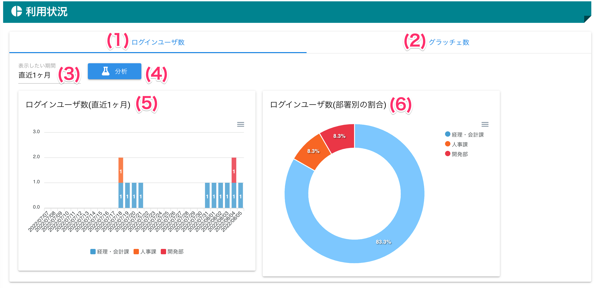

[管理者ユーザマニュアル](/管理者機能/) > [機能説明](/管理者機能/#_16) > [利用状況](/管理者機能/#_25) > [ログインユーザ数](#)
# ログインユーザ数

!!! info
    - **ログインユーザ数**とは、サービスにログインしたユーザの人数をカウントした数値です
        - 1ユーザが1日に5回ログインしたとして、1ログインとしてカウントします

## 画面
<a href="../../../images/analysis/1.png" data-lightbox="スクリーンショット" data-title="スクリーンショット">
    
</a>

（クリックすると拡大します）


## 画面項目
|   #   | 項目名                         | 必須  | 説明                                                                                                                 |
| :---: | :----------------------------- | :---: | :------------------------------------------------------------------------------------------------------------------- |
|   1   | ログインユーザ数タブ           |   -   | タブを押すことでログインユーザ数画面を表示します                                                                     |
|   2   | [グラッチェ数タブ](analysis02.md)               |   -   | タブを押すことでグラッチェ数画面を表示します                                                                         |
|   3   | 表示期間プルダウン             |   ○   | 表示する期間を1つ選択します。選択できる期間は直近1週間、直近1ヶ月、直近3ヶ月、直近6ヶ月、直近1年の5つです。          |
|   4   | [分析ボタン](#_5)                     |   -   | 選択された表示期間プルダウンの期間で分析を行います                                                                   |
|   5   | ログインユーザ数(期間)グラフ   |   -   | 選択された期間のログインユーザ数をグラフ表示します                                                                   |
|   6   | ログインユーザ数(部署別)グラフ |   -   | 選択された期間にログインしたユーザが所属する部署の割合をグラフ表示します<br>**部署設定が無効な場合は表示されません** |

## 使い方

### ログインユーザ数を表示する

<iframe src="https://scribehow.com/embed/__SoRR-bpiTWSk1WvOgoPHsQ" width="640" height="640" allowfullscreen frameborder="0"></iframe>

!!! warning
    部署設定が無効な場合、ログインユーザ数(部署別)グラフは表示されません

### グラフデータをダウンロードする

<iframe src="https://scribehow.com/embed/__UAUJfmZiQJ-bTvdc25QnPQ" width="640" height="640" allowfullscreen frameborder="0"></iframe>


#### ダウンロードできるpngファイル

<a href="../../../images/analysis/1-1.png" data-lightbox="スクリーンショット" data-title="スクリーンショット">
    
</a>
<a href="../../../images/analysis/1-2.png" data-lightbox="スクリーンショット" data-title="スクリーンショット">
    
</a>


#### ダウンロードできるCSVファイルの内容

- 期間
```
category,人事課,経理・会計課,開発部
2022/07/07,0,0,0
2022/07/08,0,0,0
2022/07/09,0,0,0
2022/07/10,0,0,0
2022/07/11,0,0,0
2022/07/12,0,0,0
2022/07/13,0,0,0
2022/07/14,0,0,0
2022/07/15,0,0,0
2022/07/16,0,0,0
2022/07/17,0,0,0
2022/07/18,1,1,0
2022/07/19,0,1,0
2022/07/20,0,1,0
2022/07/21,0,1,0
2022/07/22,0,0,0
2022/07/23,0,0,0
2022/07/24,0,0,0
2022/07/25,0,0,0
2022/07/26,0,0,0
2022/07/27,0,0,0
2022/07/28,0,0,0
2022/07/29,0,0,0
2022/07/30,0,0,0
2022/07/31,0,1,0
2022/08/01,0,1,0
2022/08/02,0,1,0
2022/08/03,0,1,0
2022/08/04,0,1,1
2022/08/05,0,1,0
```

- 部署別
```csv
category,value
人事課,1
経理・会計課,10
開発部,1
```