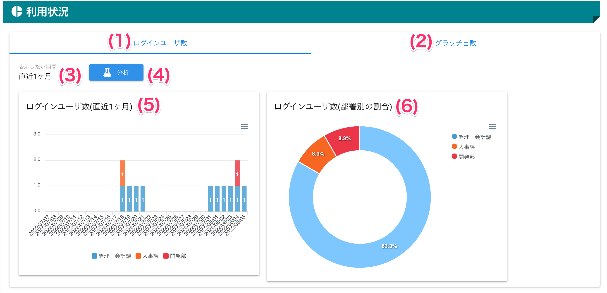
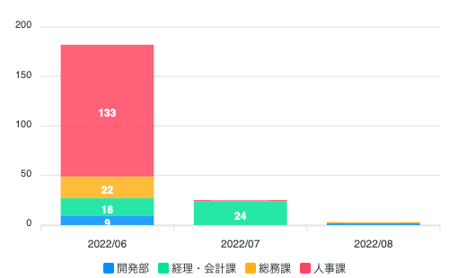
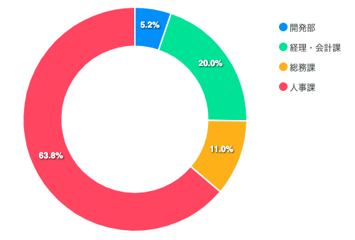

[管理者ユーザマニュアル](/管理者機能/) > [機能説明](/管理者機能/#_16) > [利用状況](/管理者機能/#_25) > [グラッチェ数](#)
# グラッチェ数

!!! info
    - **グラッチェ数**とは、ユーザがグラッチェした回数をカウントした数値です
    - 1ユーザが1日に5回グラッチェしたとして、5回としてカウントします

## 画面
<a href="../../../images/analysis/1.png" data-lightbox="スクリーンショット" data-title="スクリーンショット">
    
</a>

（クリックすると拡大します）


## 画面項目
|   #   | 項目名                         | 必須  | 説明                                                                                                                 |
| :---: | :----------------------------- | :---: | :------------------------------------------------------------------------------------------------------------------- |
|   1   | [ログインユーザ数タブ](analysis01.md)           |   -   | タブを押すことでログインユーザ数画面を表示します                                                                     |
|   2   | グラッチェ数タブ               |   -   | タブを押すことでグラッチェ数画面を表示します                                                                         |
|   3   | 表示期間プルダウン             |   ○   | 表示する期間を1つ選択します。選択できる期間は直近1週間、直近1ヶ月、直近3ヶ月、直近6ヶ月、直近1年の5つです。          |
|   4   | [分析ボタン](#_5)                     |   -   | 選択された表示期間プルダウンの期間で分析を行います                                                                   |
|   5   | グラッチェ数(期間)グラフ   |   -   | 選択された期間のグラッチェ数をグラフ表示します                                                                   |
|   6   | グラッチェ数(部署別)グラフ |   -   | 選択された期間にグラッチェしたユーザが所属する部署の割合をグラフ表示します<br>**部署設定が無効な場合は表示されません** |

## 使い方

### グラッチェ数を表示する

<iframe src="https://scribehow.com/embed/__U8aTsYWqQpm4kZDqfFwQVw" width="640" height="640" allowfullscreen frameborder="0"></iframe>

!!! warning
    部署設定が無効な場合、グラッチェ数(部署別)グラフは表示されません

### グラフデータをダウンロードする

<iframe src="https://scribehow.com/embed/__UAUJfmZiQJ-bTvdc25QnPQ" width="640" height="640" allowfullscreen frameborder="0"></iframe>


#### ダウンロードできるpngファイル

<a href="../../../images/analysis/2-1.png" data-lightbox="スクリーンショット" data-title="スクリーンショット">
    
</a>
<a href="../../../images/analysis/2-2.png" data-lightbox="スクリーンショット" data-title="スクリーンショット">
    
</a>


#### ダウンロードできるCSVファイルの内容

- 期間
```
category,開発部,経理・会計課,総務課,人事課
2022/06,9,18,22,133
2022/07,0,24,0,1
2022/08,2,0,1,0
```

- 部署別
```csv
category,value
開発部,11
経理・会計課,42
総務課,23
人事課,134
```