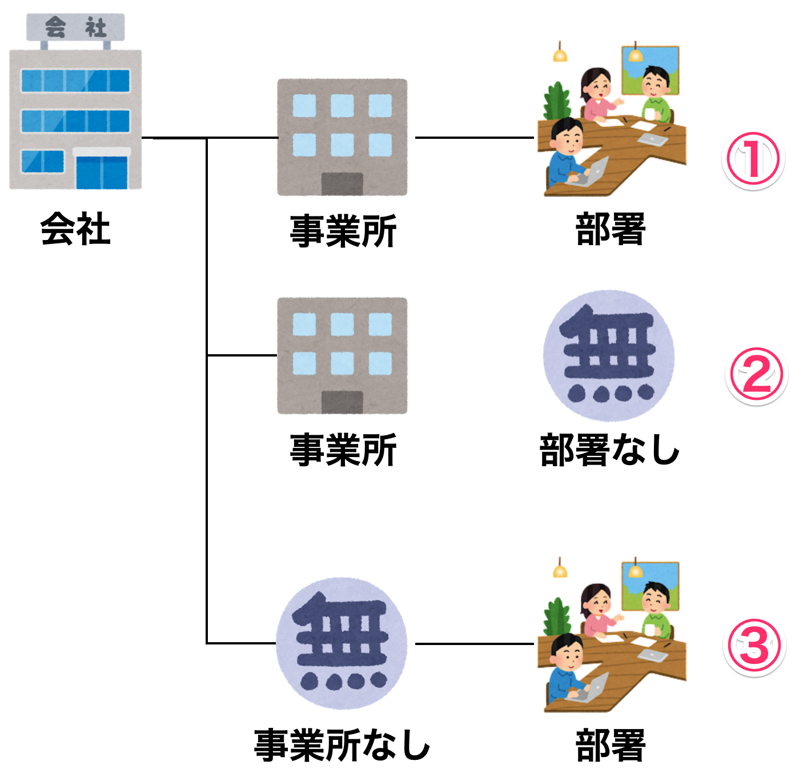

# 組織を登録する

初めにユーザが所属する**組織**を登録していきます。

## 組織の構造
組織の構造は以下の図のパターンに分かれます。事業所と部署の有無はご契約時に選択していただきます。

| パターン | 事業所 | 部署 |
| :------: | ------ | ---- |
|    ①     | あり   | なし |
|    ②     | あり   | なし |
|    ③     | なし   | あり |

!!! info
    - **事業所**が無効設定の場合、**事業所**は登録できません
    - **部署**が無効設定の場合、**部署**は登録できません

## ウォレットの管理方法

グラッチェコインでは従業員へ配るコインを保持するウォレットを、会社または事業所のどちらかで管理します。（会社と事業所の両方で管理することはできません）

ウォレット管理を会社または事業所で行うかは、ご契約時に選択していただきます。なお、上述のパターン③は会社でのみウォレット管理ができます。

ウォレット管理方法の違いは以下になります。

| ウォレット管理組織 | 説明                                                     | メリット                                                 | デメリット                                                               |
| ------------------ | -------------------------------------------------------- | -------------------------------------------------------- | ------------------------------------------------------------------------ |
| 会社               | 会社全体で1つのウォレットを持つ                       | 管理が簡単                                               | 事業所単位で使用できるコインの上限を設定するといった細かい制限ができない |
| 事業所             | 事業所ごとウォレットを持つ 会社はウォレットを持たない | 事業所ごとにコインを持たせられるので、運用の柔軟性が高い | 事業所ごとにコインの管理が必要になる                                     |

## [事業所の登録](../groupmaintenance.md#_7)

!!! info
    - **事業所**が無効設定の場合、**事業所**は登録できません

## [部署の登録](../groupmaintenance.md#_9)

!!! info
    - **部署**が無効設定の場合、**部署**は登録できません
