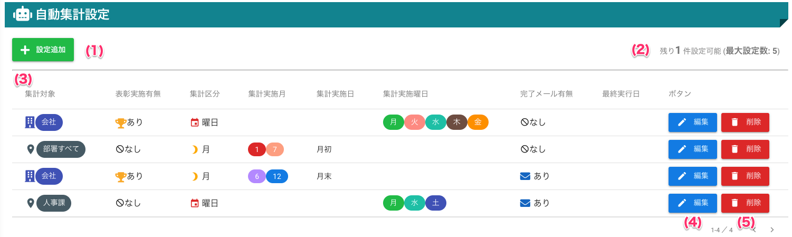

[管理者ユーザマニュアル](../../../管理者機能/) > [機能説明](../../../管理者機能/#_16) > [自動集計設定](../../../管理者機能/#_23) > [自動集計設定一覧](#)
# 自動集計設定一覧

## 画面

（クリックすると拡大します）

## 画面項目
|   #   | 項目名         | 必須  | 説明                                                                                                                                                                                                   |
| :---: | :------------- | :---: | :----------------------------------------------------------------------------------------------------------------------------------------------------------------------------------------------------- |
|   1   | [設定追加ボタン](#_5) |   -   | ボタンを押すと自動集計設定登録画面へ遷移します                                                                                                                                                         |
|   2   | 設定可能数     |   -   | 登録が可能な自動集計設定数です                                                                                                                                                                         |
|   3   | 設定一覧       |   -   |                                                                                                                                                                                                        |
|       | 集計対象       |   -   | 集計対象が会社か事業所内の部署かを表示します                                                                                                                                                           |
|       | 表彰実施有無   |   -   | 自動集計を実行時に、表彰まで行うかを表示します あり: 自動集計された順位を元に表彰まで自動で行います なし: 集計まで自動で行います集計履歴に集計結果が残るので手動で表彰することができます。 |
|       | 集計区分       |   -   | 集計を月ごとまたは曜日ごとに行うかを表示します                                                                                                                                                                                                       |
|       | 集計実施月     |   -   | 集計区分が**月**の場合、集計を実施する月を表示します                                                                                                                                                                                                      |
|       | 集計実施日     |   -   | 集計区分が**月**の場合、集計を実施する日を表示します 月初: 集計実施月の1日 月末: 集計実施月の末日 上記以外: 自動集計設定で指定した任意の日                                                                                                                                                                                                       |
|       | 集計実施曜日   |   -   | 集計区分が**曜日**の場合、集計を実施する曜日を表示します                                                                                                                                                                                                        |
|       | 最終実行日     |   -   | 自動で集計を実行した日付を表示します                                                                                                                                                                                                       |
|   4   | [編集ボタン](#_6)     |   -   | ボタンを押すと自動集計設定変更画面へ遷移します                                                                                                                                                                                                       |
|   5   | [削除ボタン](#_7)     |   -   | ボタンを押すと自動集計設定を削除します                                                                                                                                                                                                        |

## 使い方

### 自動集計設定を登録する
<iframe src="https://scribehow.com/embed/__CflNOBqgSYeX7RbBJOf--g" width="640" height="640" allowfullscreen frameborder="0"></iframe>

!!! tip
    設定内容は

    - [集計対象組織選択](autototal02.md)
    - [賞金入力](autototal03.md)
    - [集計日入力](autototal04.md)

    をご参照ください

### 自動集計設定を編集する
<iframe src="https://scribehow.com/embed/__e0WGC28VRHWrk8034pKmGA" width="640" height="640" allowfullscreen frameborder="0"></iframe>

### 自動集計設定を削除する
<iframe src="https://scribehow.com/embed/__zAKwB863QNuzvTWkUd4Xsw" width="640" height="640" allowfullscreen frameborder="0"></iframe>

