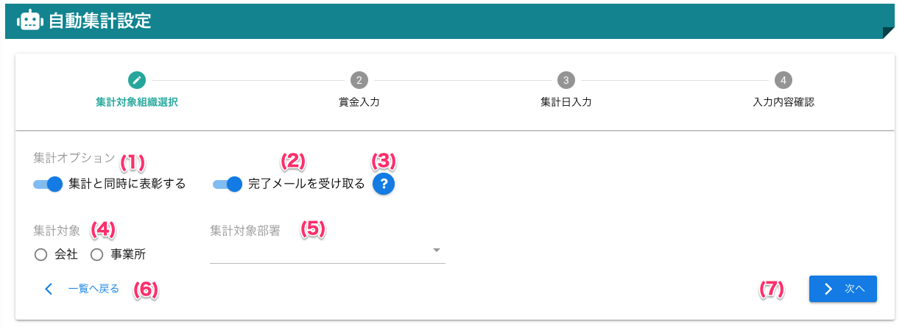

# 集計対象組織選択

## 画面

（クリックすると拡大します）

## 画面項目
|   #   | 項目名           | 必須  | 説明                                                       |
| :---: | :--------------- | :---: | :--------------------------------------------------------- |
|   1   | 表彰実行スイッチ |   -   | スイッチONを設定すると、自動で集計を実行後に表彰を行います |
|   2   | 集計対象         |   ○   | 集計対象を選択します                                       |
|   3   | 集計対象部署     |   ○   | 集計対象とする部署を選択します                             |
|   4   | 一覧へ戻るボタン |   -   | ボタンを押すと自動集計設定一覧画面へ戻ります               |
|   5   | 次へボタン       |   -   | ボタンを押すと賞金入力画面へ遷移します                     |

## 使い方

### 集計対象組織を指定する（表彰なし）
<iframe src="https://scribehow.com/embed/__dlETbo6uRaOivDyFfk9T1w" width="640" height="640" allowfullscreen frameborder="0"></iframe>

### 集計対象組織を指定する（表彰あり）
<iframe src="https://scribehow.com/embed/__9N7Ha-7zS3u8jP3Tkzr8Kw" width="640" height="640" allowfullscreen frameborder="0"></iframe>

